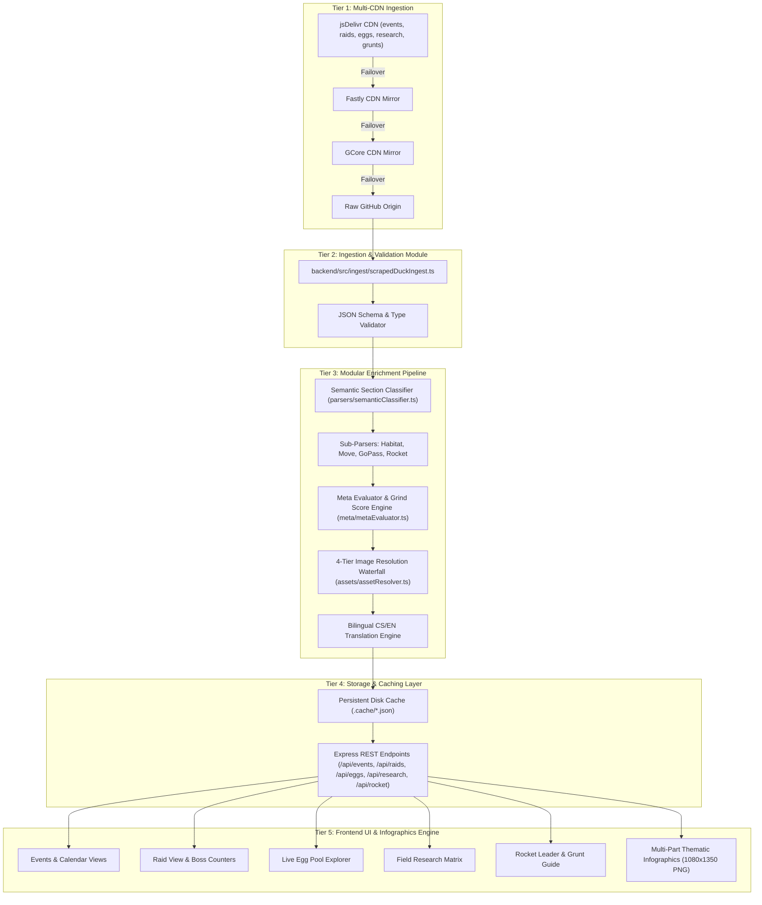

# Implementation Plan: ScrapedDuck Integration & Platform Feature Expansion

**Document Target:** `docs/plans/scrapedduck-implementation-plan.md`  
**Author:** Antigravity Engineering Team  
**Date:** August 23, 2026  
**Status:** Pending User Review / Ready for Execution  

---

## 1. Overview & Objectives

This implementation plan defines the architectural upgrade of the data ingestion and enrichment pipeline in `Pokemon-GO-event-tracker` by integrating open-source **ScrapedDuck** multi-CDN JSON feeds (`bigfoott/ScrapedDuck`).

### Primary Goals:
1. **Eliminate fragile direct HTML scraping** for event schedules, raid rosters, egg pools, field research, and Rocket lineups.
2. **Preserve 100% of custom platform features**:
   - Bilingual Czech/English translation layer (`translateTextToCs`).
   - Composite **Grind Score ($S/A/B/C$)** and PvE/PvP meta rating engine (`metaEvaluator.ts`).
   - 4-Tier image resolution waterfall (`assetResolver.ts`).
   - Thematic **multi-part segmented infographics** with Mega Raid grouping (`EventInfographic.tsx`).
   - Niantic official news reconciliation (`mergeEventDetails`).
3. **Expand website capabilities**:
   - **Automated Egg Pool Explorer** (`/cs/eggs`) with live distance tiers, shiny rates, and sprite verification.
   - **Automated Field Research Tasks & Rewards Explorer** (`/cs/research` / `/en/research`).
   - **Live Raid Boss Sync** with automated Pokebattler counter math, 100% IV CP values, and Solo/Duo difficulty badges.
   - **Live Team GO Rocket Lineup Sync** with automated grunt phrase matching.

---

## 2. Architecture & Ingestion Flow

---

## 3. Phased Step-by-Step Execution Plan

### Phase 1: Backend ScrapedDuck Multi-Feed Ingestion Engine
- **File to create:** `backend/src/ingest/scrapedDuckIngest.ts`
  - Implement resilient multi-mirror client (`fetchFromScrapedDuckWithFailover(feedName)`):
    1. `https://cdn.jsdelivr.net/gh/bigfoott/ScrapedDuck@data/${feedName}.min.json`
    2. `https://fastly.jsdelivr.net/gh/bigfoott/ScrapedDuck@data/${feedName}.min.json`
    3. `https://gcore.jsdelivr.net/gh/bigfoott/ScrapedDuck@data/${feedName}.min.json`
    4. `https://raw.githubusercontent.com/bigfoott/ScrapedDuck/data/${feedName}.min.json`
  - Add hourly timestamp query param (`?t=${Math.floor(Date.now() / 3600000)}`) to prevent stale edge cache hits.
  - Implement typed fetchers:
    - `fetchScrapedDuckEvents(): Promise<EventData[]>`
    - `fetchScrapedDuckRaids(): Promise<ScrapedDuckRaidTier[]>`
    - `fetchScrapedDuckEggs(): Promise<ScrapedDuckEggTier[]>`
    - `fetchScrapedDuckResearch(): Promise<ScrapedDuckResearchTask[]>`
    - `fetchScrapedDuckGrunts(): Promise<ScrapedDuckGrunt[]>`
- **Files to update:** `backend/src/types.ts` (Add schemas for `ScrapedDuckEggTier`, `ScrapedDuckResearchTask`, `ScrapedDuckGrunt`).

---

### Phase 2: Domain Enrichment & Sub-Parser Integration
- **Raid Boss Enrichment:**
  - Map `raids.min.json` into our `ScrapedRaidBoss` model.
  - Enrich every boss with `findRaidCounters()`, `getWeaknessesForPokemon()`, CP ranges (Normal + Weather Boosted), and difficulty tier (`solo`, `duo`, `trio`, `group`, `hard-group`).
  - Merge with custom admin raid overrides in `backend/src/storage.ts`.
- **Egg Pool Enrichment:**
  - Group `eggs.min.json` by distances (2km, 5km, 7km, 10km, 12km, Adventure Sync).
  - Verify every sprite via `resolvePokemonAsset(name, isShiny)`.
  - Provide Czech localized group titles (e.g. *„2km Vajíčka”*, *„7km Vajíčka z dárků”*).
- **Field Research Enrichment:**
  - Group `research.min.json` by task categories (Chytání, Házení, Raidy, Buddy, Power Up).
  - Translate task objectives into Czech using `translateTextToCs()`.
  - Resolve encounter Pokémon sprites and mark shiny possibilities (✨).
- **Team GO Rocket Lineup Enrichment:**
  - Ingest `grunts.min.json` into `getRocketLineupsList()`.
  - Match grunt catchphrases to typing and counters.

---

### Phase 3: Backend API Endpoints & Scheduled Automation
- **Files to update:** `backend/src/index.ts`
  - Add public REST endpoints:
    - `GET /api/eggs` (serves enriched live egg pools with 1-day TTL disk cache).
    - `GET /api/research` (serves enriched field research matrix with 1-day TTL disk cache).
    - `GET /api/raids` (upgraded with ScrapedDuck auto-sync + custom admin overrides).
    - `GET /api/rocket` (upgraded with live grunts and leader rotations).
  - Update `runScheduledScraper()`:
    - Automatically syncs all 5 feeds during the 3-hour cron run.
    - Saves all enriched outputs into persistent cache files (`.cache/eggs_cache.json`, `.cache/research_cache.json`, `.cache/raid_bosses.json`, `.cache/rocket_lineups.json`).

---

### Phase 4: Frontend Views & Interactive Explorers
- **Live Egg Explorer:**
  - Update `frontend/src/app/[lang]/eggs/page.tsx` and components to dynamically query `/api/eggs` with graceful fallback to static constants.
- **Field Research Explorer:**
  - Create/enhance `FieldResearchView.tsx` with filter by category (Stardust, Mega Energy, Rare Spawns, Items) and search bar.
- **Raid & Rocket Views:**
  - Connect `RaidView.tsx` and `RocketGuide.tsx` to the auto-synced enriched API endpoints.
- **Multi-Part Infographics:**
  - Ensure `EventInfographic.tsx` renders raid, egg, and habitat data directly from the unified enriched structure.

---

### Phase 5: Automated Testing & Verification
- Add comprehensive Vitest unit tests in `backend/src/scraper.test.ts`:
  - Multi-CDN failover fallback behavior under simulated network errors.
  - JSON schema validation for all 5 ScrapedDuck feeds.
  - End-to-end enrichment pipeline tests (Grind Score, CS translations, 4-tier sprite resolution).
- Run full regression suites:
  - `npm.cmd test` in `backend`
  - `npm.cmd run build` in `frontend` (verifying all 4900+ static Next.js pages)

---

## 4. Acceptance Criteria

| Area | Criteria | Verification Method |
| :--- | :--- | :--- |
| **Resiliency** | If jsDelivr fails or rate-limits, backend automatically cascades to Fastly -> GCore -> GitHub Raw -> Disk Cache without throwing 500 errors. | Vitest simulated network failure tests |
| **Feature Parity** | 100% of existing event details, Grind Scores, Czech translations, and infographics are preserved. | Automated test suite & manual visual verification |
| **New Features** | Live Egg Hatch Explorer and Field Research database are active and fully localized in CS and EN. | Next.js build & route validation |
| **Performance** | API responses for events, raids, eggs, and research serve in under 50ms from cache. | Express API benchmark |
| **Build Stability** | Clean TypeScript compilation and static page generation across entire Next.js frontend. | `npm.cmd run build` succeeds |

---

## 5. Next Steps

1. Review and approve this plan.
2. Proceed with Phase 1 & 2 implementation (ingestion engine + enrichment).
3. Connect API endpoints and frontend views.
4. Execute full build and verification.
