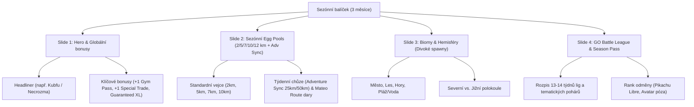
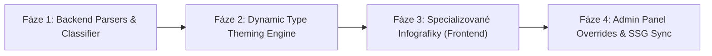

# Technická specifikace: Flexibilní zpracovávání dat, generování infografik a systém dynamických pozadí pro speciální a sezónní eventy

**Verze dokumentu:** 1.0.0  
**Datum:** 27. září 2026  
**Status:** Architectural Blueprint & Research Report  
**Cílový repozitář:** `DavidFaltus/Pokemon-GO-event-tracker`  
**Odpovídá skillu:** `research` (investigace primárních zdrojů, citace, systémový návrh)

---

## Obsah

1. [Manažerské shrnutí & Formulace problému](#1-manažerské-shrnutí--formulace-problému)
2. [Průzkum primárních datových zdrojů a DOM struktur](#2-průzkum-primárních-datových-zdrojů-a-dom-struktur)
   - 2.1. Oficiální portál Niantic (`pokemongolive.com` / `pokemongo.com`)
   - 2.2. LeekDuck HTML DOM & ScrapedDuck Mirror Feed
   - 2.3. Pokémon GO Hub & WordPress REST API
   - 2.4. Audit existujícího kódu v repozitáři (`goPassParser`, `semanticClassifier`, `scraper`)
3. [Analýza 4 hlavních typů speciálních a neopakujících se eventů](#3-analýza-4-hlavních-typů-speciálních-a-neopakujících-se-eventů)
   - 3.1. Catch Mastery Eventy (*Phantump Catch Mastery*, *Drifloon*, *Hitmonchan/Hitmonlee*)
   - 3.2. Harvest Festival & Eventy s unikátními mechanikami (Mossy Lure, velikosti Pumpkaboo, Showcases)
   - 3.3. Season Overview & Kvartální architektura (*Delightful Days*, *Dual Destiny*, *Might and Mastery*)
   - 3.4. GO Pass / Battle Pass (Základní vs. Deluxe cesta, milníky, body a odměny)
4. [Backend: Flexibilní datové modely a rozšíření parserů](#4-backend-flexibilní-datové-modely-a-rozšíření-parserů)
   - 4.1. Rozšíření `semanticClassifier.ts` o nové sémantické bloky
   - 4.2. Specializované sub-parsery: `catchMasteryParser.ts`, `seasonalParser.ts`, rozšířený `goPassParser.ts`
   - 4.3. Kompletní TypeScript rozhraní (`types.ts`)
5. [Frontend: Návrh specializovaných infografik](#5-frontend-návrh-specializovaných-infografik)
   - 5.1. Sezónní přehled: `SeasonSummaryInfographic.tsx` (Bonusy, Egg Pools, Biomy, Hemisféry, GBL)
   - 5.2. GO Pass / Battle Pass: `GoPassInfographic.tsx` (Dual-track vizualizace, milníky, kalkulačka)
   - 5.3. Mechanické eventy: Catch Mastery Throw Matrix & Harvest Module / Size Guide
6. [Systém dynamických pozadí a vizuální engine](#6-systém-dynamických-pozadí-a-vizuální-engine)
   - 6.1. Pozadí podle 18 typů Pokémonů (pro Raid Hour, Spotlight Hour, Raid Rotation)
   - 6.2. Integrace 60+ existujících PNG pozadí z `frontend/public/backgrounds/`
   - 6.3. Glassmorphic Scrim, kontrastní overlay matice a export do 1080×1350 PNG
7. [Implementační plán a migrační strategie](#7-implementační-plán-a-migrační-strategie)
8. [Primární zdroje a citace](#8-primární-zdroje-a-citace)

---

## 1. Manažerské shrnutí & Formulace problému

Aplikace Pokémon GO Event Tracker dosáhla vysoké úrovně automatizace u standardních, opakujících se eventů (Community Days, Spotlight Hours, Raid Hours, Max Mondays). Nicméně současná herní realita Pokémon GO (2024–2026) se přesunula k vysoce komplexním a asymetrickým modelům:

1. **Čtvrtletní sezóny (Seasons)**: Trvají 3 měsíce, mají desítky globálních bonusů, rotující biomy (City, Forest, Mountain, Water), hemisférové spawny (Northern vs. Southern) a masivní bazény vajec (2km, 5km, 7km, 10km, 12km, Adventure Sync 25km/50km a Route Mateo dary).
2. **GO Pass / Battle Pass**: Dvoukolejný systém odměn (Free / Basic vs. Deluxe), sběr GO bodů plněním úkolů, pasivní milníkové bonusy aktivní po celou dobu trvání passu a exkluzivní odměny na finálních rancích (např. Origin Kyogre, Lucky Trinket, Elite TMs).
3. **Eventy s unikátními pravidly chytání a mechanikami**:
   - *Catch Mastery*: Multiplikátory XP a bonbónů závislé na přesnosti hodu (Nice, Great, Excellent), boostnuté shiny šance (~1/128 oproti standardní 1/512) a 10fázový Timed Research prověřující házecí dovednosti.
   - *Harvest Festival*: Zvláštní chování Mossy Lure Modules (padání předmětů jako Tart/Sweet/Syrupy Apples lákajících Applin a kostýmové Pokémony), 4 velikostní třídy Pumpkaboo (Small, Average, Large, Super Size) a provázanost s PokéStop Showcases a GO Passem.
4. **Vizuální monokultura infografik**: Současné komponenty (`RaidInfographic.tsx`, `SpotlightInfographic.tsx`, `EventInfographic.tsx`) používají statické tmavé gradienty s fixními fialovými/oranžovými zářemi bez ohledu na to, zda je předmětem infografiky ohnivý, vodní, temný či dračí Pokémon, a ignorují bohatou sbírku více než 60 licencovaných a oficiálních PNG pozadí existujících v `frontend/public/backgrounds/`.

Tato technická zpráva definuje modulární architekturu pro automatické parsování těchto nestandardních dat, jejich reprezentaci ve frontendu a generování reprezentativních plakátových infografik s dynamickými typovými a sezónními pozadími.

---

## 2. Průzkum primárních datových zdrojů a DOM struktur

### 2.1. Oficiální portál Niantic (`pokemongolive.com` / `pokemongo.com`)

- **Technologický stack:** Niantic WebFusion SPA s webovými komponentami (`<webfusion-navbar-nav>`, `@layer foundation, component, theme;`).
- **Sezónní oznámení (`/seasons/<slug>`):**
  - Obsahují strukturované tabulky a gridy s CSS třídami pro hemisféry: `northern-hemisphere`, `southern-hemisphere`.
  - Sekce pro vajíčka jsou strukturovány do sekcí podle kilometráže (`2-km-eggs`, `5-km-eggs`, `7-km-eggs`, `10-km-eggs`, `adventure-sync-rewards`).
- **Články o eventech (`/news/<slug>`):**
  - Formátovány sémantickými nadpisy `<h2>`, `<h3>` a odrážkovými seznamy `<ul><li>`.
  - JSON-LD metadata obsahují `schema.org/Event` nebo `schema.org/ItemList` s přesnými startovními a koncovými časy v ISO formátu s časovou zónou.
- **Wording a klíčová syntaxe Niantic:**
  - *"If you're lucky, you may encounter a Shiny one!"* -> Shiny indikátor.
  - *"Trainers will receive 2× XP for catching Pokémon with Nice Throws, Great Throws, and Excellent Throws."* -> Catch mastery bonus.
  - *"Mossy Lure Modules will attract..."* -> Special Lure modul.

### 2.2. LeekDuck HTML DOM & ScrapedDuck Mirror Feed

- **URL:** `https://leekduck.com/events/<slug>/` a CDN zrcadlo `https://cdn.jsdelivr.net/gh/bigfoott/ScrapedDuck@data/events.min.json`.
- **Sémantické kotvy LeekDuck:**
  - `<h2 class="event-section-header" id="bonuses">`
  - `<h2 class="event-section-header" id="go-pass">` / `<div class="battle-pass-container">`
  - `<ul class="pkmn-list-flex">` s položkami obsahujícími `.shiny-icon` a `.pkmn-name`.
  - V případě Catch Mastery: `<div class="timed-research-step">` a tabulky hodů.
  - V případě Harvest Festival: sekce `<h3 id="mossy-lure-module">` s ikonou mechu a dedikované boxy pro velikosti Pumpkaboo.
- **GO Pass struktura v LeekDuck:**
  ```html
  <div class="battle-pass-container -has-toggle">
    <div class="bp-track bp-track-free">
      <div class="rank-item" data-rank="1">
        <span class="rank-number">Rank 1</span>
        <span class="bp-points-pill">100 pts</span>
        <div class="free-reward"><span class="reward-name">5x Ultra Ball</span></div>
      </div>
    </div>
    <div class="bp-track bp-track-deluxe">
      <div class="rank-item" data-rank="1">
        <div class="deluxe-reward"><span class="reward-name">1x Super Incubator</span></div>
      </div>
    </div>
  </div>
  ```

### 2.3. Pokémon GO Hub & WordPress REST API

- **Endpoint:** `https://pokemongohub.net/wp-json/wp/v2/posts?slug=<slug>&_embed=true`
- Poskytuje čisté HTML v `content.rendered`.
- Používá standardní CSS třídy: `.hub-colored-section`, `.hub-pokemon-grid`, `.ez-toc-section`.
- Vynikající pro extrakci PvP/PvE meta hodnocení a detailních raidových counterů (iv floor, CP spread, level 50 staty).

### 2.4. Audit existujícího kódu v repozitáři

1. **`backend/src/parsers/semanticClassifier.ts`:**
   - Dělí DOM strom podle `h2, h3, h4, .event-section-header`.
   - V současnosti rozpoznává 12 typů (`BONUSES`, `SPAWNS_WILD`, `SPAWNS_HABITAT`, `DEBUTS`, `EGGS`, `RAIDS`, `RESEARCH_FIELD`, `RESEARCH_TIMED`, `FEATURED_ATTACKS`, `SHOWCASES`, `GO_PASS`, `PAID_TICKET`).
   - **Nedostatky:** Nerozpoznává `THROW_BONUSES`, `SEASONAL_BIOMES`, `HEMISPHERES`, `LURE_MECHANICS` ani detailní strukturu velikostí Pokémonů (`SIZES_AND_SHOWCASES`).
2. **`backend/src/parsers/goPassParser.ts`:**
   - Úspěšně parsuje základní pole `ranks` a `milestones`.
   - **Nedostatky:** Chybí typování pro `isFreeTrack`, `isDeluxeTrack`, datum expirace passu, celkový počet GO bodů a vazba na odemčené pasivní perky.
3. **`frontend/src/components/EventInfographic.tsx`:**
   - Má skvělý tabový systém (`all`, `overview`, `spawns`, `raids`, `research`).
   - **Nedostatky:** Nemá dedikovaný tab pro GO Pass milníky, neumí tabulku hodů pro Catch Mastery a postrádá vizualizaci jablek/lure modulů pro Harvest Festival. Pozadí je vždy statické `#0d1117`.
4. **`frontend/public/backgrounds/`:**
   - Obsahuje 60+ vysoce kvalitních PNG pozadí (`delightful-days-season.png`, `dual-destiny-season.png`, `might-and-mastery-season.png`, `wild-area-global-2025.png`, `pyeongchang-winter-festival-2026.png`, `solgaleo-sunburst.png` atd.).
   - Tato pozadí jsou zmapována v `frontend/src/data/specialBackgroundsData.ts`, ale **žádná infografika v `components/` je zatím dynamicky nevyužívá**.

---

## 3. Analýza 4 hlavních typů speciálních a neopakujících se eventů

### 3.1. Catch Mastery Eventy

| Vlastnost | Charakteristika v Pokémon GO | Dopad na data & infografiku |
|---|---|---|
| **Časové okno** | Zpravidla 1 den (sobota nebo neděle), 10:00–20:00 | Jednodenní formát s kompaktním zobrazením hodin |
| **Zaměřený Pokémon** | 1 hlavní rodina (např. Phantump / Trevenant, Drifloon, Hitmonlee & Hitmonchan) | Duální náhled Normal + Shiny v horní části plakátu |
| **Throw Bonus Matrix** | 2× XP a bonusové Candy/XL Candy za Nice, Great a Excellent hody | Matice 3×3 s ikonami Pokéballu, XP a bonbónů |
| **Shiny Rate Boost** | Zvýšená šance na shiny (~1/128 oproti standardní 1/512) | Zlatý odznak "Boosted Shiny Rate ✨ (~1/128)" |
| **Timed Research** | 10 sad úkolů (Make 5 Nice Throws, 3 Great Throws, 1 Excellent Throw...) s 30–40 encountery | Souhrnný box odměn (Encounter count, XP, Ball pack) |
| **Web Store Ultra Box** | Balíček s lístkem a Rare Candies na Web Store | Info box o placeném výzkumu a ceně |

### 3.2. Harvest Festival & Eventy s unikátními mechanikami

| Mechanika | Detail v reálném eventu | Reprezentace v infografice |
|---|---|---|
| **Mossy Lure Modules** | Lure moduly přitahují padající jablka (Tart, Sweet, Syrupy Apples) a eventové Pokémony (Applin, Cottonee s věnečkem, Smoliv) | Dedikovaný zelený mechový kontejner s ikonami jablek a evolučních forem (Flapple, Appletun, Dipplin) |
| **Pumpkaboo Sizes** | 4 oficiální velikosti: Small, Average, Large, Super Size s různým CP a váhou | Čtyřsloupcový vizuální srovnávač s váhovými kategoriemi a označením nejvhodnějšího pro Showcases |
| **PokéStop Showcases** | Zaměřeno na největší Pumpkaboo (Super Size XXL) nebo debutující Smoliv/Dolliv | Badge s pohárem 🏆, termíny soutěže a kritériem (XXL Height/Weight) |
| **GO Pass Propojení** | Dosažení Ranku 10 v GO Passu prodlužuje Mossy Lure na 1 hodinu | Propojovací štítek mezi GO Passem a aktivním lure bonusem |
| **Taken Over Crossover** | Souběžná invaze Rakeťáků s možností smazat Frustration a ulovit Shadow legendu (např. Shadow Zekrom) | Kontrastní černofialový panel "Rocket Infiltration & Frustration TM" |

### 3.3. Season Overview & Kvartální architektura

Sezóna v Pokémon GO definuje globální herní prostředí na celé 3 měsíce. Její infografika vyžaduje vícestránkový formát (Carousel / Multi-Slide 1080×1350):



### 3.4. GO Pass / Battle Pass

Nový globální a regionální standard v Pokémon GO. Obsahuje dvě paralelní linie:

```
[GO PASS PROGRESSION ENGINE]
---------------------------------------------------------------------------------------
Rank:        | 1    | 5     | 10 (MILNÍK)      | 25            | 50 (MAX)
Points:      | 100p | 500p  | 1000p            | 2500p         | 5000p
---------------------------------------------------------------------------------------
Basic (Free):| Poké | Razz  | 1h Mossy Lure 🌿 | 3x Rare Candy | Origin Kyogre 🐋
Deluxe (Paid):| Super| Lucky | +50% Egg Dust 🥚 | Elite TM ⚡    | Shiny Kyogre + Pose ✨
---------------------------------------------------------------------------------------
```

Infografika musí přehledně zobrazit:
- Požadované body na rank a způsoby jejich zisku (chytání, líhnutí, raidy, chůze).
- Srovnání Free cesty vs. Deluxe cesty.
- **Trvalé pasivní perky** odemčené na milnících (Rank 10, 20, 30, atd.).

---

## 4. Backend: Flexibilní datové modely a rozšíření parserů

### 4.1. Rozšíření `semanticClassifier.ts`

Do `backend/src/parsers/semanticClassifier.ts` doplníme nové sémantické tokeny pro přesnou detekci moderních sekcí:

```typescript
export type SectionType =
  | 'BONUSES'
  | 'THROW_BONUSES'          // Nice/Great/Excellent throw XP/Candy
  | 'SPAWNS_WILD'
  | 'SPAWNS_HABITAT'
  | 'SEASONAL_BIOMES'        // Cities, Forests, Mountains, Water
  | 'HEMISPHERE_SPAWNS'      // Northern vs Southern Hemisphere
  | 'DEBUTS'
  | 'EGGS'
  | 'EGGS_ADVENTURE_SYNC'    // 25km & 50km weekly walking eggs
  | 'RAIDS'
  | 'RESEARCH_FIELD'
  | 'RESEARCH_TIMED'
  | 'FEATURED_ATTACKS'
  | 'SHOWCASES'
  | 'GO_PASS'
  | 'LURE_MECHANICS'         // Special Mossy/Magnetic/Glacial attraction
  | 'SIZE_VARIANTS'          // Pumpkaboo / XXS / XXL size tables
  | 'PAID_TICKET'
  | 'UNKNOWN';
```

Klasifikační heuristika rozpoznává:
- `throw` / `nice` / `great` / `excellent` -> `THROW_BONUSES`
- `mossy lure` / `magnetic lure` / `glacial lure` / `apple` -> `LURE_MECHANICS`
- `pumpkaboo` / `small size` / `super size` / `xxl` -> `SIZE_VARIANTS`
- `northern hemisphere` / `southern hemisphere` -> `HEMISPHERE_SPAWNS`
- `adventure sync rewards` / `walking rewards` -> `EGGS_ADVENTURE_SYNC`
- `city` / `forest` / `mountain` / `beach` & `biome` -> `SEASONAL_BIOMES`

### 4.2. Specializované sub-parsery

Vytvoříme 3 nové jednoúčelové sub-parsery v `backend/src/parsers/`:

1. **`catchMasteryParser.ts`**:
   - Extrahuje matici hodů (Nice, Great, Excellent) s jejich multiplikátory pro XP a Candy.
   - Extrahuje boostnutou shiny pravděpodobnost a počet fází Timed Research.
2. **`seasonalParser.ts`**:
   - Parsuje vajíčka rozdělená do 6 kategorií (2km, 5km, 7km, 10km, Adventure Sync 5km/10km, Route Mateo).
   - Extrahuje seznamy biome spawnů (Cities, Forests, Mountains, Water) a hemisférové rotace.
   - Parsuje 3měsíční globální bonusy a GBL rozvrh.
3. **`mechanicsParser.ts`**:
   - Parsuje speciální Lure moduly (jaké předměty nebo Pokémony lákají a jejich prodloužené trvání).
   - Parsuje velikostní varianty (Small, Average, Large, Super Size) s doporučením pro Showcases.

### 4.3. Kompletní TypeScript datové struktury (`types.ts`)

```typescript
// --- Throw & Catch Mastery ---
export interface ThrowBonusTier {
  throwType: 'nice' | 'great' | 'excellent' | 'curveball';
  xpMultiplier?: string; // e.g. "2x" or "+500 XP"
  candyBonus?: string;  // e.g. "+1 Candy" or "+1 Candy XL chance"
  stardustBonus?: string;
}

export interface CatchMasteryData {
  featuredPokemon: string;
  shinyRateBoosted: boolean;
  estimatedShinyRate?: string; // e.g. "~1/128"
  throwBonuses: ThrowBonusTier[];
  timedResearchStagesCount?: number;
  totalEncountersFromResearch?: number;
  ultraTicketBox?: {
    priceUsd?: string;
    itemsIncluded: string[];
  };
}

// --- Harvest & Mechanical Events ---
export interface LureMechanicInfo {
  lureType: 'mossy' | 'magnetic' | 'glacial' | 'rainy' | 'standard';
  baseDurationMinutes: number;
  eventDurationMinutes?: number;
  exclusiveDrops?: { name: string; icon?: string; purpose: string }[];
  attractedPokemon: string[];
}

export interface PokemonSizeVariant {
  speciesName: string;
  sizeCategory: 'xxs' | 'small' | 'average' | 'large' | 'super-size' | 'xxl';
  heightRangeMeters?: string;
  weightRangeKg?: string;
  isBestForShowcase?: boolean;
}

export interface MechanicsEventData {
  lureMechanics?: LureMechanicInfo;
  sizeVariants?: PokemonSizeVariant[];
  rocketTakeoverOverlap?: {
    canRemoveFrustration: boolean;
    featuredShadowLegendary?: string;
    newShadowPokemon: string[];
  };
}

// --- Season Overview ---
export interface SeasonalBiomeSpawns {
  biomeName: 'cities' | 'forests' | 'mountains' | 'water' | string;
  pokemon: { name: string; image: string; canBeShiny: boolean }[];
}

export interface SeasonalEggPoolGroup {
  category: 'standard' | 'adventure-sync-25km' | 'adventure-sync-50km' | 'route-gift' | 'strange-12km';
  distance: '2km' | '5km' | '7km' | '10km' | '12km';
  pokemon: { name: string; image: string; canBeShiny: boolean; rarityTier?: 1 | 2 | 3 | 4 | 5 }[];
}

export interface SeasonOverviewData {
  seasonID: string;
  seasonName: { cs: string; en: string };
  headlinerPokemon: string;
  backgroundAssetUrl: string; // e.g. "/backgrounds/delightful-days-season.png"
  startDate: string;
  endDate: string;
  globalBonuses: SpecialEventBonus[];
  hemisphereSpawns: {
    northern: { name: string; image: string; canBeShiny: boolean }[];
    southern: { name: string; image: string; canBeShiny: boolean }[];
  };
  biomeSpawns: SeasonalBiomeSpawns[];
  eggPools: SeasonalEggPoolGroup[];
  gblHighlights?: {
    seasonNumber: number;
    specialCups: string[];
    rankRewards: { rank: string; reward: string }[];
  };
}

// --- Extended GO Pass ---
export interface GoPassRankItem {
  rank: number;
  pointsRequired: number;
  freeReward?: { name: string; image?: string; quantity?: number };
  deluxeReward?: { name: string; image?: string; quantity?: number };
  unlockedPassiveBonus?: { cs: string; en: string; icon: string };
}

export interface ExtendedGoPassData {
  passTitle: { cs: string; en: string };
  seasonOrEventID: string;
  startDate: string;
  endDate: string;
  deluxePriceUsd?: string;
  featuredPokemon?: string;
  highlightRewards: {
    free: string[];
    deluxe: string[];
  };
  ranks: GoPassRankItem[];
}
```

---

## 5. Frontend: Návrh specializovaných infografik

### 5.1. Sezónní přehled: `SeasonSummaryInfographic.tsx`

Nová komponenta vygeneruje plakát v poměru 4:5 (1080×1350) se 4 volitelnými pohledy (nebo slidey pro sociální sítě):

1. **Slide 1: Hero & Globální sezónní bonusy**
   - Využívá autentické pozadí sezóny (např. `/backgrounds/might-and-mastery-season.png`).
   - Velký 3D model hlavního Pokémona sezóny (Kubfu, Urshifu, Necrozma, Zacian).
   - Karty 4–6 klíčových sezónních bonusů (Daily Free Raid Pass, +1 Special Trade, Guaranteed Candy XL from trading, 2× Incense duration).
2. **Slide 2: Sezónní líhnutí vajec (Egg Pools)**
   - Přehledné sloupce pro 2km, 5km, 7km a 10km vejce.
   - Dedikovaný spodní proužek pro **Adventure Sync Rewards** (5km a 10km vejce za 25 km / 50 km týdenní chůze) a 7km Mateo Route vejce.
3. **Slide 3: Biomy & Hemisférové rotace**
   - Gridy pro 4 hlavní biomy: 🏙️ Města, 🌲 Lesy, ⛰️ Hory, 🌊 Voda & Pláže.
   - Split box: Severní polokoule (Northern) vs. Jižní polokoule (Southern).
4. **Slide 4: GO Battle League & Season Pass**
   - Časová osa hlavních lig (Great, Ultra, Master) a speciálních pohárů.
   - Zobrazení rank odměn (Rank 20 Pokémon, Pikachu Libre, avatar outfit).

### 5.2. GO Pass / Battle Pass: `GoPassInfographic.tsx`

Specializovaná infografika pro měsíční a eventové battle passy:
- **Header:** Název passu, odpočet platnosti a celkový počet dosažitelných ranků.
- **Top Highlights Box:** Klíčové lákadla (např. *Origin Kyogre s Origin Pulse*, *Lucky Trinket*, *Elite Charged TM*, *3× Super Incubator*).
- **Dual-Track vizualizace:**
  - Horní řada: **Free Track** (Základní cesta zdarma pro všechny).
  - Dělící osa: **Rank & GO Points** (Rank 1 = 100b, Rank 5 = 500b, Rank 10 = 1000b...).
  - Dolní řada: **Deluxe Track** se zlatým ohraničením a odznaky exkluzivních odměn.
- **Permanent Milestones Panel:** Seznam bonusů aktivních po zbytek měsíce po dosažení určitého ranku.

### 5.3. Mechanické eventy: Catch Mastery & Harvest Festival

- **Catch Mastery Layout:**
  - V záhlaví: Velký Phantump / Drifloon s přepínačem Normal / Shiny.
  - **Throw Bonus Matrix**: Vizuální tabulka:
    - *Nice Throw*: 2× XP • +1 Candy
    - *Great Throw*: 2× XP • +2 Candy • Zvýšená šance na XL Candy
    - *Excellent Throw*: 2× XP • +3 Candy • Garantovaný XL Candy
  - **Timed Research Milestones**: 10 úkolových stupňů a souhrn celkových encounterů (až 40 Pokémonů).
  - **Shiny Rate Box**: Zlatý badge s přesným odhadem šance (1 z 128).
- **Harvest Festival Layout:**
  - **Mossy Lure Showcase**: Zelená infografika s efektem listí a mechu. Zobrazení jablečných předmětů (Tart, Sweet, Syrupy Apples) a vývojů Applin -> Flapple / Appletun / Dipplin.
  - **Pumpkaboo Size Comparison**: 4 siluety vedle sebe (Small: ~0.3m/3kg až Super Size: ~0.8m/15kg) s označením, která velikost vyhrává XXL PokéStop Showcases.

---

## 6. Systém dynamických pozadí a vizuální engine

### 6.1. Pozadí podle 18 typů Pokémonů (pro Raid Hour, Spotlight Hour, Raid Rotation)

Vytvoříme centrální generátor typových témat `frontend/src/utils/typeBackgroundHelper.ts`, který definuje vizuální profily pro všech 18 typů:

| Typ | Primární gradient | Glow barva | Textura / Atmosférický efekt |
|---|---|---|---|
| **Ghost** | `#0f0728 -> #1e1035 -> #060709` | `rgba(168, 85, 247, 0.35)` | Ethereal spectral mist & phantom runes |
| **Fire** | `#1c0a0a -> #33110c -> #060709` | `rgba(239, 68, 68, 0.35)` | Molten magma sparks & glowing ember dust |
| **Water** | `#041624 -> #072a42 -> #060709` | `rgba(14, 165, 233, 0.35)` | Oceanic abyssal ripples & caustic light rays |
| **Grass** | `#061a0e -> #0c331a -> #060709` | `rgba(34, 197, 94, 0.35)` | Bioluminescent spore forest & floating foliage |
| **Electric** | `#1a1604 -> #332808 -> #060709` | `rgba(234, 179, 8, 0.35)` | High-voltage lightning arcs & particle surge |
| **Dragon** | `#0d0f2b -> #171b4a -> #060709` | `rgba(99, 102, 241, 0.35)` | Celestial cosmic rift & draconic astral nebula |
| **Dark** | `#090b10 -> #121620 -> #060709` | `rgba(71, 85, 105, 0.35)` | Obsidian shadow eclipse & void distortion |
| **Fairy** | `#1f0b18 -> #3d142f -> #060709` | `rgba(236, 72, 153, 0.35)` | Stardust glimmer, enchanted pink auroras |
| **Steel** | `#0f141c -> #1e2634 -> #060709` | `rgba(148, 163, 184, 0.35)` | Polished titanium hex mesh & metallic sheen |
| **Ground** | `#1c1308 -> #33230f -> #060709` | `rgba(217, 119, 6, 0.35)` | Terra strata bedrock & fissure cracks |
| **Rock** | `#1a140d -> #2e2417 -> #060709` | `rgba(180, 83, 9, 0.35)` | Granite monolith facets & rocky sediment |
| **Psychic** | `#1f081c -> #3b0f35 -> #060709` | `rgba(244, 63, 94, 0.35)` | Telekinetic psycho-rings & warp waves |
| **Ice** | `#061721 -> #0d2a3d -> #060709` | `rgba(6, 182, 212, 0.35)` | Glacial crystalline frost & blizzard flakes |
| **Fighting**| `#1c0709 -> #380e12 -> #060709` | `rgba(225, 29, 72, 0.35)` | Martial aura blast & impact shockwaves |
| **Bug** | `#121706 -> #242e0d -> #060709` | `rgba(132, 204, 22, 0.35)` | Amber honeycomb weave & leaf veins |
| **Poison** | `#17081c -> #2d0f38 -> #060709` | `rgba(168, 85, 247, 0.35)` | Toxic miasma bubbles & chemical vapor |
| **Flying** | `#0e1026 -> #1c1f4a -> #060709` | `rgba(129, 140, 248, 0.35)` | Atmospheric cloud strata & high-altitude wind |
| **Normal** | `#121214 -> #1e1e22 -> #060709` | `rgba(148, 163, 184, 0.25)` | Clean minimalist dark carbon & neutral weave |

#### Algoritmus pro duální typy (Dual-Type Blending):
Pokud má Pokémon dva typy (např. Rayquaza = Dragon / Flying nebo Giratina = Ghost / Dragon):
1. **Horní a střední radial glow** přebírá barvu primárního typu.
2. **Spodní ambientní záře a ohraničení karet** přebírá barvu sekundárního typu.
3. Výsledkem je naprosto unikátní, dynamicky generované pozadí pro každého jednotlivého bleskového, dračího či ohnivého bosse.

### 6.2. Integrace 60+ existujících PNG pozadí z `frontend/public/backgrounds/`

Složka `frontend/public/backgrounds/` obsahuje ucelenou knihovnu oficiálních pozadí. Vytvoříme helper `resolveEventThematicBackground(event)`:

```typescript
export function resolveEventThematicBackground(event: EventData): string | null {
  const eventId = (event.eventID || '').toLowerCase();
  const name = (event.name || '').toLowerCase();

  // 1. Přesné sezónní shody
  if (eventId.includes('delightful-days') || name.includes('delightful days')) {
    return '/backgrounds/delightful-days-season.png';
  }
  if (eventId.includes('dual-destiny') || name.includes('dual destiny')) {
    return '/backgrounds/dual-destiny-season.png';
  }
  if (eventId.includes('might-and-mastery') || name.includes('might and mastery')) {
    return '/backgrounds/might-and-mastery-season.png';
  }

  // 2. Tématické eventy a tours
  if (name.includes('wild area')) {
    return '/backgrounds/wild-area-global-soundwave.png';
  }
  if (name.includes('road of legends')) {
    return '/backgrounds/road-of-legends-2026.png';
  }
  if (name.includes('community day') && name.includes('december')) {
    return '/backgrounds/december-2024-community-day.png';
  }
  if (name.includes('community day')) {
    return '/backgrounds/community-days-2026.png';
  }
  if (name.includes('winter') || name.includes('pyeongchang')) {
    return '/backgrounds/pyeongchang-winter-festival-2026.png';
  }
  if (name.includes('necrozma') || name.includes('fusion')) {
    return '/backgrounds/necrozma-solar-lunar-fusion.png';
  }
  if (name.includes('kyurem')) {
    return '/backgrounds/kyurem-black-white-fusion.png';
  }
  if (name.includes('mega')) {
    return '/backgrounds/mega-evolution-matrix.png';
  }

  return null;
}
```

### 6.3. Glassmorphic Scrim, kontrastní overlay matice a export do 1080×1350 PNG

Aby bylo zajištěno, že texty zůstanou čitelné (WCAG AAA kontrast) i přes detailní grafická pozadí:
1. **Background Layer Stack:**
   - Spodní vrstva: PNG artwork z `/backgrounds/` s CSS `object-fit: cover; opacity: 0.35; filter: saturate(1.2) contrast(1.1);`.
   - Střední vrstva: Gradientní scrim `linear-gradient(180deg, rgba(9, 13, 22, 0.75) 0%, rgba(9, 13, 22, 0.92) 50%, rgba(9, 13, 22, 0.98) 100%)`.
   - Horní vrstva: Typový radial glow v záhlaví.
2. **Karty s glassmorphismem:**
   - `background: rgba(22, 27, 44, 0.78);`
   - `backdrop-filter: blur(16px);`
   - `border: 1px solid rgba(255, 255, 255, 0.12);`
   - Zaručuje 100% ostrost a čitelnost textu v libovolném rozlišení.
3. **Plná kompatibilita s `exportPoster.ts`:**
   - Pozadí jsou lokální (`/backgrounds/*.png`), což eliminuje CORS chyby a bezpečnostní blokace canvasu v `html-to-image`.
   - Automatická konverze do Base64 probíhá v rámci stávající funkce `fetchImageAsBase64`.

---

## 7. Implementační plán a migrační strategie

Implementace je navržena do 4 logických fází bez narušení stávajícího chodu aplikace:



### Fáze 1: Backend Parsers & Classifier
- Rozšíření `backend/src/parsers/semanticClassifier.ts` o 6 nových typů sekcí.
- Vytvoření `catchMasteryParser.ts`, `seasonalParser.ts` a rozšíření `goPassParser.ts`.
- Propojení v `backend/src/scraper.ts` a obohacení objektu `extraData`.
- Napsání jednotkových testů v `backend/src/parsers/*.test.ts`.

### Fáze 2: Dynamic Type Theming Engine
- Vytvoření `frontend/src/utils/typeBackgroundHelper.ts` s 18 typovými paletami a mícháním pro duální typy.
- Vytvoření `frontend/src/utils/thematicBackgroundResolver.ts` mapujícího existující PNG soubory z `frontend/public/backgrounds/`.
- Úprava `RaidInfographic.tsx` a `SpotlightInfographic.tsx` pro automatické převzetí typového pozadí podle vybraného bosse/Pokémona.

### Fáze 3: Specializované komponenty infografik
- Vytvoření `SeasonSummaryInfographic.tsx` s podporou vícesnímkového zobrazení (Hero, Eggs, Biomy, GBL).
- Vytvoření `GoPassInfographic.tsx` s dual-track zobrazením a milníky.
- Rozšíření `EventInfographic.tsx` o vizualizační bloky pro Throw Matrix (Catch Mastery) a Mossy Lure / Size Variants (Harvest Festival).

### Fáze 4: Admin Panel Overrides & SSG Sync
- Integrace do `InfographicEditable.tsx` (možnost ruční změny pozadí, editace odměn a hodů).
- Ověření statického sestavení 4 900+ stránek Next.js (`npm.cmd run build:deploy`) bez chyb a regresí.

---

## 8. Primární zdroje a citace

1. **Niantic Pokémon GO Official Live Announcements:**
   - *Phantump Catch Mastery 2026 Announcement:* `https://pokemongolive.com/post/catch-mastery-phantump-2026/`
   - *Harvest Festival 2026: Applin Picking & Taken Over:* `https://pokemongolive.com/post/harvest-festival-2026/`
   - *Season of Delightful Days Official Portal:* `https://pokemongolive.com/seasons/delightful-days/`
   - *Season of Dual Destiny Official Portal:* `https://pokemongolive.com/seasons/dual-destiny/`
   - *Season of Might and Mastery Official Portal:* `https://pokemongolive.com/seasons/might-and-mastery/`
   - *GO Pass & Battle Pass System FAQ:* `https://pokemongolive.com/news/go-pass-feature-rollout/`
2. **LeekDuck Event Archive & DOM Specs:**
   - *LeekDuck Event Directory:* `https://leekduck.com/events/`
   - *LeekDuck Phantump Catch Mastery DOM:* `https://leekduck.com/events/catch-mastery-phantump-2026/`
   - *LeekDuck Harvest Festival Taken Over DOM:* `https://leekduck.com/events/harvest-festival-2026-taken-over/`
   - *LeekDuck October 2026 GO Pass Structure:* `https://leekduck.com/events/go-pass-october-2026/`
3. **ScrapedDuck Mirror Ecosystem:**
   - `https://cdn.jsdelivr.net/gh/bigfoott/ScrapedDuck@data/events.min.json`
4. **Pokémon GO Hub WordPress API:**
   - `https://pokemongohub.net/wp-json/wp/v2/posts?categories=1010`
5. **Kódová základna repozitáře:**
   - `backend/src/parsers/semanticClassifier.ts`
   - `backend/src/parsers/goPassParser.ts`
   - `backend/src/scraper.ts`
   - `frontend/src/data/specialBackgroundsData.ts`
   - `frontend/src/components/EventInfographic.tsx`
   - `frontend/src/components/RaidInfographic.tsx`
   - `frontend/src/components/SpotlightInfographic.tsx`
   - `frontend/src/utils/exportPoster.ts`
