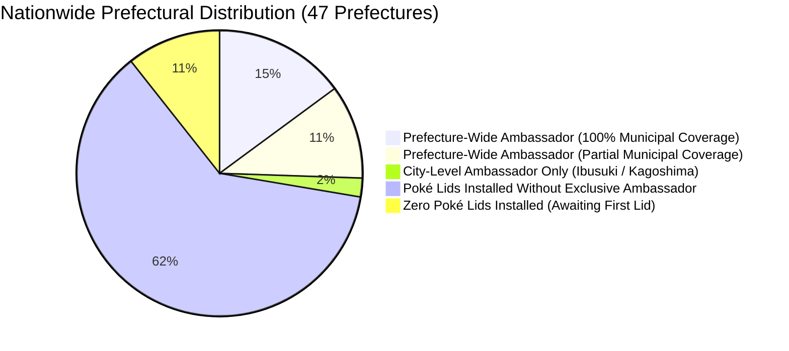
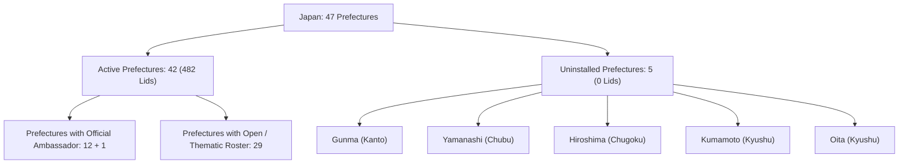
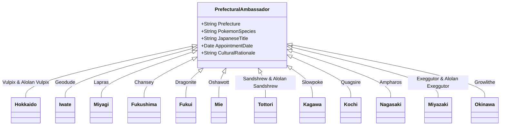
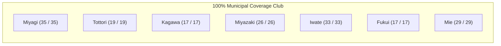
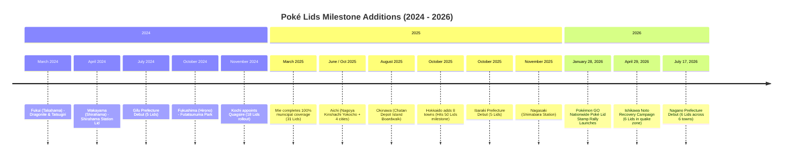

# Poké Lids (Pokéfuta / ポケふた) Complete Registry & Nationwide Audit

**Author:** Antigravity Research & Engineering Team  
**Date:** September 2026  
**Document Status:** Complete / Definitive Primary Source Reference  
**Target Repository:** `DavidFaltus/Pokemon-GO-event-tracker`  
**Primary File Location:** `docs/research/pokelids-complete-registry-audit.md`  
**Related Reference:** `docs/research/pokemon-go-special-backgrounds-and-pokelids-guide.md`

---

## 1. Executive Summary & Nationwide Registry Metrics

**Poké Lids** (*Pokéfuta* / ポケふた) are bespoke, full-color utility manhole covers installed across Japan under **Pokémon Local Acts** (*ポケモンローカルActs*). Coordinated by The Pokémon Company in close partnership with regional prefectures and municipal governments, the initiative drives eco-tourism, regional revitalisation, and cultural appreciation. In *Pokémon GO*, every Poké Lid functions as a permanent in-game PokéStop dispensing exclusive Postcards, field research, and powering the **Poké Lid Stamp Rally (ポケふたスタンプラリー)** engine.

### Core Registry Statistics (as of September 2026)

| Metric | Official Count | Primary Registry Source |
| :--- | :--- | :--- |
| **Total Poké Lids Installed Nationwide** | **482** | [Pokémon Local Acts Registry](https://local.pokemon.jp/manhole/) & [Pokéfuta DB](https://data.pokefuta.com/) |
| **Prefectures with Active Poké Lids** | **42 / 47** | Primary Municipal Government Registries |
| **Prefectures Awaiting Initial Installation** | **5 / 47** | Verified Negative Coverage Audit |
| **Prefectures with Official Ambassador Pokémon** | **12** (Prefecture-wide) + **1** (City-level) | Official Pokémon Local Acts Charter |
| **Prefectures with 100% Municipal Coverage** | **7** | Miyagi, Tottori, Kagawa, Miyazaki, Iwate, Fukui, Mie |
| **Earliest Historical Installation** | **Dec 20, 2018** | Ibusuki City, Kagoshima Prefecture (Eevee) |
| **Most Recent Prefectural Debut** | **July 17, 2026** | Nagano Prefecture (6 Municipalities) |

---

## 2. Prefectural Coverage Audit: Installed vs. Uninstalled

Japan consists of 47 prefectures. As of September 2026, **42 prefectures** host at least one official Poké Lid, while exactly **5 prefectures** have zero installations.

### The 5 Uninstalled Prefectures

| Prefecture (Kenchō) | Region | Municipalities | Status / Municipal Collaboration Context |
| :--- | :--- | :--- | :--- |
| **Gunma (群馬県)** | Kanto | 35 | No active Pokémon Local Acts agreement or municipal installations. |
| **Yamanashi (山梨県)** | Chubu | 27 | No official Poké Lids installed; Mt. Fuji tourism managed independently. |
| **Hiroshima (広島県)** | Chugoku | 23 | No official Poké Lids installed despite high cultural and domestic travel profile. |
| **Kumamoto (熊本県)** | Kyushu | 45 | Focuses regional mascot branding on Kumamon and the *One Piece* statue campaign. |
| **Oita (大分県)** | Kyushu | 18 | Renowned for onsen tourism (Beppu, Yufuin); no Poké Lids installed. |

> [!NOTE]
> Until mid-2026, **Nagano Prefecture** was on this list. Nagano officially exited the uninstalled category on **July 17, 2026**, when it unveiled its first six Poké Lids across six municipalities.

---

## 3. Master Nationwide Poké Lids Registry Table

Below is the complete audit of all 47 prefectures sorted by standard Japanese geographical order (ISO 3166-2:JP code order from North to South), displaying their exact lid count, official ambassador status, and featured themes.

| ISO Code | Prefecture (English / Kanji) | Region | Installed Lids | Official Ambassador Pokémon | Municipal Coverage Status | Notable Themes / Featured Pokémon |
| :---: | :--- | :--- | :---: | :--- | :--- | :--- |
| **JP-01** | **Hokkaido (北海道)** | Hokkaido | **50** | **Vulpix & Alolan Vulpix** (*Rokon & Alola Rokon*) | Partial (50 / 179) | Subarctic snow, lavender fields, Tokachi mountains, Sapporo, Betsukai. |
| **JP-02** | **Aomori (青森県)** | Tohoku | **2** | *None (Open Roster)* | Partial (2 / 40) | Hachinohe (Wingull & Geodude), Hashikami (Pyukumuku, Pincurchin, Snom). |
| **JP-03** | **Iwate (岩手県)** | Tohoku | **36** | **Geodude** (*Ishitsubute*) | **100% (33 / 33)** | "Iwa" + "Te" = Rock Hand; Rock-type Pokémon, Sanriku coastal reconstruction. |
| **JP-04** | **Miyagi (宮城県)** | Tohoku | **37** | **Lapras** (*Rapurasu*) | **100% (35 / 35)** | Pacific ocean coast, Matsushima Bay maritime hospitality, Sendai city center. |
| **JP-05** | **Akita (秋田県)** | Tohoku | **5** | *None (Open Roster)* | Partial (5 / 25) | Akita dog tributes (Growlithe, Dachsbun, Rockruff), Oga Namahage (Glalie). |
| **JP-06** | **Yamagata (山形県)** | Tohoku | **5** | *None (Open Roster)* | Partial (5 / 35) | Cherry capital, Zao snow monsters, Dewa Sanzan mountain shrines. |
| **JP-07** | **Fukushima (福島県)** | Tohoku | **43** | **Chansey** (*Rakkī*) | Partial (43 / 59) | "Fuku" (Luck) = Lucky; Lucky Parks (Koriyama, Namie, Yanaizu, Showa). |
| **JP-08** | **Ibaraki (茨城県)** | Kanto | **5** | *None (Open Roster)* | Partial (5 / 44) | Debuted Oct 2025; Hitachi Seaside Park, Lake Kasumigaura, Tsukuba science. |
| **JP-09** | **Tochigi (栃木県)** | Kanto | **3** | *None (Open Roster)* | Partial (3 / 25) | Utsunomiya gyoza, Nikko Toshogu heritage, strawberry orchards. |
| **JP-10** | **Gunma (群馬県)** | Kanto | **0** | *None* | **0% (Uninstalled)** | Awaiting first installation. |
| **JP-11** | **Saitama (埼玉県)** | Kanto | **3** | *None (Open Roster)* | Partial (3 / 63) | Tokorozawa anime cultural complex, Sayama green tea hills. |
| **JP-12** | **Chiba (千葉県)** | Kanto | **4** | *None (Open Roster)* | Partial (4 / 54) | Kisarazu, Boso coastal lighthouses, Narita gateway. |
| **JP-13** | **Tokyo (東京都)** | Kanto | **13** | *None (Open Roster)* | Partial (4 / 62) | Machida (6 Gen 1 lids by Satoshi Tajiri's hometown), Ogasawara (4 lids), Ueno (2), PokéPark Kanto (1). |
| **JP-14** | **Kanagawa (神奈川県)** | Kanto | **5** | *None (Open Roster)* | Partial (1 / 33) | Yokohama Minato Mirai cluster (Sakuragicho, Red Brick, Marine Tower) celebrating Pikachu. |
| **JP-15** | **Niigata (新潟県)** | Chubu | **4** | *None (Open Roster)* | Partial (4 / 30) | Ojiya Nishikigoi koi carp (Magikarp), rice terraces, snowy Echigo mountains. |
| **JP-16** | **Toyama (富山県)** | Chubu | **3** | *None (Open Roster)* | Partial (3 / 15) | Toyama Bay firefly squids, Kurobe Dam alpine canyon. |
| **JP-17** | **Ishikawa (石川県)** | Chubu | **8** | *None (Open Roster)* | Partial (7 / 19) | Kanazawa heritage; 6 Noto Peninsula Earthquake Reconstruction lids (Suzu, Wajima, Noto, Anamizu, Nanao, Shika). |
| **JP-18** | **Fukui (福井県)** | Chubu | **17** | **Dragonite** (*Kairyū*) | **100% (17 / 17)** | Japan's dinosaur capital ("Ryū" = Dinosaur/Dragon); coastal Echizen cliffs, Wakasa bay. |
| **JP-19** | **Yamanashi (山梨県)** | Chubu | **0** | *None* | **0% (Uninstalled)** | Awaiting first installation. |
| **JP-20** | **Nagano (長野県)** | Chubu | **6** | *None (Open Roster)* | Partial (6 / 77) | Debuted July 2026; Ina, Kiso, Okaya, Omachi, Minamimaki, Yamanouchi (Kleavor, Snom, Bidoof). |
| **JP-21** | **Gifu (岐阜県)** | Chubu | **5** | *None (Open Roster)* | Partial (5 / 42) | Debuted July 2024; Sekigahara battlefield, Gero Onsen, Takayama historic village. |
| **JP-22** | **Shizuoka (静岡県)** | Chubu | **5** | *None (Open Roster)* | Partial (5 / 35) | Mt. Fuji southern foothills, Suruga Bay deep-sea biology, green tea estates. |
| **JP-23** | **Aichi (愛知県)** | Chubu | **9** | *None (Open Roster)* | Partial (5 / 54) | Nagoya City (Kinshachi Yokocho), Toyota automotive heritage, Mikawa bay. |
| **JP-24** | **Mie (三重県)** | Kansai | **31** | **Oshawott** (*Mijumaru*) | **100% (29 / 29)** | "Mijū" pun, Mikimoto pearl shells, Ise-Shima national park, Kumano Kodo. |
| **JP-25** | **Shiga (滋賀県)** | Kansai | **5** | *None (Open Roster)* | Partial (2 / 19) | Lake Biwa water heritage (Gyarados in Otsu), Koka ninja homeland (Greninja). |
| **JP-26** | **Kyoto (京都府)** | Kansai | **8** | *None (Open Roster)* | Partial (2 / 26) | Johto historic capital (Ho-Oh, starters in Arashiyama/Okazaki), Uji tea (Sinistcha), Nintendo Museum. |
| **JP-27** | **Osaka (大阪府)** | Kansai | **5** | *None (Open Roster)* | Partial (3 / 43) | Higashiosaka rugby/manufacturing, Osaka Bay waterfront, culinary themes. |
| **JP-28** | **Hyogo (兵庫県)** | Kansai | **3** | *None (Open Roster)* | Partial (3 / 41) | Awaji Island gateway, Himeji Castle approach, Kobe maritime port. |
| **JP-29** | **Nara (奈良県)** | Kansai | **5** | *None (Open Roster)* | Partial (1 / 39) | Ikaruga Town Horyuji pilgrimage trail (Entei, Deerling, Bronzong, Chimecho). |
| **JP-30** | **Wakayama (和歌山県)** | Kansai | **5** | *None (Open Roster)* | Partial (5 / 30) | Shirahama Onsen coastal rock formations, Kumano mountain shrines. |
| **JP-31** | **Tottori (鳥取県)** | Chugoku | **20** | **Sandshrew & Alolan Sandshrew** (*Sando & Alola Sando*) | **100% (19 / 19)** | Tottori Sand Dunes, Mt. Daisen snowy slopes, coastal fishing harbors. |
| **JP-32** | **Shimane (島根県)** | Chugoku | **5** | *None (Open Roster)* | Partial (5 / 19) | Izumo Taisha mythology, Oki Islands remote geopark (Dedenne & Lopunny). |
| **JP-33** | **Okayama (岡山県)** | Chugoku | **4** | *None (Open Roster)* | Partial (4 / 27) | Momotaro folktale echoes, Seto Inland Sea bridgeheads, Kurashiki canals. |
| **JP-34** | **Hiroshima (広島県)** | Chugoku | **0** | *None* | **0% (Uninstalled)** | Awaiting first installation. |
| **JP-35** | **Yamaguchi (山口県)** | Chugoku | **4** | *None (Open Roster)* | Partial (1 / 19) | Shimonoseki Kanmon Strait: pufferfish (Qwilfish), Ganryujima duel (Ekans & Koffing). |
| **JP-36** | **Tokushima (徳島県)** | Shikoku | **3** | *None (Open Roster)* | Partial (3 / 24) | Naruto roaring whirlpools (Pelipper, Wingull, Slowpoke), Awa Odori culture. |
| **JP-37** | **Kagawa (香川県)** | Shikoku | **18** | **Slowpoke** (*Yadon*) | **100% (17 / 17)** | "Yadon" = "Sanuki Udon"; Yadon Park, Seto Inland Sea olive groves, Ritsurin Garden. |
| **JP-38** | **Ehime (愛媛県)** | Shikoku | **2** | *None (Open Roster)* | Partial (2 / 20) | Matsuyama Dogo Onsen, Shimanami Kaido cycling route, mikan citrus groves. |
| **JP-39** | **Kochi (高知県)** | Shikoku | **18** | **Quagsire** (*Nuō*) | Partial (18 / 34) | Appointed Nov 2024; Shimanto & Niyodo crystal rivers ("Niyodo Blue"), Tosa Bay. |
| **JP-40** | **Fukuoka (福岡県)** | Kyushu | **8** | *None (Open Roster)* | Partial (4 / 60) | Kitakyushu Mojiko Retro port, Genkai Sea fisheries, Hakata historic districts. |
| **JP-41** | **Saga (佐賀県)** | Kyushu | **3** | *None (Open Roster)* | Partial (3 / 20) | Arita ceramic porcelain kilns, Yoshinogari Yayoi archaeological ruins. |
| **JP-42** | **Nagasaki (長崎県)** | Kyushu | **15** | **Ampharos** (*Denryū*) | Partial (15 / 21) | Appointed Jun 2024; Port lighthouses, trade gateways, "Denderaryuba" folk song. |
| **JP-43** | **Kumamoto (熊本県)** | Kyushu | **0** | *None* | **0% (Uninstalled)** | Awaiting first installation. |
| **JP-44** | **Oita (大分県)** | Kyushu | **0** | *None* | **0% (Uninstalled)** | Awaiting first installation. |
| **JP-45** | **Miyazaki (宮崎県)** | Kyushu | **26** | **Exeggutor & Alolan Exeggutor** (*Nasshī & Alola Nasshī*) | **100% (26 / 26)** | "Sunshine Prefecture" official tree: Phoenix palm; Nichinan coast, Takachiho gorge. |
| **JP-46** | **Kagoshima (鹿児島県)** | Kyushu | **9** | **Eevee & Evolutions** (*Ībui*) *(City-Level: Ibusuki City)* | Partial (1 / 43) | "I love Suki" $\rightarrow$ Ibusuki; all 9 lids in Ibusuki (Eevee + 8 Eeveelutions); sand bath onsen. |
| **JP-47** | **Okinawa (沖縄県)** | Kyushu/Okinawa | **17** | **Growlithe** (*Gādī*) | Partial (13 / 41) | Appointed Feb 2024; Ryukyuan Shisa roof guardian lion-dog motif; Chatan American Village. |
| **Total** | **Nationwide Summary** | **8 Regions** | **482** | **12 Prefectural + 1 Municipal** | **7 Prefectures @ 100%** | **42 Participating Prefectures / 5 Awaiting Installation** |

---

## 4. Ambassadorial Pokémon: Definitive Registry & Misconception Analysis

A cornerstone of Pokémon Local Acts is the appointment of an **Ambassador Pokémon** (officially designated as *Ōen Pokémon* / 応援ポケモン or *Oshi Pokémon* / 推しポケモン). These appointments formalize long-term promotional contracts between The Pokémon Company and prefectural governments.

### 4.1. Official Ambassadorial Appointments Roster

#### 1. Hokkaido — Vulpix & Alolan Vulpix (*Rokon & Alola Rokon*)
- **Official Title:** 北海道だいすき発見隊 (Hokkaido Aficionado Discovery Team Leaders)
- **Appointment Date:** December 2018
- **Rationale:** Alolan Vulpix embodies Hokkaido’s snow-covered subarctic winters, alpine flora, and ice festivals, while classic Vulpix pairs as the ancestral form representing Hokkaido's volcanic hot springs.

#### 2. Iwate Prefecture — Geodude (*Ishitsubute*)
- **Official Title:** いわて応援ポケモン (Iwate Support Pokémon)
- **Appointment Date:** May 2019
- **Rationale:** An iconic visual and phonetic pun: *Iwa* (岩, Rock) + *Te* (手, Hand) = a Rock with Hands! Geodude promotes regional resilience and Sanriku coast post-tsunami recovery.

#### 3. Miyagi Prefecture — Lapras (*Rapurasu*)
- **Official Title:** みやぎ応援ポケモン (Miyagi Support Pokémon)
- **Appointment Date:** July / October 2019
- **Rationale:** Lapras is the Transport Pokémon known for ferrying travelers gently across waters. Appointed to revitalize the Pacific coast following the 2011 Tohoku disaster, evoking the tranquil waters of Matsushima Bay.

#### 4. Fukushima Prefecture — Chansey (*Rakkī*)
- **Official Title:** ふくしま応援ポケモン (Fukushima Support Pokémon)
- **Appointment Date:** February 2019
- **Rationale:** Direct linguistic pun: Chansey’s Japanese name *Lucky* corresponds to *Fuku* (福, Good Fortune / Happiness). Fukushima hosts four dedicated "Lucky Parks" with life-size Chansey play structures.

#### 5. Fukui Prefecture — Dragonite (*Kairyū*)
- **Official Title:** ふくい応援ポケモン (Fukui Support Pokémon)
- **Appointment Date:** October 2023
- **Rationale:** Fukui is Japan's foremost dinosaur and fossil excavation hub (Fukui Prefectural Dinosaur Museum in Katsuyama). In Japanese, *Ryū* (竜 / 龍) signifies both dinosaurs (*Kyōryū*) and dragons (*Kairyū*).

#### 6. Mie Prefecture — Oshawott (*Mijumaru*)
- **Official Title:** みえ応援ポケモン (Mie Support Pokémon)
- **Appointment Date:** December 2021
- **Rationale:** The kanji for Mie (三重) can be vocalized as *Mijū*, echoing *Mijumaru*. Oshawott carries a scalchop shell (*hotachi*), directly celebrating Mie’s world-famous Mikimoto pearl aquaculture and seafood.

#### 7. Tottori Prefecture — Sandshrew & Alolan Sandshrew (*Sando & Alola Sando*)
- **Official Title:** とっとりふるさと大使 (Tottori Furusato Ambassadors)
- **Appointment Date:** December 2018
- **Rationale:** Ground-type Sandshrew represents the iconic Tottori Sand Dunes (*Tottori Sakyū*). Alolan Sandshrew represents the deep winter snows that mantle Mount Daisen.

#### 8. Kagawa Prefecture — Slowpoke (*Yadon*)
- **Official Title:** うどん県PR団 (Udon Prefecture PR Team)
- **Appointment Date:** December 2018 (PR collaborations began April 2015)
- **Rationale:** The most famous pun in Japanese pop culture: *Yadon* mimics *Sanuki Udon*, Kagawa's signature specialty dish. Kagawa proudly brands itself as "Slowpoke Prefecture" (*Yadon-ken*) and features Yadon Park in Ayagawa.

#### 9. Kochi Prefecture — Quagsire (*Nuō*)
- **Official Title:** 高知だいすきポケモン (Kochi Aficionado Pokémon)
- **Appointment Date:** November 2024
- **Rationale:** Quagsire is the peaceful Water/Ground Fish Pokémon that dwells in pristine freshwater rivers. Kochi is celebrated across Japan for its extraordinarily clean streams—specifically the Shimanto River (Japan's "Last Pristine River") and the Niyodo River (famed for "Niyodo Blue" clarity).

#### 10. Miyazaki Prefecture — Exeggutor & Alolan Exeggutor (*Nasshī & Alola Nasshī*)
- **Official Title:** 宮崎だいすきポケモン (Miyazaki Aficionado Pokémon)
- **Appointment Date:** October 2020
- **Rationale:** Miyazaki is the sub-tropical "Sunshine Prefecture." Its official prefectural tree is the Canary Island Date Palm (*Phoenix canariensis*). Tall Alolan Exeggutor and classic Exeggutor naturally match the palm-lined coastal drives of Nichinan.

#### 11. Nagasaki Prefecture — Ampharos (*Denryū*)
- **Official Title:** ながさき未来応援ポケモン (Nagasaki Future Support Pokémon)
- **Appointment Date:** June 2024
- **Rationale:** Ampharos is the Light Pokémon whose tail beacon guides ships across vast oceans, reflecting Nagasaki’s history as Japan’s primary trade window to the world and its harbor lighthouses. Phonetically, *Denryū* mirrors the rhythm of Nagasaki’s famous traditional children's folk song *"Denderaryuba"* (でんでらりゅうば).

#### 12. Okinawa Prefecture — Growlithe (*Gādī*)
- **Official Title:** おきなわ応援ポケモン (Okinawa Support Pokémon)
- **Appointment Date:** February 2024
- **Rationale:** Growlithe is the Puppy Pokémon modeled after the mythical Ryukyuan guardian lions (*Shīshā*) perched on traditional terracotta roof tiles and stone gateways to protect households from malevolent spirits.

#### 13. Municipal-Level Appointment: Ibusuki City (Kagoshima) — Eevee (*Ībui*)
- **Official Title:** いぶすきスポーツ・文化交流大使 (Ibusuki Sports and Cultural Exchange Ambassador)
- **Appointment Date:** December 2018
- **Rationale:** Phonetic wordplay: *Ibusuki* (いぶすき) sounds like *"I love Suki"* (イーブイ好き $\rightarrow$ *Ībui-suki*). This led to the historic installation of the world's first Poké Lid on December 20, 2018, followed by all eight Eeveelutions across the city.

---

### 4.2. Fact-Checking Common Misconceptions

Rumors and unofficial fan compilations frequently misattribute ambassadorial status. Primary-source verification clarifies the following:

| Purported Assignment | Actual Official Status | Authoritative Verification |
| :--- | :--- | :--- |
| **Kochi $\rightarrow$ Tatsugiri** (*Sharitatsu*) | **False.** Official ambassador is **Quagsire (Nuō)**. | Tatsugiri appears on a coastal Pokélid in Takahama Town, **Fukui Prefecture** (paired with Dragonite). Kochi's official Local Acts partner is Quagsire, appointed in November 2024. |
| **Nagasaki $\rightarrow$ Dedenne** (*Dedenne*) | **False.** Official ambassador is **Ampharos (Denryū)**. | Dedenne appears on a Pokélid in Okinoshima Town, **Shimane Prefecture** (paired with Lopunny). Nagasaki officially appointed Ampharos in June 2024. |
| **Kagoshima $\rightarrow$ Machamp** (*Kairikī*) | **False.** No prefecture-wide ambassador; **Ibusuki City** appointed **Eevee**. | Machamp participated in select domestic physical fitness and baseball tie-ins and appears on a lid in Aizubange Town, **Fukushima Prefecture**. Kagoshima Prefecture has never chartered Machamp under Pokémon Local Acts. |
| **Okinawa $\rightarrow$ Corsola** (*Sanīgo*) | **False.** Official ambassador is **Growlithe (Gādī)**. | While Corsola is an in-game regional spawn and appears on a Pokélid in Ginowan City, Okinawa's official Local Acts ambassador is Growlithe, appointed in February 2024. |

---

## 5. The Seven 100% Municipal Coverage Prefectures

Achieving **100% municipal coverage** (*全自治体設置*) requires installing an active Poké Lid in every registered city (*shi*), town (*chō*), and village (*son*) across the entire prefecture. Seven prefectures have accomplished this feat:

1. **Miyagi Prefecture:** 35 / 35 Municipalities (37 Lids)
   - Completed in 2021. Features Lapras across all coastal and inland towns, with Sendai hosting 3 lids.
2. **Tottori Prefecture:** 19 / 19 Municipalities (20 Lids)
   - Completed in 2020. Features Sandshrew and Alolan Sandshrew across all 4 cities, 14 towns, and 1 village.
3. **Kagawa Prefecture:** 17 / 17 Municipalities (18 Lids)
   - Completed in 2020. Features Slowpoke in all 8 cities and 9 towns.
4. **Miyazaki Prefecture:** 26 / 26 Municipalities (26 Lids)
   - Completed in 2021. Features Exeggutor and Alolan Exeggutor in all 9 cities, 14 towns, and 3 villages.
5. **Iwate Prefecture:** 33 / 33 Municipalities (36 Lids)
   - Features Geodude in every single municipality across Iwate's vast territory, designed by local artist Yudai Ogasawara.
6. **Fukui Prefecture:** 17 / 17 Municipalities (17 Lids)
   - Features Dragonite in all 9 cities and 8 towns, combining paleontology with coastal landmarks.
7. **Mie Prefecture:** 29 / 29 Municipalities (31 Lids)
   - **Achieved in March 2025** after adding the final 7 municipalities (Kuwana, Owase, Inabe, Komono, Taiki, Kihoku, Mihama). All 29 municipalities feature Oshawott.

---

## 6. Recent Installations Chronology (2024–2026)

### Key Recent Installations Detail

*   **July 17, 2026 — Nagano Prefecture Debut (6 Lids):**  
    Marked Nagano's official entry as Japan's 42nd Poké Lid prefecture. Unveiled across six distinct mountain municipalities:
    *   *Ina City:* Kleavor (*Basagiri*), Tsareena, Darmanitan (Miharashi Farm)
    *   *Kiso Village:* Trevenant, Rookidee, Pachirisu (Yabuhara-juku Artist Park)
    *   *Okaya City:* Frosmoth, Snom (Okaya Silk Park)
    *   *Omachi City:* Bidoof, Dratini (Omachi Shopping Arcade)
    *   *Minamimaki Village:* Helioptile, Heliolisk (Nobeyama Highland)
    *   *Yamanouchi Town:* Galarian Darumaka, Panpour, Mankey (Yudanaka Station Kaede-no-Yu)
*   **April 29, 2026 — Ishikawa Prefecture Noto Peninsula Recovery Campaign (6 Lids):**  
    Following the January 1, 2024 Noto Peninsula Earthquake, The Pokémon Company donated six commemorative Poké Lids to bolster regional tourism and reconstruction:
    *   *Suzu City:* Mitsuke Beach (featuring Sylveon)
    *   *Wajima City:* Michi-no-Eki Wajima (Furatto Homu)
    *   *Noto Town:* Yanagida Botanical Park
    *   *Anamizu Town:* Anamizu Station
    *   *Nanao City:* Yuttari Park (adjacent to Wakura Pokémon Footbath)
    *   *Shika Town:* World's Longest Bench (Togi Coast)
*   **January 28, 2026 — Pokémon GO Nationwide Stamp Rally Rollout:**  
    Niantic deployed the native Poké Lid Stamp Rally (*ポケふたスタンプラリー*) to all 42 participating prefectures, enabling on-site Photo Disc spins to award Yellow Border verification stamps and grant exclusive prefectural Location Background Pikachu encounters.
*   **October 27, 2025 — Ibaraki Prefecture Debut (5 Lids):**  
    Ibaraki received its inaugural five Poké Lids installed across Mito, Tsukuba, Oarai, Hitachi, and Kasumigaura.
*   **October 15, 2025 — Hokkaido 50th Lid Milestone:**  
    Hokkaido added eight new lids (Betsukai, Yubetsu, Tsubetsu, Horonobe, Assabu, Yuni, Sunagawa, Sapporo), bringing Hokkaido’s total to an imperial 50 installations.

---

## 7. Authoritative Primary Sources & Registry Links

1. **Pokémon Local Acts Official Portal:**  
   [https://local.pokemon.jp/](https://local.pokemon.jp/)
2. **Official Poké Lids (Pokéfuta) Registry:**  
   [https://local.pokemon.jp/manhole/](https://local.pokemon.jp/manhole/) (Japanese)  
   [https://local.pokemon.jp/en/manhole/](https://local.pokemon.jp/en/manhole/) (English)
3. **National Poké Lids Database & Field Coordinate Archive:**  
   [https://data.pokefuta.com/](https://data.pokefuta.com/)
4. **Serebii.net Pokéfuta Registry & Location Index:**  
   [https://www.serebii.net/pokelids/](https://www.serebii.net/pokelids/)
5. **Bulbapedia Pokémon Local Acts Project Archive:**  
   [https://bulbapedia.bulbagarden.net/wiki/Pok%C3%A9mon_Local_Acts](https://bulbapedia.bulbagarden.net/wiki/Pok%C3%A9mon_Local_Acts)
6. **Mie Prefecture Tourism Federation × Oshawott Portal:**  
   [https://www.kankomie.or.jp/special/pokemon/](https://www.kankomie.or.jp/special/pokemon/)
7. **Kagawa Prefecture Udon-ken PR Slowpoke Portal:**  
   [https://yadon.my-kagawa.jp/](https://yadon.my-kagawa.jp/)
8. **Fukui Prefecture Dinosaur × Dragonite Portal:**  
   [https://local.pokemon.jp/municipality/fukui/](https://local.pokemon.jp/municipality/fukui/)
9. **Kochi Prefecture Quagsire Tourism Portal:**  
   [https://kochi-tabi.jp/](https://kochi-tabi.jp/)
10. **Ishikawa Prefecture Noto Reconstruction Pokémon Tour:**  
    [https://local.pokemon.jp/](https://local.pokemon.jp/)
