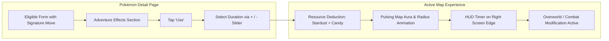
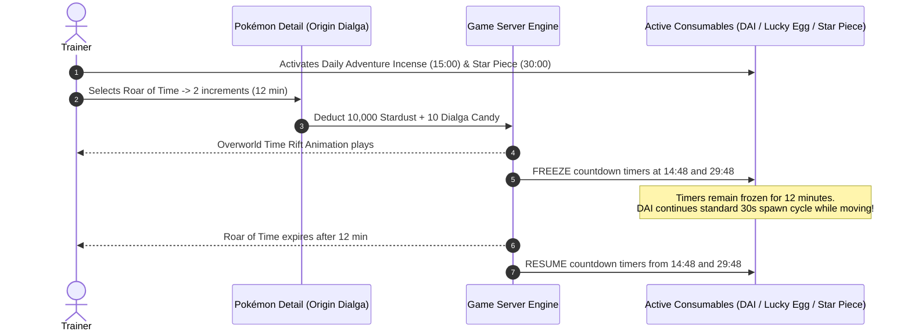
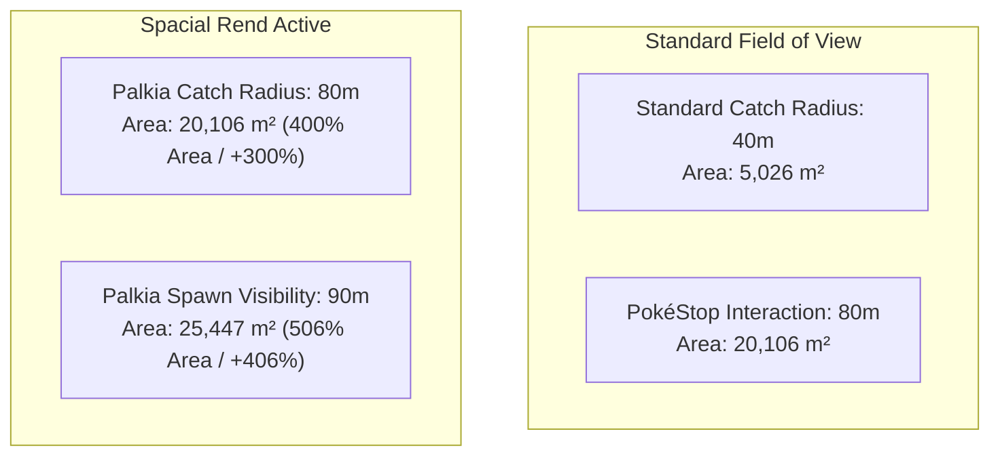
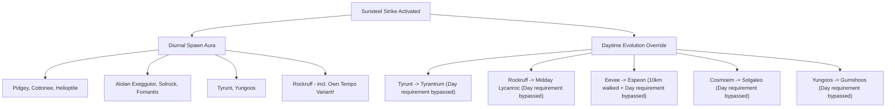
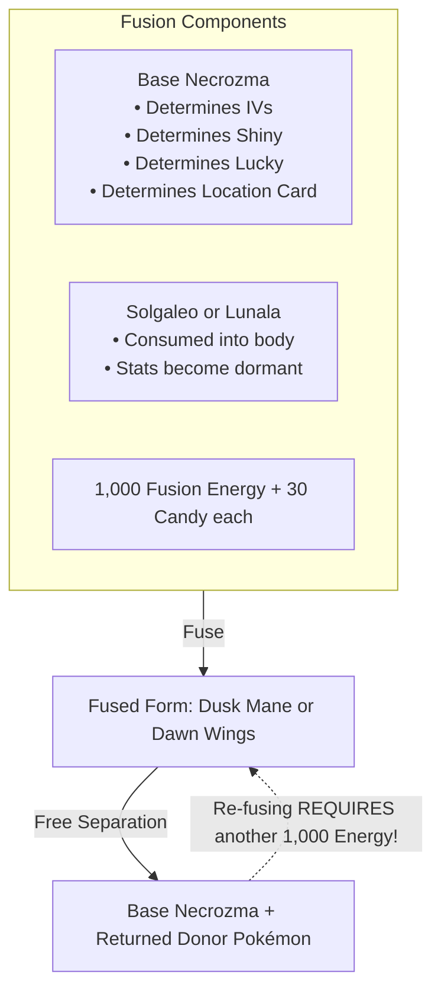

# Pokémon GO: Comprehensive Guide to Adventure Effects (Dobrodružné efekty)

**Author:** Antigravity Research & Engineering Team  
**Date:** September 2026  
**Document Status:** Complete / Definitive Primary Source Reference  
**Target Repository:** `DavidFaltus/Pokemon-GO-event-tracker`  
**Primary File Location:** `docs/research/pokemon-go-adventure-effects-complete-guide.md`  

---

## Table of Contents

1. [Executive Summary & Concept Overview](#1-executive-summary--concept-overview)
   - 1.1. What are Adventure Effects?
   - 1.2. In-Game UI, Activation Workflow & Duration Controls
   - 1.3. Global System Rules, Stacking & 24-Hour Caps
   - 1.4. Elite Charged TM Policy & Move Exclusivity
2. [Master Comparison & Economic Cost Matrix](#2-master-comparison--economic-cost-matrix)
3. [Deep Dive: Individual Pokémon & Adventure Effects](#3-deep-dive-individual-pokémon--adventure-effects)
   - 3.1. Origin Forme Dialga — **Roar of Time** (*Chronokinesis & Consumable Timer Freeze*)
   - 3.2. Origin Forme Palkia — **Spacial Rend** (*Spatial Distortion & Interaction Radius Expansion*)
   - 3.3. Dusk Mane Necrozma — **Sunsteel Strike** (*Solar Radiance, Diurnal Spawns & Daytime Evolution Override*)
   - 3.4. Dawn Wings Necrozma — **Moongeist Beam** (*Lunar Resonance, Nocturnal Spawns & Full Moon Bypass*)
   - 3.5. Black Kyurem — **Freeze Shock** (*Sub-Zero Paralysis & Encounter Immobilization*)
   - 3.6. White Kyurem — **Ice Burn** (*Thermal Deceleration & Ring Dilation*)
   - 3.7. Crowned Sword Zacian — **Behemoth Blade** (*Offensive Assault & Max Battle Penetration*)
   - 3.8. Crowned Shield Zamazenta — **Behemoth Bash** (*Bulwark Defense & Max Battle Fortification*)
   - 3.9. Eternatus — **Dynamax Cannon** (*Max Move Overdrive & Transcendent Level 4*)
   - 3.10. Mega Mewtwo X & Mega Mewtwo Y — **Dynamic Punch+ & Future Sight+** (*Super Mega Raid Breaker & Telepathic IV Appraisal*)
4. [Cross-System Mechanics, Edge Cases & Rule Matrix](#4-cross-system-mechanics-edge-cases--rule-matrix)
   - 4.1. Comprehensive Item & System Interaction Table
   - 4.2. Stacking with Mega Evolution & Primal Reversion
   - 4.3. Fusion Mechanics: IV, Shiny, Lucky Inheritance & Resource Economics
   - 4.4. Form Reversion vs Permanent Transformation Systems
   - 4.5. Movement Speed Caps, GPS Drift & Incense Spawn cadences
5. [Trainer Strategic Playbooks & Optimization Guides](#5-trainer-strategic-playbooks--optimization-guides)
   - 5.1. Playbook A: The Infinite Galarian Bird & Master Ball Expedition (Roar of Time + DAI)
   - 5.2. Playbook B: Massive Event Cluster Grinding (Spacial Rend + Fast Catch / Go Plus+)
   - 5.3. Playbook C: The Exponential Stardust / XP Blitz (Roar of Time + Multipliers + Star Piece / Lucky Egg)
   - 5.4. Playbook D: Legendary Duo/Solo & Super Mega Raid Clears (Behemoth Blade / Bash + Dynamic Punch+)
   - 5.5. Playbook E: High-IV Hunter & Hundo Sniping (Future Sight+ Visual Aura)
   - 5.6. Playbook F: Day/Night Evolutionary Backlog Clearance (Ursaluna, Lycanroc, Eeveelutions)
6. [Primary Source Citations & Official Documentation](#6-primary-source-citations--official-documentation)

---

## 1. Executive Summary & Concept Overview

### 1.1. What are Adventure Effects?

Introduced in February 2024 alongside the debut of Origin Forme Dialga and Origin Forme Palkia at Pokémon GO Tour: Sinnoh, **Adventure Effects** (*Dobrodružné efekty*) represent an active field mechanic distinct from ordinary combat attacks. 

Unlike standard Charged Attacks that function strictly inside Raid Battles, Gym Battles, Trainer Battles (GO Battle League), Team GO Rocket encounters, and Max Battles, **Adventure Effects are activated manually outside of battle directly from the Pokémon’s summary screen**. Upon activation, they consume **Stardust** and the Pokémon's corresponding **Candy** (or **Mega Energy**) to alter world rules, map boundaries, spawn pools, item clocks, combat statistics, or catch mechanics for a temporary duration.



### 1.2. In-Game UI, Activation Workflow & Duration Controls

1. **Access Points:**
   - **Pokémon Storage:** Open Main Menu $\rightarrow$ Pokémon $\rightarrow$ Select the eligible Pokémon.
   - **Buddy Screen:** If the eligible Pokémon is assigned as the active Buddy, tap the Buddy avatar on the bottom left $\rightarrow$ scroll to its profile page.
2. **Activation Interface:**
   - Located directly beneath the Fast and Charged Attacks section.
   - A dedicated **"Adventure Effects"** banner displays the move title, icon, and brief description alongside a **"Use"** button.
3. **Increment Selection:**
   - Tapping **Use** opens an increment adjustment modal with `+` and `–` buttons.
   - Each increment provides a set duration (typically **6 minutes** or **10 minutes**) and requires an exact unit of Stardust and Candy.
   - **Single Activation Limit:** A single tap of "Use" can queue up to **2 hours (120 minutes)** of active time.
   - **Continuous Extension:** Players can immediately re-enter the UI and tap "Use" again while the effect is running to queue additional time up to the hard ceiling.
4. **Visual & Auditory Cues:**
   - Upon activation, an animated full-screen distortion effect plays (e.g., diamond crystal rifts for Dialga, pink cosmic ripples for Palkia, solar flares for Dusk Mane, lunar eclipse flashes for Dawn Wings).
   - A circular timer icon appears permanently docked to the right edge of the Overworld Map View showing the remaining time.
   - The trainer's interaction radius ring pulses with a dedicated color aura.

### 1.3. Global System Rules, Stacking & 24-Hour Caps

* **The Single Active Effect Rule:** **Only ONE Adventure Effect may be active at any given moment.** Activating a second Adventure Effect is strictly prohibited by the game engine; the UI will prevent activation until the current effect expires or is manually replaced where prompt permitted.
* **Maximum Stacking Ceiling:** No Adventure Effect can be stacked beyond **24 total continuous hours** ($1,440$ minutes).
* **Stacking with Mega Evolution & Primal Reversion:** Adventure Effects **CAN** run concurrently with Mega Evolution or Primal Reversion. For instance, a player can activate Origin Palkia's Spacial Rend while Primal Kyogre is active to enjoy both the 80m catch radius and the Water/Electric/Bug XL Candy catch boost.
* **Fainted Pokémon Status:** An eligible Pokémon does **not** need to be fully revived or healed to activate its Adventure Effect from storage.

### 1.4. Elite Charged TM Policy & Move Exclusivity

* **Standard Rule:** Signature Charged Attacks granting Adventure Effects **cannot** be obtained via standard Charged TMs.
* **Elite Charged TM Restrictions:** Upon initial release, Niantic strictly barred Elite Charged TMs from learning any Adventure Effect move.
* **Limited Anniversary / Event Exceptions:** During special major events (such as the *Road of Legends* 10th Anniversary event leading up to GO Fest 2026), Niantic temporarily unlocked Elite Charged TM access for Origin Dialga (*Roar of Time*) and Origin Palkia (*Spacial Rend*). Outside announced event windows, obtaining these moves requires catching the Pokémon during dedicated raid rotations or performing the prerequisite Fusion.

---

## 2. Master Comparison & Economic Cost Matrix

The following table summarizes all 11 Pokémon possessing Adventure Effects released or announced through 2026:

| Pokémon | Form | Signature Attack | Increment Duration | Cost per Increment | Max Stack Limit | Total Cost for 24h Stack | Overworld / Field Mechanism |
| :--- | :--- | :--- | :--- | :--- | :--- | :--- | :--- |
| **Dialga** | Origin Forme | **Roar of Time** | 6 min | 5,000 Dust + 5 Candy | 24 Hours (240 inc.) | 1,200,000 Dust + 1,200 Candy | Freezes countdown timer on Incense, Daily Adventure Incense, Lucky Egg, Star Piece |
| **Palkia** | Origin Forme | **Spacial Rend** | 10 min | 5,000 Dust + 5 Candy | 24 Hours (144 inc.) | 720,000 Dust + 720 Candy | Expands wild Pokémon spawn visibility to 90m and catch radius to 80m (4x area) |
| **Necrozma** | Dusk Mane | **Sunsteel Strike** | 10 min | 3,000 Dust + 3 Candy | 24 Hours (144 inc.) | 432,000 Dust + 432 Candy | Attracts diurnal wild Pokémon (Incense effect); enables daytime evolutions anytime |
| **Necrozma** | Dawn Wings | **Moongeist Beam** | 10 min | 3,000 Dust + 3 Candy | 24 Hours (144 inc.) | 432,000 Dust + 432 Candy | Attracts nocturnal wild Pokémon; enables nighttime evolutions anytime (incl. Ursaluna) |
| **Kyurem** | Black Kyurem | **Freeze Shock** | 10 min | 5,000 Dust + 5 Candy | 24 Hours (144 inc.) | 720,000 Dust + 720 Candy | Paralyzes wild Pokémon; completely prevents movement, jump, and attack animations |
| **Kyurem** | White Kyurem | **Ice Burn** | 10 min | 5,000 Dust + 3 Candy | 24 Hours (144 inc.) | 720,000 Dust + 432 Candy | Decelerates the target catch ring speed, significantly easing Excellent Throws |
| **Zacian** | Crowned Sword | **Behemoth Blade** | 6 min | 5,000 Dust + 5 Candy | 24 Hours (240 inc.) | 1,200,000 Dust + 1,200 Candy | Increases Pokémon Attack by +10% in Raids and +5% in Max Battles |
| **Zamazenta** | Crowned Shield | **Behemoth Bash** | 6 min | 5,000 Dust + 5 Candy | 24 Hours (240 inc.) | 1,200,000 Dust + 1,200 Candy | Increases Pokémon Defense by +10% in Raids and +5% in Max Battles |
| **Eternatus** | Standard Form | **Dynamax Cannon** | 10 min | 5,000 Dust + 30 Candy | 24 Hours (144 inc.) | 720,000 Dust + 4,320 Candy | Overdrives Max Moves in Max Battles (+1 Level; unlocks locked to L1, boosts L3 to L4) |
| **Mewtwo** | Mega Mewtwo X | **Dynamic Punch+** | 10 min | Mewtwo Energy + Candy | 24 Hours (144 inc.) | Scaled Energy + Candy | +Damage vs Mega Pokémon in Mega Raids; breaks 2 shields simultaneously in Super Mega Raids |
| **Mewtwo** | Mega Mewtwo Y | **Future Sight+** | 10 min | Mewtwo Energy + Candy | 24 Hours (144 inc.) | Scaled Energy + Candy | Telepathic Appraisal: 3-Star (82%+ IV) wild Pokémon visibly glow on encounter screen |

---

## 3. Deep Dive: Individual Pokémon & Adventure Effects

```
                                 ADVENTURE EFFECTS
                                         │
        ┌────────────────────────────────┼────────────────────────────────┐
        ▼                                ▼                                ▼
  [TEMPORAL / SPATIAL]           [ASTRAL / DIURNAL]             [TACTICAL / COMBAT]
   Origin Dialga (Roar)           Dusk Mane (Sunsteel)           Crowned Zacian (Blade)
   Origin Palkia (Spacial)        Dawn Wings (Moongeist)         Crowned Zamazenta (Bash)
                                                                 Eternatus (Dynamax Cannon)
                                                                 Mega Mewtwo X/Y (+Attacks)
```

---

### 3.1. Origin Forme Dialga — Roar of Time

* **Species:** Dialga (Origin Forme) — *The Temporal Pokémon* (Dragon / Steel)
* **Signature Charged Attack:** **Roar of Time** (*Časový řev*)
  * **Trainer Battles:** 150 Power (65 Energy, Dragon)
  * **Gyms & Raids:** 160 Power (1-bar, 100 Energy, Dragon)
* **Adventure Effect Cost & Timing:**
  * **Per Increment:** 6 minutes $\rightarrow$ **5,000 Stardust + 5 Dialga Candy**
  * **Single Tap UI Max:** 2 hours (20 increments) $\rightarrow$ 100,000 Stardust + 100 Dialga Candy
  * **Total 24h Ceiling:** 24 hours (240 increments) $\rightarrow$ **1,200,000 Stardust + 1,200 Dialga Candy**

#### Exact Field Mechanism
Roar of Time warps time around the trainer, temporarily halting the countdown timers on specific consumable inventory boosts. While active, the item icons in the Overworld HUD display a distinct "pause" overlay symbol.



#### Affected vs. Unaffected Items Matrix
* **PAUSED ITEMS (Eligible):**
  1. **Standard Incense** (Green) & **Event Incense** (Orange)
  2. **Daily Adventure Incense** (Blue, 15-minute standard duration)
  3. **Lucky Egg** (Double XP boost)
  4. **Star Piece** (+50% Stardust boost)
* **UNPAUSED ITEMS (Strictly Ineligible):**
  - **Mystery Box** (Meltan Box — timer continues to drain)
  - **Coin Bag** (Roaming Form Gimmighoul — timer continues to drain)
  - **Lure Modules** (All types — Lures are anchored to PokéStops, not player inventories)
  - **Mega Evolution / Primal Reversion** (8-hour cooldown clock is server-fixed)
  - **Max Mushrooms** / Dynamax battle timers

#### Key Rules & Tactical Edge Cases
1. **Activation Order Agnostic:** Trainers may activate Roar of Time *before* popping a Star Piece or Lucky Egg, or *afterwards*. If activated beforehand, newly activated items instantly spawn with frozen clocks at their full initial duration.
2. **The Daily Adventure Incense (DAI) Loophole:** DAI's normal 15-minute restriction is completely bypassed. If extended for 60 minutes with Roar of Time, players receive **75 minutes of continuous DAI spawns**, provided they maintain a brisk, straight-line walking speed ($\sim 6 - 10 \text{ km/h}$). This is the single highest-yield method for hunting **Galarian Articuno, Zapdos, and Moltres**.

#### How to Obtain
* **Debut:** Pokémon GO Tour: Sinnoh (February 2024).
* **Guaranteed Signature Move:** Players selecting the **Diamond Badge** during GO Tour: Sinnoh obtained a 100% guarantee that captured Origin Forme Dialga knew Roar of Time. Pearl Badge players had a random chance ($\sim 1/10$).
* **Elite TM Policy:** Ineligible via standard Elite Charged TM until the limited-time *Road of Legends* 10th Anniversary event in 2026.

---

### 3.2. Origin Forme Palkia — Spacial Rend

* **Species:** Palkia (Origin Forme) — *The Spatial Pokémon* (Water / Dragon)
* **Signature Charged Attack:** **Spacial Rend** (*Prostorové štěpení*)
  * **Trainer Battles:** 95 Power (50 Energy, Dragon)
  * **Gyms & Raids:** 160 Power (1-bar, 100 Energy, Dragon)
* **Adventure Effect Cost & Timing:**
  * **Per Increment:** 10 minutes $\rightarrow$ **5,000 Stardust + 5 Palkia Candy**
  * **Single Tap UI Max:** 2 hours (12 increments) $\rightarrow$ 60,000 Stardust + 60 Palkia Candy
  * **Total 24h Ceiling:** 24 hours (144 increments) $\rightarrow$ **720,000 Stardust + 720 Palkia Candy**

#### Exact Field Mechanism & Spatial Mathematics
Spacial Rend distorts physical space, expanding the trainer's encounter reach across the map.



* **Standard Catch Radius:** $r = 40 \text{ m} \implies \text{Area} = \pi (40)^2 \approx 5,026.5 \text{ m}^2$.
* **Spacial Rend Catch Radius:** $r = 80 \text{ m} \implies \text{Area} = \pi (80)^2 \approx 20,106.2 \text{ m}^2$.
  * **Net Gain:** **$4.0\times$ baseline area** (+300% expansion). Wild Pokémon within 80 meters can be tapped, encountered, and caught.
* **Spacial Rend Spawn Visibility Radius:** $r = 90 \text{ m} \implies \text{Area} = \pi (90)^2 \approx 25,446.9 \text{ m}^2$.
  * Wild spawns appear on the map up to 90 meters away.
* **PokéStop & Gym Interaction Range:** **UNMODIFIED.** Spacial Rend does **NOT** increase interaction range with PokéStops or Gyms beyond their standard permanent 80m limit.

#### Key Rules & Tactical Edge Cases
1. **Stationary / Low-Mobility Hunting:** Essential for trainers playing from fixed locations (hotels, airports, homes, cafes) or players with restricted mobility. It effectively pulls 4 times as many natural cluster spawns into reach.
2. **Accessing Inaccessible Terrain:** Allows encountering Pokémon spawned inside private property, construction zones, water bodies, or cliffs without trespassing.
3. **Auto-Catcher Reach:** Auto-catchers (GO Plus+, Gotcha) track encounters based on the expanded 80m catch ring, dramatically boosting passive collection speed.

#### How to Obtain
* **Debut:** Pokémon GO Tour: Sinnoh (February 2024).
* **Guaranteed Move:** Choosing the **Pearl Badge** guaranteed Spacial Rend upon Origin Palkia raid capture; Diamond players had a random chance.
* **Elite TM Policy:** Elite Charged TM locked until the limited-time *Road of Legends* 2026 window.

---

### 3.3. Dusk Mane Necrozma — Sunsteel Strike

* **Species:** Necrozma (Dusk Mane Form) — *The Prism Pokémon* (Psychic / Steel)
* **Signature Charged Attack:** **Sunsteel Strike** (*Úder ocelového slunce*)
  * **Trainer Battles:** 135 Power (65 Energy, Steel)
  * **Gyms & Raids:** 230 Power (1-bar, 100 Energy, Steel)
* **Adventure Effect Cost & Timing:**
  * **Per Increment:** 10 minutes $\rightarrow$ **3,000 Stardust + 3 Necrozma Candy**
  * **Single Tap UI Max:** 2 hours (12 increments) $\rightarrow$ 36,000 Stardust + 36 Necrozma Candy
  * **Total 24h Ceiling:** 24 hours (144 increments) $\rightarrow$ **432,000 Stardust + 432 Necrozma Candy**

#### Exact Field Mechanism
Harnesses solar radiance to simulate midday daylight conditions regardless of local real-world time:
1. **Incense-Like Diurnal Spawns:** Emits an aura that attracts daylight-associated wild Pokémon directly to the player's avatar.
2. **Daytime Evolution Override:** Any Pokémon requiring daytime or sunlight to evolve can be evolved at any hour of the night while the effect is active.



#### Daytime Evolution Target Table
| Base Pokémon | Evolution Form | Standard Requirement | Sunsteel Strike Bypass Effect |
| :--- | :--- | :--- | :--- |
| **Tyrunt** | Tyrantrum | 50 Candy + Local Daytime | Can evolve at midnight |
| **Rockruff** | Lycanroc (Midday Form) | 50 Candy + Local Daytime | Can evolve at midnight |
| **Eevee** | Espeon | 10km Walked as Buddy + Local Daytime | Can evolve into Espeon at night (still requires 10km walked) |
| **Cosmoem** | Solgaleo | 100 Cosmog Candy + Local Daytime | Can evolve into Solgaleo at night |
| **Yungoos** | Gumshoos | 50 Candy + Local Daytime | Can evolve at night |

#### Item Mutual Exclusivity Rules
Sunsteel Strike acts as its own Incense system. Consequently, it **CANNOT be active simultaneously with:**
- Standard Incense (Green/Orange)
- Daily Adventure Incense (DAI)
- Mystery Box (Meltan)
- Coin Bag (Gimmighoul)
- Other Adventure Effects

#### How to Obtain & Fusion Mechanics
1. **Base Ingredients:**
   - Standard Necrozma (retains IVs, Shiny status, Lucky status, and Location Card)
   - Solgaleo (consumed into the fusion; Solgaleo's IVs/cosmetics are dormant)
2. **Fusion Cost:**
   - **1,000 Solar Fusion Energy** (Earned from Dusk Mane Necrozma Raids or Special Research)
   - **30 Necrozma Candy**
   - **30 Cosmog Candy**
3. **Move Learning:** Dusk Mane Necrozma automatically learns Sunsteel Strike upon fusion.
4. **Reversibility:** Unfusing is 100% free (0 Energy, 0 Candy). However, re-fusing requires another 1,000 Solar Fusion Energy.
5. **TM Restrictions:** Cannot be learned or restored via regular or Elite Charged TM.

---

### 3.4. Dawn Wings Necrozma — Moongeist Beam

* **Species:** Necrozma (Dawn Wings Form) — *The Prism Pokémon* (Psychic / Ghost)
* **Signature Charged Attack:** **Moongeist Beam** (*Paprsek měsíčního přízraku*)
  * **Trainer Battles:** 135 Power (65 Energy, Ghost)
  * **Gyms & Raids:** 230 Power (1-bar, 100 Energy, Ghost)
* **Adventure Effect Cost & Timing:**
  * **Per Increment:** 10 minutes $\rightarrow$ **3,000 Stardust + 3 Necrozma Candy**
  * **Single Tap UI Max:** 2 hours (12 increments) $\rightarrow$ 36,000 Stardust + 36 Necrozma Candy
  * **Total 24h Ceiling:** 24 hours (144 increments) $\rightarrow$ **432,000 Stardust + 432 Necrozma Candy**

#### Exact Field Mechanism
Harnesses lunar energy to simulate deep nighttime and full moon conditions regardless of local daylight:
1. **Incense-Like Nocturnal Spawns:** Attracts nighttime-associated wild Pokémon directly to the player.
2. **Nighttime & Full Moon Evolution Override:** Any Pokémon requiring nighttime or a full moon can be evolved during bright midday sun.

#### Nocturnal Attraction Pool
* Alolan Rattata
* Clefairy
* Alolan Marowak
* Gligar
* Galarian Zigzagoon
* Lunatone
* Munna
* Amaura
* **Rockruff** (including chance of the rare "Own Tempo" form capable of Dusk Form evolution)

#### Nighttime Evolution Target Table
| Base Pokémon | Evolution Form | Standard Requirement | Moongeist Beam Bypass Effect |
| :--- | :--- | :--- | :--- |
| **Amaura** | Aurorus | 50 Candy + Local Nighttime | Can evolve at noon |
| **Rockruff** | Lycanroc (Midnight Form) | 50 Candy + Local Nighttime | Can evolve at noon |
| **Eevee** | Umbreon | 10km Walked as Buddy + Local Nighttime | Can evolve into Umbreon during day (still requires 10km walked) |
| **Cosmoem** | Lunala | 100 Cosmog Candy + Local Nighttime | Can evolve into Lunala during day |
| **Ursaring** | **Ursaluna** | 100 Teddiursa Candy + **Real-World Full Moon** | **Bypasses Full Moon entirely!** Evolve into Ursaluna on demand |

> [!IMPORTANT]
> **The Ursaluna Full Moon Bypass:** In normal gameplay, Ursaring can only evolve into Ursaluna roughly once every 29.5 days when Niantic activates the in-game full moon phase. **Moongeist Beam is the only player-controlled mechanism in Pokémon GO that artificially triggers the full moon flag**, allowing instant Ursaluna evolutions anytime.

#### How to Obtain & Fusion Mechanics
1. **Base Ingredients:** Standard Necrozma + Lunala.
2. **Fusion Cost:** **1,000 Lunar Fusion Energy** + 30 Necrozma Candy + 30 Cosmog Candy.
3. Automatically learns Moongeist Beam upon fusion.
4. Cannot be taught via Charged TM or Elite Charged TM.

---

### 3.5. Black Kyurem — Freeze Shock

* **Species:** Black Kyurem — *The Boundary Pokémon* (Dragon / Ice)
* **Signature Charged Attack:** **Freeze Shock** (*Zmrazující šok*)
* **Adventure Effect Cost & Timing:**
  * **Per Increment:** 10 minutes $\rightarrow$ **5,000 Stardust + 5 Kyurem Candy**
  * **Single Tap UI Max:** 2 hours (12 increments) $\rightarrow$ 60,000 Stardust + 60 Kyurem Candy
  * **Total 24h Ceiling:** 24 hours (144 increments) $\rightarrow$ **720,000 Stardust + 720 Kyurem Candy**

#### Exact Field Mechanism
Black Kyurem discharges electrically charged sub-zero ice across the overworld. While active:
* **Complete Encounter Paralysis:** All wild Pokémon encountered (wild spawns, incense, lures, research rewards, and raid catches) are completely immobilized.
* **Elimination of Attack & Dodge Animations:** Pokémon cannot jump, leap, dodge sideways, headbutt, or bat away Poké Balls.
* **Target Ring Permanence:** The catch ring is permanently visible and centered, never interrupted by attack retaliation.

#### Synergy & Auto-Catchers
* **Pokémon GO Plus+ / Auto-Catchers:** Significantly reduces flee rates on hardware accessories by eliminating target state changes.
* **Manual Fast-Catch:** Facilitates lightning-fast manual catching without wasting balls on unexpected attack deflections.

#### How to Obtain & Fusion Mechanics
1. **Fusion Recipe:** Kyurem (must already know **Glaciate**) + Zekrom.
2. Upon fusion, Glaciate converts directly into **Freeze Shock**.
3. If unfused, Freeze Shock reverts back to Glaciate.
4. **Tour Pass Milestones:** Debuted during Pokémon GO Tour: Unova (2025). Progressing the Black Version Tour Pass provided duration multiplier boosts ($1.5\times$, $2\times$, $3\times$ duration per increment).

---

### 3.6. White Kyurem — Ice Burn

* **Species:** White Kyurem — *The Boundary Pokémon* (Dragon / Ice)
* **Signature Charged Attack:** **Ice Burn** (*Mrazivý plamen*)
* **Adventure Effect Cost & Timing:**
  * **Per Increment:** 10 minutes $\rightarrow$ **5,000 Stardust + 3 Kyurem Candy** *(Note: Discounted candy cost compared to Black Kyurem)*
  * **Single Tap UI Max:** 2 hours (12 increments) $\rightarrow$ 60,000 Stardust + 36 Kyurem Candy
  * **Total 24h Ceiling:** 24 hours (144 increments) $\rightarrow$ **720,000 Stardust + 432 Kyurem Candy**

#### Exact Field Mechanism
White Kyurem radiates extreme chilling thermal energy that slows atmospheric movement:
* **Reticle Deceleration:** The contracting target catch ring (Inner Colored Ring) contracts at **roughly 30% to 50% of its normal speed**.
* **Excellent Throw Precision:** The window for landing an **Excellent Throw** remains open for significantly longer, making Excellent throws near-effortless even on erratic or distant raid bosses (e.g., Zubat, Kartana, Kyogre).
* **XP Stacking:** Highly synergistic with Lucky Eggs and 2x–4x Catch XP event multipliers.

#### How to Obtain & Fusion Mechanics
1. **Fusion Recipe:** Kyurem (must know **Glaciate**) + Reshiram.
2. Glaciate transforms directly into **Ice Burn**.
3. Reverts to Glaciate upon separation.
4. Progressing the White Version Tour Pass during GO Tour: Unova boosted duration up to $3\times$.

---

### 3.7. Crowned Sword Zacian — Behemoth Blade

* **Species:** Zacian (Crowned Sword Form) — *The Warrior Pokémon* (Fairy / Steel)
* **Signature Charged Attack:** **Behemoth Blade** (*Kolosální čepel*)
* **Adventure Effect Cost & Timing:**
  * **Per Increment:** 6 minutes $\rightarrow$ **5,000 Stardust + 5 Zacian Candy**
  * **Single Tap UI Max:** 2 hours (20 increments) $\rightarrow$ 100,000 Stardust + 100 Zacian Candy
  * **Total 24h Ceiling:** 24 hours (240 increments) $\rightarrow$ **1,200,000 Stardust + 1,200 Zacian Candy**

#### Exact Field Mechanism & Combat Bonuses
Behemoth Blade functions as a temporary combat amplifier affecting active team members:
* **Raid Battles:** Grants a flat **+10% damage bonus** to all attacks dealt by the player's Pokémon in Gym Raids.
* **Max Battles:** Grants a flat **+5% damage bonus** in Max Battles at Power Spots.
* **Max Battle Entrance:** Crowned Sword Zacian is exclusively permitted to participate in Max Battles despite not being a Dynamax/Gigantamax Pokémon, allowing players to level up Behemoth Blade as a Max Attack.

#### Form Transformation: Permanent Energy Unlock
* **Transformation Cost:** 1,000 **Crowned Sword Energy** + Zacian knowing **Iron Head**.
* **Iron Head Conversion:** Iron Head transforms into Behemoth Blade upon assuming Crowned Sword form.
* **No Recurring Energy Fee:** *Crucial mechanic distinction* — Once a specific Zacian has been unlocked with 1,000 Energy, it can change between Hero of Many Battles and Crowned Sword form **infinitely at zero resource cost**.

---

### 3.8. Crowned Shield Zamazenta — Behemoth Bash

* **Species:** Zamazenta (Crowned Shield Form) — *The Warrior Pokémon* (Fighting / Steel)
* **Signature Charged Attack:** **Behemoth Bash** (*Kolosální štít*)
* **Adventure Effect Cost & Timing:**
  * **Per Increment:** 6 minutes $\rightarrow$ **5,000 Stardust + 5 Zamazenta Candy**
  * **Single Tap UI Max:** 2 hours (20 increments) $\rightarrow$ 100,000 Stardust + 100 Zamazenta Candy
  * **Total 24h Ceiling:** 24 hours (240 increments) $\rightarrow$ **1,200,000 Stardust + 1,200 Zamazenta Candy**

#### Exact Field Mechanism & Combat Bonuses
Behemoth Bash fortifies team structural durability:
* **Raid Battles:** Grants a **+10% defense increase** (reducing incoming boss damage) across all raid participants.
* **Max Battles:** Grants a **+5% defense increase** in Max Battles, significantly mitigating heavy Tier 5/6 boss nukes.
* **Max Guard Synergy:** Allows unlocking and training the exclusive Max Guard move on Zamazenta.
* **Form Transformation:** 1,000 Crowned Shield Energy + Iron Head. Permanent free switching once unlocked.

---

### 3.9. Eternatus — Dynamax Cannon

* **Species:** Eternatus — *The Gigantic Pokémon* (Poison / Dragon)
* **Signature Charged Attack:** **Dynamax Cannon** (*Dynamaxové dělo*)
* **Adventure Effect Cost & Timing:**
  * **Per Increment:** 10 minutes $\rightarrow$ **5,000 Stardust + 30 Eternatus Candy**
  * **Single Tap UI Max:** 2 hours (12 increments) $\rightarrow$ 60,000 Stardust + 360 Eternatus Candy
  * **Total 24h Ceiling:** 24 hours (144 increments) $\rightarrow$ **720,000 Stardust + 4,320 Eternatus Candy**

#### Exact Field Mechanism & Max Move Overdrive
Debuting during *Pokémon GO Fest 2025: Max Finale*, Dynamax Cannon is tailored specifically to dominate Max Battles at Power Spots:
1. **Locked Max Moves Activation:** Any Max Move that is locked (Level 0) on your participating Max Pokémon is temporarily unlocked to **Level 1**.
2. **Transcendent Level 4 Overdrive:** Any Max Move already trained to the maximum cap of **Level 3** is overdriven to **Level 4**, unlocking power scaling unattainable through standard Max Particle upgrades.

---

### 3.10. Mega Mewtwo X & Mega Mewtwo Y — Dynamic Punch+ & Future Sight+

* **Species:** Mewtwo (Mega Mewtwo X / Mega Mewtwo Y) — *The Genetic Pokémon*
* **Debut:** Pokémon GO Fest 2026: Mega Finale
* **Unique Mechanics:** Once Mewtwo has Mega-Evolved into form X or Y and unlocked its secondary Charged Attack, **its Adventure Effect can be activated even when Mewtwo is NOT actively Mega-Evolved**.

#### Mega Mewtwo X: Dynamic Punch+
* **Cost:** Mewtwo Mega Energy X + Mewtwo Candy
* **Adventure Effect:**
  * Increases damage output against Mega-Evolved Pokémon in Mega Raids and Super Mega Raids.
  * **Shield Breaker:** In Super Mega Raids, attacks **break two boss shields at once** instead of one.

#### Mega Mewtwo Y: Future Sight+
* **Cost:** Mewtwo Mega Energy Y + Mewtwo Candy
* **Adventure Effect — Telepathic IV Appraisal:**
  * When entering a wild encounter while Future Sight+ is active, any Pokémon that possesses **3-star appraisal (82.2% IV or higher, including 100% IV Hundos) emits a radiant visual aura/glow**.
  * Eliminates the need to catch and manually appraise hundreds of wild spawns during rapid grinding.

---

## 4. Cross-System Mechanics, Edge Cases & Rule Matrix

### 4.1. Comprehensive Item & System Interaction Table

| System / Item | Roar of Time (Dialga) | Spacial Rend (Palkia) | Sunsteel Strike (Dusk Mane) | Moongeist Beam (Dawn Wings) | Freeze Shock (Black Kyurem) | Ice Burn (White Kyurem) | Behemoth Moves (Zacian/Zamazenta) |
| :--- | :--- | :--- | :--- | :--- | :--- | :--- | :--- |
| **Standard Incense** | **PAUSES TIMER** | Stacks (Spawns at 80m) | **BLOCKED (Incompatible)** | **BLOCKED (Incompatible)** | Stacks (Spawns frozen) | Stacks (Slow ring) | Stacks |
| **Daily Adventure Incense** | **PAUSES TIMER** | Stacks (Spawns at 80m) | **BLOCKED (Incompatible)** | **BLOCKED (Incompatible)** | Stacks (Spawns frozen) | Stacks (Slow ring) | Stacks |
| **Lucky Egg** | **PAUSES TIMER** | Stacks | Stacks | Stacks | Stacks | Stacks (Ideal combo) | Stacks |
| **Star Piece** | **PAUSES TIMER** | Stacks | Stacks | Stacks | Stacks | Stacks | Stacks |
| **Mystery Box (Meltan)** | *No effect (drains)* | Stacks | **BLOCKED (Incompatible)** | **BLOCKED (Incompatible)** | Stacks | Stacks | Stacks |
| **Coin Bag (Gimmighoul)**| *No effect (drains)* | Stacks | **BLOCKED (Incompatible)** | **BLOCKED (Incompatible)** | Stacks | Stacks | Stacks |
| **PokéStop Lures** | *No effect (drains)* | Stacks (Spawns at 80m) | Stacks | Stacks | Stacks | Stacks | Stacks |
| **Mega / Primal Timer** | *No effect (drains)* | Stacks concurrently | Stacks concurrently | Stacks concurrently | Stacks concurrently | Stacks concurrently | Stacks concurrently |
| **Auto-Catchers (Go Plus+)**| Stacks | Stacks (Locks on at 80m)| Stacks | Stacks | **100% Target Stability**| Stacks | Stacks |

### 4.2. Stacking with Mega Evolution & Primal Reversion

Adventure Effects function as an independent engine layer from the Mega Evolution system. 
* A trainer can run **Primal Groudon** for Fire/Ground/Grass bonuses while running **Roar of Time** to preserve a Star Piece.
* A trainer can run **Mega Rayquaza** for Dragon catch candy boosts while running **Spacial Rend** to expand the catch ring to 80 meters.

### 4.3. Fusion Mechanics: IV, Shiny, Lucky Inheritance & Resource Economics



* **Stat Dominance:** The **Base Pokémon** (Necrozma or Kyurem) dictates 100% of the IVs, Lucky status, Shiny status, Level, and Location Card of the resulting fusion. The donor Pokémon (Solgaleo, Lunala, Reshiram, Zekrom) contributes nothing to stats.
* **Separation Penalty:** While separating a fusion costs 0 resources, **re-fusing requires spending another full 1,000 Fusion Energy**. Never separate a fused Legendary unless strictly necessary.
* **Trading Prohibition:** Fused Pokémon cannot be traded, transferred to Professor Willow, or sent to Pokémon HOME. To trade, you must separate them first.

### 4.4. Movement Speed Caps, GPS Drift & Incense Spawn Cadences

* **Daily Adventure Incense (DAI) Mechanics:** DAI requires continuous displacement ($\sim 100 \text{ meters per 30 seconds}$ or $\sim 6 - 10 \text{ km/h}$). Sitting stationary while Roar of Time is active will result in **zero** DAI spawns.
* **Speed Caps:** If moving above $20 \text{ km/h}$ (passenger cap), wild Pokémon will flee after 1 throw regardless of whether Freeze Shock or Spacial Rend is active.

---

## 5. Trainer Strategic Playbooks & Optimization Guides

### 5.1. Playbook A: The Infinite Galarian Bird & Master Ball Expedition
* **Core Combo:** Daily Adventure Incense + Origin Dialga (Roar of Time).
* **Target Objective:** Catching Galarian Articuno, Zapdos, or Moltres.
* **Execution:**
  1. Travel to a straight, unobstructed walking route (long parkway or pedestrian boulevard).
  2. Activate Daily Adventure Incense (15 minutes).
  3. Immediately open storage and activate Roar of Time for 4 to 8 increments (24 to 48 minutes).
  4. Walk briskly in a single direction without stopping or doubling back.
  5. Spawns will continue every 30 seconds for the entire frozen duration, turning a stressful 15-minute rush into a relaxed 60-minute Legendary hunt.

### 5.2. Playbook B: Massive Event Cluster Grinding
* **Core Combo:** Origin Palkia (Spacial Rend) + Pokémon GO Plus+ / Fast Catch.
* **Target Objective:** Maximizing catch volume during Community Days, GO Wild Area, or GO Fest.
* **Execution:**
  1. Position in a high-density PokéStop/spawn cluster (downtown, botanical garden).
  2. Activate Spacial Rend in 2-hour blocks.
  3. The encounter circle expands to 80 meters, tripling the simultaneous Pokémon visible on screen.
  4. Utilize fast-catch mechanics or let an auto-catcher sweep perimeter spawns that would normally require walking an extra 40 meters.

### 5.3. Playbook C: The Exponential Stardust / XP Blitz
* **Core Combo:** Roar of Time + 3x/4x Catch Dust/XP Event + 1 Star Piece + 1 Lucky Egg.
* **Target Objective:** Reaching 1,000,000+ Stardust or 5,000,000+ XP in a single session.
* **Execution:**
  1. Wait for a Community Day or Event featuring a $3\times$ Catch Stardust or $4\times$ Catch XP bonus.
  2. Pop 1 Star Piece and 1 Lucky Egg.
  3. Immediately activate Roar of Time for 120 minutes (costs 100k dust, but saves multiple rare Star Pieces and generates 300k+ net dust).
  4. Catch continuously with fast-catch technique.

### 5.4. Playbook D: Legendary Duo/Solo & Super Mega Raid Clears
* **Core Combo:** Crowned Sword Zacian (Behemoth Blade) + Mega Mewtwo X (Dynamic Punch+).
* **Target Objective:** Beating high-tier raids with minimal players (short-manning).
* **Execution:**
  1. Activate Behemoth Blade for a party-wide +10% attack surge.
  2. If tackling Super Mega Raids, activate Mega Mewtwo X's Dynamic Punch+ to shatter 2 shields per charge move, bypassing boss invulnerability phases in record time.

### 5.5. Playbook E: High-IV Hunter & Hundo Sniping
* **Core Combo:** Mega Mewtwo Y (Future Sight+) + High-Density Cluster.
* **Target Objective:** Pinpointing 100% IV (Hundo) or PvP 3-star IV Pokémon without catching trash.
* **Execution:**
  1. Activate Future Sight+.
  2. Tap wild spawns rapidly.
  3. If the Pokémon does NOT emit a telepathic aura upon entering the catch encounter, instantly run away.
  4. Only catch spawns that glow with the 3-star appraisal aura.

### 5.6. Playbook F: Day/Night Evolutionary Backlog Clearance
* **Core Combo:** Dusk Mane Necrozma (Sunsteel Strike) & Dawn Wings Necrozma (Moongeist Beam).
* **Target Objective:** Clearing time-locked evolution tasks without waiting for real-world moons or sunrises.
* **Execution:**
  1. **For Ursaluna:** Activate Dawn Wings Necrozma (Moongeist Beam). Open storage, select Ursaring, and evolve immediately without waiting a month for a full moon.
  2. **For Espeon / Umbreon:** Walk Eevee 10km. Use Sunsteel Strike at night for Espeon, or Moongeist Beam during the day for Umbreon.

---

## 6. Primary Source Citations & Official Documentation

1. **Niantic Support & Help Center:**
   - *What are Adventure Effects?* — Official Help Article ID 4386:  
     `https://niantic.helpshift.com/hc/en/6-pokemon-go/faq/4386-what-are-adventure-effects/`
2. **Pokémon GO Official News (pokemongolive.com / pokemongo.com):**
   - *The Origin Formes of Dialga and Palkia have emerged in Pokémon GO, bringing almighty Adventure Effects!* (Feb 2024):  
     `https://pokemongo.com/news/origin-forme-adventure-effects-dialga-palkia`
   - *Harness the power of the sun and moon with two new Adventure Effects: Sunsteel Strike and Moongeist Beam!* (GO Fest 2024):  
     `https://pokemongo.com/news/fusion-adventure-effects-necrozma`
   - *Behold the power of Pokémon fusion! Dusk Mane and Dawn Wings Necrozma Debut* (GO Fest 2024):  
     `https://pokemongo.com/news/dusk-mane-dawn-wings-necrozma-fusion`
   - *Enhance your encounters with Black Kyurem and White Kyurem’s new Adventure Effects!* (GO Tour: Unova 2025):  
     `https://pokemongo.com/news/fusion-adventure-effects-kyurem`
   - *Unleash the power of Zacian and Zamazenta with new Crowned Sword and Crowned Shield Energy!* (GO Fest 2025):  
     `https://pokemongo.com/news/crowned-energy-resource-zacian-zamazenta`
   - *Unleash the power of the sword and shield with two new Adventure Effects: Behemoth Blade and Behemoth Bash!* (GO Fest 2025):  
     `https://pokemongo.com/news/adventure-effects-crowned-zacian-zamazenta`
   - *Harness the power of Eternatus with the new Dynamax Cannon Adventure Effect!* (GO Fest 2025: Max Finale):  
     `https://pokemongo.com/news/adventure-effect-eternatus`
   - *More mega moments! Additional Charged Attacks and Mega Mewtwo Adventure Effects debut during Mega Finale!* (GO Fest 2026):  
     `https://pokemongo.com/news/more-mega-updates-2026`
