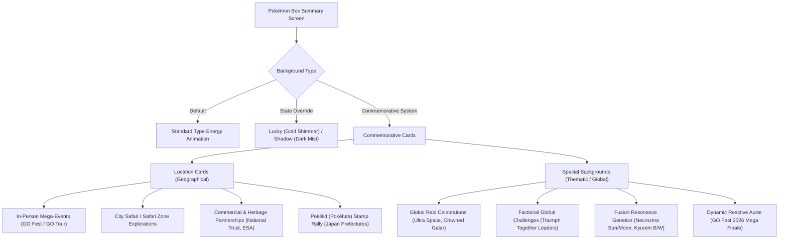
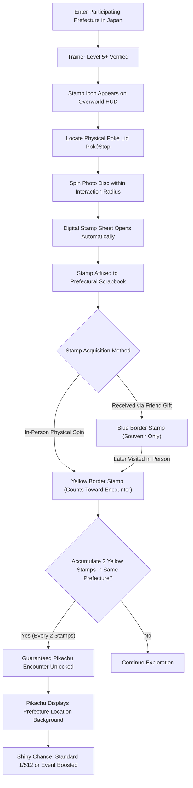
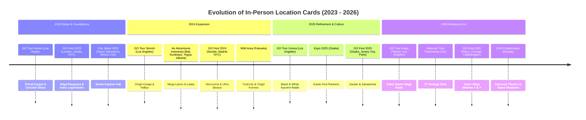
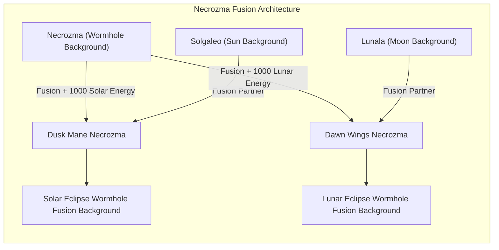
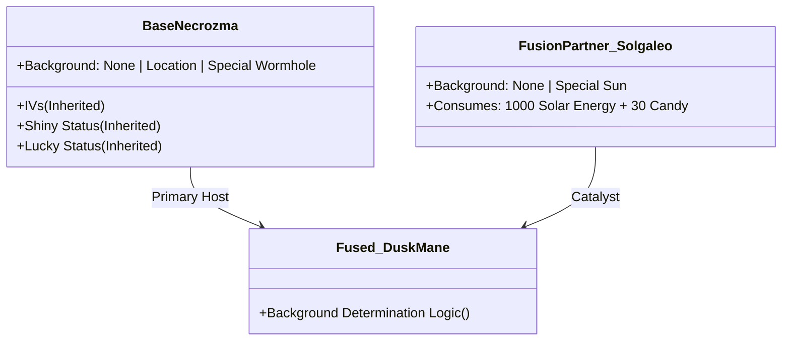

# Pokémon GO: Comprehensive Guide to Special Backgrounds, Location Cards & Pokélid Stamp Rally

**Author:** Antigravity Research & Engineering Team  
**Date:** September 2026  
**Document Status:** Complete / Definitive Primary Source Reference  
**Target Repository:** `DavidFaltus/Pokemon-GO-event-tracker`  
**Primary File Location:** `docs/research/pokemon-go-special-backgrounds-and-pokelids-guide.md`  

---

## Executive Overview & Architectural System Classification

In Pokémon GO, commemorative background cards are cosmetic modifications rendered behind a Pokémon on its summary screen. Initially introduced as an experimental live-event souvenir mechanic in early 2023, the architecture has evolved into a two-pillar visual collectible system:

1. **Location Cards (Lokační karty / Lokační pozadí):** Commemorate a **specific physical geographic place or venue**. Originally restricted to ticketed in-person events (Pokémon GO Tour, Pokémon GO Fest, City Safari, Safari Zone, and Air Adventures), the feature expanded nationwide in Japan via the **Pokélid (Pokéfuta) Stamp Rally**, where physical visits to municipal manhole covers grant prefecture-specific Location Cards.
2. **Special Backgrounds (Speciální pozadí):** Commemorate a **global event theme, cosmic dimension, faction, or lore-based phenomenon**. Debuting globally in July 2024 (*Inbound from Ultra Space*), Special Backgrounds are accessible to Trainers worldwide without physical travel requirements and feature complex multi-card fusion genetics (such as Necrozma's Solar/Lunar Eclipse variants and Kyurem's Black/White resonance forms).

---

# Part 1: Pokélid (Pokéfuta / ポケふた) Stamp Rally in Japan

## 1.1. What are Poké Lids (Pokéfuta)?

**Poké Lids** (*Pokéfuta* / ポケふた) are unique, artistic, Pokémon-themed utility manhole covers installed across Japan as part of **Pokémon Local Acts** (*ポケモンローカルActs*). Initiated by The Pokémon Company in conjunction with municipal and prefectural governments, the campaign revitalizes regional tourism and local economies by celebrating indigenous heritage, agricultural specialties, and scenic landmarks through bespoke Pokémon artwork.

Every single Poké Lid is a permanent, one-of-a-kind installation manufactured from cast iron and durable epoxy resin. In Pokémon GO, **each physical Poké Lid serves as an official in-game PokéStop** displaying custom high-resolution Photo Disc artwork corresponding to the physical lid design. Spinning these PokéStops yields exclusive collectible Postcards for the Trainer's Postcard Book and Vivillon progression.

### Prefectural Ambassadorial Assignment System
Each participating prefecture designates an official "Support Pokémon" (Ambassador Pokémon) whose Japanese name, biological traits, or mythology align with local characteristics:

| Prefecture (Kenchō) | Official Ambassador Pokémon | Cultural & Phonetic Rationale |
| :--- | :--- | :--- |
| **Hokkaido (北海道)** | **Alolan Vulpix & Vulpix** (*Rokon & Alola Rokon*) | Appointed leaders of the "Hokkaido Aficionado Expedition" (2018); symbolizes Hokkaido's subarctic, snow-capped winter landscapes. |
| **Iwate (岩手県)** | **Geodude** (*Ishitsubute*) | Visual and phonetic pun: *Iwa* (岩, Rock) + *Te* (手, Hand) = a Rock with hands! |
| **Miyagi (宮城県)** | **Lapras** (*Rapurasu*) | Appointed in 2019 to aid Pacific tsunami disaster recovery; represents scenic ocean coastlines (Matsushima Bay) and maritime hospitality. |
| **Fukushima (福島県)** | **Chansey** (*Rakkī*) | Linguistic pun: Chansey's Japanese name *Lucky* corresponds to the *Fuku* (福, Good Fortune / Luck) in Fukushima. |
| **Fukui (福井県)** | **Dragonite** (*Kairyū*) | Fukui is the fossil and dinosaur excavation capital of Japan; *Ryū* (竜) represents both dragons and prehistoric dinosaurs. |
| **Mie (三重県)** | **Oshawott** (*Mijumaru*) | Phonetic wordplay: The Kanji for Mie (三重) can be vocalized as *Mijū*, echoing *Mijumaru*. |
| **Tottori (鳥取県)** | **Sandshrew & Alolan Sandshrew** (*Sando & Alola Sando*) | Ground-type sand dwellers celebrating the massive coastal Tottori Sand Dunes (*Tottori Sakyū*). |
| **Kagawa (香川県)** | **Slowpoke** (*Yadon*) | Iconic phonetic homophone: *Yadon* mimics Kagawa's world-famous dish, *Sanuki Udon*. Kagawa playfully calls itself "Slowpoke Prefecture" (*Yadon-ken*). |
| **Kochi (高知県)** | **Quagsire** (*Nuō*) | Appointed November 2024 to celebrate Kochi's crystal-clear rivers (Shimanto and Niyodo, the "Miracle Clear Water"). |
| **Nagasaki (長崎県)** | **Ampharos** (*Denryū*) | Appointed June 2024; represents historic port lighthouses, illumination heritage, and the traditional local song *"Denderaryuba"*. |
| **Miyazaki (宮崎県)** | **Exeggutor & Alolan Exeggutor** (*Nasshī*) | Appointed October 2020; represents the tropical "Sunshine Prefecture" and resembles Miyazaki's official tree, the Phoenix palm. |
| **Okinawa (沖縄県)** | **Growlithe** (*Gādī*) | Emulates the mythical Ryukyuan guardian lions (*Shīshā*) perched on traditional Okinawan tiled roofs. |
| **Kagoshima - Ibusuki (指宿市)** | **Eevee** (*Ībui*) | City-level appointment: *"Ibusuki"* forms the playful phonetic phrase *"I love Suki"* $\rightarrow$ *Ībui*. |

> [!NOTE]
> Four prefectures—**Miyagi, Tottori, Kagawa, and Miyazaki**—achieved **100% municipal coverage**, meaning every single city, town, and village across the entire prefecture features an active Poké Lid PokéStop.

---

## 1.2. The Poké Lid Stamp Rally Mechanics (GOスタンプラリー)

In late 2025, Niantic and The Pokémon Company piloted an interactive in-game exploration engine known as the **Poké Lid Stamp Rally** (*ポケふたスタンプラリー*), launching initially in Kyushu and Okinawa before rolling out **nationwide across all 41+ participating prefectures on January 28, 2026**.

### In-Game Architecture & UI Workflow
1. **Access Point:** Located within the Trainer Profile $\rightarrow$ **Scrapbook** (*スクラップブック*) $\rightarrow$ Tap the lower-right Stamp Rally icon.
2. **Eligibility Criteria:** Requires **Trainer Level 5 or higher**.
3. **HUD Indicator:** When a Trainer is physically within proximity of an active Poké Lid zone, a dedicated Stamp icon illuminates on the upper-right corner of the map HUD.
4. **Acquisition Protocol:**
   - Trainers must physically navigate to the Poké Lid's GPS coordinates.
   - Upon entering the standard interaction radius (40m / 80m under Spacial Rend) and spinning the Photo Disc, the app displays the animated **Prefectural Stamp Sheet** and affixes the unique emblem of that specific lid.

### Dual-Border Validation Logic: Yellow vs. Blue Stamps
The game engine strictly differentiates between physical on-site exploration and social gift sharing:

*   **Yellow Border Stamps (On-Site Verification):** Awarded **exclusively** when the player's client spins the physical PokéStop while verified by GPS within range. **Only Yellow Border stamps count toward reward thresholds.**
*   **Blue Border Stamps (Social Souvenirs):** Awarded when opening a Postcard Gift sent by a friend who spun that Poké Lid. These stamps register in the player's Scrapbook for visual completionism but **provide 0 progression** toward the encounter reward.
*   **Retroactive Upgrade:** If a player has a Blue Border stamp recorded from a Gift, subsequent physical travel to that PokéStop and spinning its disc permanently converts the Blue Border to a **Yellow Border**, instantly applying its progression point.

---

## 1.3. Reward Structure: Prefectural Location Background Pikachu

*   **Trigger Condition:** **Every two (2) Yellow Border stamps collected within the SAME prefecture** instantly triggers a claimable research encounter.
*   **Encounters:** A costumed or wild Pikachu that possesses an exclusive, prefecture-specific **Location Background** (*ロケーション背景*).
*   **Artistic Rendering:** The background portrays the distinct cultural, geographical, and meteorological attributes of that specific prefecture:
    *   *Hokkaido:* Snowfall over the Tokachi mountain range with Alolan Vulpix motifs.
    *   *Miyagi:* Matsushima Bay islets, pine trees, and Lapras water ripples.
    *   *Kagawa:* Sanuki Udon bowls, golden wheat fields, and Slowpoke silhouettes.
    *   *Tottori:* Wind-swept sand dunes and Alolan Sandshrew burrow lines.
    *   *Miyazaki:* Sunlit coastline with Phoenix palm fronds and Exeggutor foliage.
    *   *Okinawa:* Shuri-style red roof tiles, turquoise seas, and Hibiscus blossoms.
*   **Repeatability:** The mechanic is completely uncapped. Collecting 10 Yellow Border stamps across 10 different lids in Miyagi awards **5 independent Pikachu encounters**, each carrying the Miyagi Location Background.
*   **Shiny Eligibility:** Pikachu encountered through this feature can be **Shiny** (*色違い*). Shiny status coexists seamlessly with the Location Background.
*   **Lifecycle:** Unlike time-limited seasonal events, the Poké Lid Stamp Rally is classified by Niantic as a **permanent core gameplay feature** with no expiration date.

---

# Part 2: Complete Global & In-Person Special Backgrounds & Location Cards Catalog (2023–2026)

## 2.1. Structural Rules & Game Mechanics

### 1. The Summary Screen Cycling Engine
Pokémon carrying a Location Card or Special Background do not permanently replace the underlying elemental typing backdrop. Instead, the game engine runs an automated, cyclical cross-fade:
$$\text{Type Animated Energy} \longleftrightarrow \text{Location / Special Commemorative Art}$$
If the Pokémon is **Lucky**, the cycle alternates between the golden sparkling particle field and the commemorative card. If the Pokémon is **Shadow**, the dark purple aura particles overlay on top of the cycling commemorative background.

### 2. Trading Classification & Persistence
*   **Mandatory Special Trade:** **Any Pokémon bearing a Location Card or Special Background is hard-coded as a Special Trade.** Even if the Pokémon is non-legendary, non-shiny, and already registered in the recipient's Pokédex, trading it consumes the daily Special Trade slot.
*   **Background Preservation:** **Backgrounds are 100% permanent across trades.** The recipient receives the Pokémon with its Location Card or Special Background intact.
*   **Trade Screen Blindness Warning:** The pre-trade confirmation modal does *not* display a prominent background badge. Trainers must verify using search string filters (`locationbackground` or `specialbackground`) prior to initiating trades to avoid unintended daily Special Trade consumption.
*   **Evolution Inheritance:** Evolving a Pokémon retains its background unconditionally (e.g., an Explorer Hat Eevee with an Amsterdam card evolving into Vaporeon retains the Amsterdam card; a Treecko with a National Trust card evolving into Sceptile retains the card).
*   **Pokémon HOME Stripping:** Transferring any Pokémon with a Location Card or Special Background to **Pokémon HOME permanently and irreversibly erases the background**. HOME lacks the rendering framework for GO backgrounds.

### 3. Inventory Search Filters
Trainers can isolate backgrounds using native search query terms:
*   `background`: Returns all Pokémon possessing any Location Background or Special Background.
*   `locationbackground` or `locationcards`: Restricts results exclusively to geographic Location Cards.
*   `specialbackground`: Restricts results exclusively to thematic/global Special Backgrounds.

---

## 2.2. Master Chronological Catalog: In-Person City Location Cards

In-Person Location Cards commemorate physical attendance at real-world ticketed venues. Drop mechanics during mega-events are governed by probability rolls from in-person Raid Battles (~20% to 33% standard chance, with select ticket packages or early raid catches granting guaranteed rates) or completion of on-site Timed/Field Research.

### Comprehensive In-Person Location Cards Master Table

| Year | Event Name & Host City | Operational Dates | Featured Pokémon | Visual Backdrop Motif | Acquisition Channel & Probability |
| :--- | :--- | :--- | :--- | :--- | :--- |
| **2023** | **GO Tour: Hoenn – Las Vegas** *(Las Vegas, NV, USA)* | Feb 18–19, 2023 | **Primal Kyogre, Primal Groudon** | Sunset Strip silhouette, neon palm trees, and Red Rock desert canyons. | In-person Primal Raids at Sunset Park; ~20% random drop chance. |
| **2023** | **GO Fest 2023: London** *(London, UK)* | Aug 4–6, 2023 | **Mega Rayquaza, Xerneas, Yveltal, Cresselia** | Brockwell Park greenery, River Thames, Tower Bridge, and Big Ben clocktower. | In-person 5-Star & Mega Raids; ~25% drop chance for ticket holders. |
| **2023** | **GO Fest 2023: Osaka** *(Osaka, Japan)* | Aug 4–6, 2023 | **Mega Rayquaza, Xerneas, Yveltal, Cresselia** | Expo '70 Commemorative Park, Tower of the Sun, and Osaka Castle skyline. | In-person 5-Star & Mega Raids; ~25% drop chance for ticket holders. |
| **2023** | **GO Fest 2023: New York City** *(New York City, NY, USA)* | Aug 18–20, 2023 | **Mega Rayquaza, Xerneas, Yveltal, Cresselia** | Randall’s Island Park, Manhattan suspension bridges, and Art Deco skyline. | In-person 5-Star & Mega Raids; ~25% drop chance for ticket holders. |
| **2023** | **City Safari: Seoul** *(Seoul, South Korea)* | Oct 7–8, 2023 | **Eevee (Explorer Hat)** | N Seoul Tower, Han River bridges, and traditional Hanok palace eaves. | "Eevee Explorers" Timed Research; 100% guaranteed on completion. |
| **2023** | **City Safari: Barcelona** *(Barcelona, Spain)* | Oct 13–14, 2023 | **Eevee (Explorer Hat)** | Sagrada Família spires, Park Güell mosaic tiling, and Mediterranean coastline. | "Eevee Explorers" Timed Research; 100% guaranteed on completion. |
| **2023** | **City Safari: Mexico City** *(Mexico City, Mexico)* | Nov 4–5, 2023 | **Eevee (Explorer Hat)** | Angel of Independence, Chapultepec Castle, and Jacaranda blossoms. | "Eevee Explorers" Timed Research; 100% guaranteed on completion. |
| **2024** | **GO Tour: Sinnoh – Los Angeles** *(Pasadena/LA, CA, USA)* | Feb 16–18, 2024 | **Origin Forme Dialga, Origin Forme Palkia** | Rose Bowl Stadium arches, San Gabriel Mountains, and California fan palms. | In-person 5-Star Raids; ~30% random drop chance for ticket holders. |
| **2024** | **Air Adventures: Bali** *(Denpasar, Bali, Indonesia)* | Mar 2–3, 2024 | **Mega Latios, Mega Latias** | Balinese Candi Bentar split gates, tropical beaches, and Mount Agung silhouette. | In-person Mega Raids; ~25% drop chance for ticket holders. |
| **2024** | **City Safari: Tainan** *(Tainan, Taiwan)* | Mar 9–10, 2024 | **Eevee (Explorer Hat)** | Chihkan Tower, historic Confucius temples, and traditional Taiwanese lantern streets. | "Eevee Explorers" Timed Research; 100% guaranteed on completion. |
| **2024** | **Air Adventures: Surabaya** *(Surabaya, Indonesia)* | May 11–12, 2024 | **Mega Latios, Mega Latias** | Suroboyo monument (Shark & Crocodile), Suramadu suspension bridge. | In-person Mega Raids; ~25% drop chance for ticket holders. |
| **2024** | **GO Fest 2024: Sendai** *(Sendai, Japan)* | May 30 – June 2, 2024 | **Necrozma, Nihilego, Xurkitree, Kartana, Guzzlord** | Nanakita Park foliage, Aoba Castle equestrian statue of Date Masamune, Tanabata streamers. | In-person 5-Star Raids; ~33% drop chance for ticket holders. |
| **2024** | **GO Fest 2024: Madrid** *(Madrid, Spain)* | June 14–16, 2024 | **Necrozma, Nihilego, Pheromosa, Kartana, Guzzlord** | Parque Juan Carlos I, Puerta de Alcalá neoclassical gate, Palacio de Cristal. | In-person 5-Star Raids; ~33% drop chance for ticket holders. |
| **2024** | **GO Fest 2024: New York City** *(New York City, NY, USA)* | July 5–7, 2024 | **Necrozma, Nihilego, Buzzwole, Kartana, Guzzlord** | Manhattan skyline, Empire State Building spire, and East River waterfront. | In-person 5-Star Raids; ~33% drop chance for ticket holders. |
| **2024** | **Air Adventures: Yogyakarta** *(Yogyakarta, Indonesia)* | Aug 24–25, 2024 | **Mega Latios, Mega Latias** | Prambanan temple spires, Merapi volcano peak, and batik floral filigree. | In-person Mega Raids; ~25% drop chance for ticket holders. |
| **2024** | **WCS 2024 Honolulu** *(Honolulu, HI, USA)* | Aug 16–20, 2024 | **Scuba Gear Pikachu ("Scubachu")** | Diamond Head crater, Waikiki Pacific surf, and Hawaiian Hibiscus flora. | Event Field Research & 1-Star In-Person Raids; 100% from Research, ~30% from Raids. |
| **2024** | **City Safari: Jakarta** *(Jakarta, Indonesia)* | Sept 21–22, 2024 | **Eevee (Explorer Hat), Mega Latios, Mega Latias** | Monas (National Monument) obelisk and modern Bundaran HI cityscape. | Research (Eevee) & Mega Raids (Latios/Latias); guaranteed on Research. |
| **2024** | **City Safari: Incheon** *(Incheon, South Korea)* | Sept 27–29, 2024 | **Safari Hat Pikachu, Skiddo, Eevee (Explorer Hat)** | Songdo Central Park canal, Incheon Grand Bridge, and futuristic architecture. | "Eevee Explorers" Research & Event Wild Spawns; 100% on Research. |
| **2024** | **Wild Area: Fukuoka** *(Fukuoka, Japan)* | Nov 16–17, 2024 | **Toxtricity (Amped/Low Key), Origin Dialga & Palkia** | Maizuru Park ruins, Hakata Bay coastal lights, and electric punk graffiti aesthetic. | In-person Max Battles & 5-Star Raids; ~33% drop chance. |
| **2024** | **City Safari: São Paulo** *(São Paulo, Brazil)* | Dec 7–8, 2024 | **Eevee (Explorer Hat)** | Ibirapuera Park, Octávio Frias de Oliveira cable-stayed bridge, and Paulistano street art. | "Eevee Explorers" Timed Research; 100% guaranteed on completion. |
| **2025** | **GO Tour: Unova – Los Angeles** *(Los Angeles, CA, USA)* | Feb 21–23, 2025 | **Reshiram, Zekrom, Kyurem** | Downtown LA modern high-rises blended with Rose Bowl Stadium architecture. | In-person 5-Star Raids; ~30% drop chance for ticket holders. |
| **2025** | **City Safari: Hong Kong** *(Hong Kong)* | Early 2025 | **Eevee (Explorer Hat)** | Victoria Harbour skyline, traditional junk boat sails, and neon sign corridors. | "Eevee Explorers" Timed Research; 100% guaranteed on completion. |
| **2025** | **Expo 2025 Osaka** *(Osaka, Japan)* | Apr 13 – Oct 13, 2025 | **Bulbasaur, Charmander, Squirtle, Pikachu** | Yumeshima artificial island pavilion ring and futuristic oceanic bio-domes. | On-site Field Research & Timed Tasks within Expo grounds. |
| **2025** | **GO Fest 2025: Osaka** *(Osaka, Japan)* | Summer 2025 | **Crowned Sword Zacian, Crowned Shield Zamazenta** | Umeda Sky Building, Dotonbori canal reflections, and modern Osaka urban vista. | In-person 5-Star Raids; ~33% drop chance for ticket holders. |
| **2025** | **GO Fest 2025: Jersey City** *(Jersey City, NJ, USA)* | Summer 2025 | **Crowned Sword Zacian, Crowned Shield Zamazenta** | Liberty State Park, Statue of Liberty silhouette, and Hudson River panorama. | In-person 5-Star Raids; ~33% drop chance for ticket holders. |
| **2025** | **GO Fest 2025: Paris** *(Paris, France)* | Summer 2025 | **Crowned Sword Zacian, Crowned Shield Zamazenta** | Champ de Mars, Eiffel Tower iron lattice, and Seine river embankments. | In-person 5-Star Raids; ~33% drop chance for ticket holders. |
| **2025** | **City Safari 2025 Cycle** *(Amsterdam, Bangkok, Cancun, Valencia, Vancouver)* | Throughout 2025 | **Eevee (Explorer Hat)** | Unique municipal landmarks per city (Canals of Amsterdam, Wat Arun in Bangkok, Maya arches in Cancun, City of Arts and Sciences in Valencia, Lions Gate in Vancouver). | "Eevee Explorers" Timed Research; 100% guaranteed on completion. |
| **2026** | **GO Tour 2026: Kalos** *(Tainan & Los Angeles)* | Feb 2026 | **Kalos First Partners (Chesnaught, Delphox, Greninja), Mega Raids** | Lumiose Prism Tower stylized neon vectors juxtaposed with host city skylines. | In-person Mega Raids & ticketed Special Research. |
| **2026** | **National Trust Heritage Collaboration** *(UK - 27 Key Properties)* | July 18 – Sept 6, 2026 | **Treecko, Grovyle, Sceptile** | Architectural etchings of historic UK estates (Gibside, Clumber Park, Fountains Abbey). | On-site Timed Research & localized Raids at registered heritage sites. |
| **2026** | **GO Fest 2026: Tokyo, Chicago, Copenhagen** | Summer 2026 | **Mega Mewtwo X & Y, Legendary Titans** | Iconic host city monuments (Tokyo Skytree, Chicago Cloud Gate/Skyline, Copenhagen Nyhavn gables). | In-person Super Mega Raids; ~33% drop chance for ticket holders. |
| **2026** | **City Safari 2026 Cycle** *(Boston, Brisbane, Lisbon, Marseille, Munich, Rio de Janeiro)* | Sept 26–27, 2026 | **Eevee (Explorer Hat)** | Iconic municipal vistas (Boston Harbor, Brisbane Story Bridge, Lisbon Tram 28, Marseille Notre-Dame de la Garde, Munich Frauenkirche, Rio Christ the Redeemer). | "Eevee Explorers" Timed Research; 100% guaranteed on completion. |
| **2026** | **European Space Agency (ESA)** *(6 Science Museums in Europe)* | Oct 4, 2026 – Apr 30, 2027 | **Astronaut Pikachu** | Deep-space telemetry grid, Ariane rocket booster plumes, and orbital satellite paths. | In-person 1-Star Raids at designated museums (e.g., London Science Museum, Cité de l'espace). |

---

## 2.3. Master Chronological Catalog: Global Special Backgrounds

Unlike city-bound Location Cards, **Special Backgrounds are distributed globally**. They celebrate franchise lore, cosmic events, or factional milestones, and introduce sophisticated multi-card fusion mechanics.

### Comprehensive Global Special Backgrounds Master Table

| Year | Event Title | Active Window | Featured Pokémon | Thematic Art Description | Distribution Channel & Drop Probability |
| :--- | :--- | :--- | :--- | :--- | :--- |
| **2024** | **Inbound from Ultra Space** | July 8–13, 2024 | **Ultra Beasts (Nihilego, Buzzwole, Pheromosa, Xurkitree, Celesteela, Kartana, Guzzlord, Blacephalon, Stakataka)** | Swirling multidimensional **Ultra Space Wormhole** with neon-violet distortion ripples. | Global 5-Star Raids; ~20% random drop chance for all players worldwide. |
| **2024** | **Pokémon GO Fest 2024: Global** | July 13–14, 2024 | **Ultra Beasts (Sat), Necrozma (Sun)** | Swirling **Ultra Space Wormhole** background identical to Inbound event. | Global 5-Star Raids; ~25% random drop chance for all players worldwide. |
| **2024** | **GO Fest 2024: Sun & Moon Research** | July 13–14, 2024 | **Solgaleo, Lunala** | **Radiant Sunburst** (Solgaleo) with solar flares; **Luminescent Crescent Moon** (Lunala) with starry cosmic nebula. | Global Ticketed Special Research *"The Dusk Resolves / The Dawn Unfolds"*; 100% guaranteed. |
| **2024** | **Necrozma Fusion Resonance** | July 14, 2024 onward | **Dusk Mane Necrozma, Dawn Wings Necrozma** | **Solar Eclipse Wormhole** (Dusk Mane) blending gold solar rays with violet rift; **Lunar Eclipse Wormhole** (Dawn Wings) blending indigo lunar crescent with rift. | **System Inheritance:** Achieved when fusing a Wormhole Necrozma with a Sun Solgaleo or Moon Lunala. |
| **2024** | **Triumph Together: Team Leaders** | Aug 23–30, 2024 | **Ponyta (Candela), Elekid (Spark), Lapras (Blanche)** | Dynamic factional backgrounds: **Valor Fiery Embers** (Red), **Instinct Lightning Bolts** (Yellow), **Mystic Crystalline Frost** (Blue). | Premium Timed Research completion celebrating the unlocking of Global Team Challenges; 100% guaranteed. |
| **2024** | **GO Wild Area: Global** | Nov 23–24, 2024 | **Toxtricity (Amped & Low Key), Mighty Pokémon** | High-voltage electric distortion grid overlaid with deep neon purple amplifier soundwaves. | Global Max Battles & 4-Star / 5-Star Raids; ~20% drop chance. |
| **2025** | **Pokémon GO Tour: Unova – Global** | Mar 1–2, 2025 | **Reshiram, Zekrom, Kyurem** | Monochromatic Yin & Yang energy swirls representing the dual ideals and truth of the Unova region. | Global 5-Star Raids; ~25% drop chance for all Trainers. |
| **2025** | **Unova Enigma Field Research** | Mar 1–2, 2025 | **Woobat, Darmanitan, Zorua, Munna** | Eerie lavender distortion haze adorned with floating Unovan glyphs and Dream Mist particulates. | Event-exclusive PokéStop Field Research tasks; guaranteed upon completion. |
| **2025** | **Kyurem Fusion Resonance** | Mar 2, 2025 onward | **Black Kyurem, White Kyurem** | **Overdrive Lightning Rift** (Black Kyurem) combining icy shards with Zekrom generator sparks; **Turboblaze Thermal Halo** (White Kyurem) combining glacial spires with Reshiram flame trails. | **System Inheritance:** Achieved by fusing Kyurem carrying a Special Background with an opposite-color Zekrom/Reshiram carrying a Special Background. |
| **2025** | **GO Fest 2025: Global** | Summer 2025 | **Crowned Sword Zacian, Crowned Shield Zamazenta** | Royal Galar crest vectors with swirling ethereal Slumbering Weald mist and cyan/magenta auroral flares. | Global 5-Star Crowned Raids; ~25% drop chance. |
| **2026** | **Pokémon GO Tour: Kalos – Global** | Feb 2026 | **60+ Eligible Species (Starters, Mega Candidates)** | Hexagonal Mega Evolution energy matrix pulsating with DNA helix strands and multicolored Mega crests. | Global Mega Raids & Timed Research milestones. |
| **2026** | **GO Fest 2026: Mega Finale** | Summer 2026 | **Mega Mewtwo X, Mega Mewtwo Y, Super Mega Bosses** | **Dynamic Reactive Aura:** An animated, hyper-speed psychic particle distortion field that **intensifies and alters color when the Pokémon undergoes active Mega Evolution**. | Super Mega Raids during GO Fest 2026 Global & Mega Finale; ~30% drop chance. |
| **2026** | **Dancing in the Moonlight** | Autumn 2026 | **Clefairy, Lunatone, Umbreon, Volbeat, Illumise** | Traditional Mid-Autumn lunar halo surrounded by glowing lanterns, osmanthus petals, and star dust. | Event-exclusive Timed Research across Asia-Pacific celebrating the Mid-Autumn Festival. |

---

## 2.4. Fusion Background Genetics & Rule Matrix

The introduction of **Pokémon Fusion** (Dusk Mane / Dawn Wings Necrozma in 2024, followed by Black / White Kyurem in 2025) created unique programmatic rules for how backgrounds interact upon merging and unmerging:

### Fusion Background Inheritance Rules
1. **The Primary Host Principle:** The fused Pokémon (Dusk Mane, Dawn Wings, Black Kyurem, White Kyurem) is structurally an alternate form of the **Primary Host** (Necrozma or Kyurem). All combat statistics (IVs, Level, Shiny status, Lucky status) are inherited strictly from the host.
2. **Combination Matrix:**
   - **Case A (Host has Wormhole + Partner has Sun/Moon):** The fused entity achieves **Resonance Evolution**, rendering the exclusive **Solar Eclipse** or **Lunar Eclipse** fusion variant background.
   - **Case B (Host has City Location Card + Partner has Sun/Moon):** The City Location Card takes precedence; the fused form displays the **City Location Card** (e.g., Sendai, Madrid, or NYC).
   - **Case C (Host has NO Background + Partner has Sun/Moon):** The background is **suppressed**. The fused form displays standard typing backgrounds.
   - **Case D (Host has Wormhole + Partner has NO Background):** The fused form retains the base **Wormhole Special Background** without eclipse embellishments.
3. **Kyurem Dual-Color Requirement:** For Black Kyurem and White Kyurem, the fused variant background unlocks **only when fusing Kyurem with a partner carrying the opposite ideological background** (Black Version background paired with White Version background).
4. **Reversibility Integrity:** Separating a fused Pokémon (which consumes 0 resources) restores both individual Pokémon to their storage slots with their original, individual backgrounds completely intact.

---

## 2.5. Comparative Strategic Matrix for Collectors & Traders

| Attribute / Feature | In-Person Location Cards | Global Special Backgrounds | Pokélid Prefectural Cards |
| :--- | :--- | :--- | :--- |
| **Geographic Requirement** | Physical on-site attendance at host city | Accessible worldwide from any location | Physical on-site visit to Poké Lids in Japan |
| **Ticket Prerequisite** | Paid in-person event ticket required | None (or standard Global ticket for research) | Completely free (Trainer Level 5+ required) |
| **Primary Method** | 5-Star / Mega Raids, Timed Research | 5-Star Raids, Max Battles, Global Research | In-person PokéStop spins (Yellow Stamps) |
| **Drop Predictability** | Variable (~20–33% raid drop; 100% research) | Variable (~20–25% raid drop; 100% research) | **100% Guaranteed** (Every 2 Yellow stamps) |
| **Trade Classification** | **Special Trade** (Consumes daily slot) | **Special Trade** (Consumes daily slot) | **Special Trade** (Consumes daily slot) |
| **Trade Preservation** | 100% Preserved | 100% Preserved | 100% Preserved |
| **Lucky Cycling** | Alternates: Lucky Gold $\leftrightarrow$ City Card | Alternates: Lucky Gold $\leftrightarrow$ Special Card | Alternates: Lucky Gold $\leftrightarrow$ Prefecture Card |
| **Evolution Transfer** | Retained through all evolutionary stages | Retained through all evolutionary stages | Retained (Pikachu $\rightarrow$ Raichu preserves card) |
| **HOME Compatibility** | **Erased** upon transfer | **Erased** upon transfer | **Erased** upon transfer |
| **Search Filter** | `locationbackground` | `specialbackground` | `locationbackground` |

---

## 2.6. Primary Source Citations & Official Documentation

1. **Niantic Pokémon GO Live Official Releases:**
   - *Location Cards Arrive in Pokémon GO Tour: Hoenn – Las Vegas:* [pokemongolive.com/post/pokemongotour-hoenn-lasvegas-location-cards/](https://pokemongolive.com/post/pokemongotour-hoenn-lasvegas-location-cards/)
   - *Inbound from Ultra Space & Special Backgrounds Global Debut:* [pokemongolive.com/post/inbound-from-ultra-space-2024/](https://pokemongolive.com/post/inbound-from-ultra-space-2024/)
   - *GO Fest 2024 Global Necrozma Fusion Mechanics:* [pokemongolive.com/post/gofest-2024-global-details/](https://pokemongolive.com/post/gofest-2024-global-details/)
   - *Triumph Together Global Challenges & Team Backgrounds:* [pokemongolive.com/post/triumph-together-2024/](https://pokemongolive.com/post/triumph-together-2024/)
   - *Pokémon GO Wild Area: Fukuoka & Global:* [pokemongolive.com/post/go-wild-area-2024/](https://pokemongolive.com/post/go-wild-area-2024/)
   - *Pokémon GO Tour: Unova – Fusion Resonance:* [pokemongolive.com/post/go-tour-unova-2025/](https://pokemongolive.com/post/go-tour-unova-2025/)
   - *National Poké Lid Stamp Rally Launch (ポケふたスタンプラリー全国展開):* [pokemongolive.com/ja/post/pokefuta-stamp-rally-japan/](https://pokemongolive.com/ja/post/pokefuta-stamp-rally-japan/)
2. **Niantic Help Center (HelpShift Official Knowledge Base):**
   - *Understanding Location Cards and Special Backgrounds in Pokémon GO:* [niantic.helpshift.com/hc/en/6-pokemon-go/faq/3842-location-cards-and-special-backgrounds/](https://niantic.helpshift.com/hc/en/6-pokemon-go/faq/3842-location-cards-and-special-backgrounds/)
   - *GO Stamp Rally & Poké Lid FAQ:* [niantic.helpshift.com/hc/en/6-pokemon-go/faq/4412-go-stamp-rally/](https://niantic.helpshift.com/hc/en/6-pokemon-go/faq/4412-go-stamp-rally/)
3. **The Pokémon Company / Pokémon Local Acts Portal:**
   - *Pokémon Local Acts Official Directory & Ambassador Registry:* [local.pokemon.jp](https://local.pokemon.jp/)
   - *Pokéfuta Utility Hole Cover Interactive Japanese Map:* [local.pokemon.jp/manhole/](https://local.pokemon.jp/manhole/)
4. **Community Databases & Verified Asset Repositories:**
   - Serebii.net Pokémon GO Database (Event Location Cards & Timed Research Archives)
   - Bulbapedia Knowledge Base: *Background (GO)* & *Pokémon Local Acts*
   - Dittobase Digital Asset Engine: Special and Location Background Index
