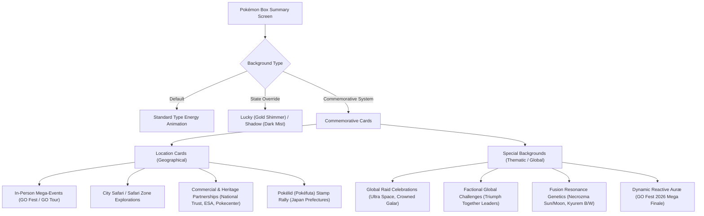

# Pokémon GO: Comprehensive Guide to Special Backgrounds, Location Cards & Pokélid Stamp Rally

**Author:** Antigravity Research & Engineering Team  
**Date:** September 2026  
**Document Status:** Complete / Definitive Primary Source Reference  
**Target Repository:** `DavidFaltus/Pokemon-GO-event-tracker`  
**Primary File Location:** `docs/research/pokemon-go-special-backgrounds-and-pokelids-guide.md`  
**Primary Online Sources:**
- Official Pokémon GO Live: [pokemongolive.com](https://pokemongolive.com)
- Official Niantic Help Center: [niantic.helpshift.com](https://niantic.helpshift.com/hc/en/6-pokemon-go/faq/3842-location-cards-and-special-backgrounds/)
- Pokémon GO Fandom Wiki Database: [pokemongo.fandom.com/wiki/Backgrounds](https://pokemongo.fandom.com/wiki/Backgrounds)
- Pokémon Local Acts Official Registry: [local.pokemon.jp](https://local.pokemon.jp/)

---

## Executive Overview & Architectural System Classification

In Pokémon GO, commemorative background cards are cosmetic modifications rendered behind a Pokémon on its summary screen. Initially introduced as an experimental live-event souvenir mechanic in early 2023, the architecture has evolved into a two-pillar visual collectible system:

1. **Location Cards (Lokační karty / Lokační pozadí):** Commemorate a **specific physical geographic place or venue**. Restricted to ticketed in-person events (Pokémon GO Tour, Pokémon GO Fest, City Safari, Safari Zone, and Air Adventures), partnerships (National Trust UK, Pokémon Center Flagship stores, ESA museums), and nationwide in Japan via the **Pokélid (Pokéfuta) Stamp Rally**, where physical visits to municipal manhole covers grant prefecture-specific Location Cards.
2. **Special Backgrounds (Speciální pozadí):** Commemorate a **global event theme, cosmic dimension, faction, or lore-based phenomenon**. Debuting globally in July 2024 (*Inbound from Ultra Space*), Special Backgrounds are accessible to Trainers worldwide without physical travel requirements and feature complex multi-card fusion genetics (such as Necrozma's Solar/Lunar Eclipse variants and Kyurem's Black/White resonance forms).

```mermaid
flowchart TD
    A["Pokémon Box Summary Screen"] --> B{"Background Type"}
    B -->|"Default"| C["Standard Type Energy Animation"]
    B -->|"State Override"| D["Lucky (Gold Shimmer) / Shadow (Dark Mist)"]
    B -->|"Commemorative System"| E["Commemorative Cards"]
    
    E --> F["Location Cards (Geographical)"]
    E --> G["Special Backgrounds (Thematic / Global)"]
    
    F --> F1["In-Person Mega-Events (GO Fest / GO Tour)"]
    F --> F2["City Safari / Safari Zone Explorations"]
    F --> F3["Commercial & Heritage Partnerships (National Trust, ESA, Pokecenter)"]
    F --> F4["Pokélid (Pokéfuta) Stamp Rally (Japan Prefectures)"]
    
    G --> G1["Global Raid Celebrations (Ultra Space, Crowned Galar)"]
    G --> G2["Factional Global Challenges (Triumph Together Leaders)"]
    G --> G3["Fusion Resonance Genetics (Necrozma Sun/Moon, Kyurem B/W)"]
    G --> G4["Dynamic Reactive Auræ (GO Fest 2026 Mega Finale)"]
```

---

# Part 1: Pokélid (Pokéfuta / ポケふた) Stamp Rally in Japan

> [!NOTE]
> Detailed documentation for the **Pokélid Stamp Rally across all 41+ Japanese prefectures** is maintained in its dedicated standalone guide:
> 👉 `/guides/pokelid-stamp-rally-japan-guide` and `docs/research/pokelids-complete-registry-audit.md`.
> 
> The rest of this document focuses on **all non-Pokélid Special Backgrounds and In-Person Location Cards** historically released in Pokémon GO from 2023 through 2026.

---

# Part 2: Global Special Backgrounds Catalog (2024–2026)

Global Special Backgrounds can be obtained by players worldwide regardless of physical location. They appear during global active windows via Raid Battles, Max Battles, Special Research, or Fusion mechanics.

### Complete Inventory of Global Special Backgrounds (31 Total)

| Year | Event & Location | Background Title | Featured Pokémon | Image URL | Acquisition Method |
| :--- | :--- | :--- | :--- | :--- | :--- |
| **2024** | **GO Fest 2024: Global & Inbound from Ultra Space** *Worldwide (5★ Raids)* | **Ultra Space (Wormhole)** | Necrozma, Nihilego, Buzzwole, Pheromosa, Xurkitree, Celesteela *(+4 more)* | [View Image](https://static.wikia.nocookie.net/pokemongo/images/c/c8/Special_Background_GoFest2024_Wormhole.png/revision/latest) | Random drop from 5-Star Ultra Beast and Necrozma raids (~1 in 5 chance) |
| **2024** | **GO Fest 2024: Global Special Research** *Worldwide (Special Research Reward)* | **Radiant Sunburst (Solar)** | Solgaleo | [View Image](https://static.wikia.nocookie.net/pokemongo/images/c/c5/Special_Background_GoFest2024_Radiance.png/revision/latest) | Guaranteed reward for completing the GO Fest 2024 ticketed storyline |
| **2024** | **GO Fest 2024: Global Special Research** *Worldwide (Special Research Reward)* | **Luminescent Moon (Lunar)** | Lunala | [View Image](https://static.wikia.nocookie.net/pokemongo/images/c/c5/Special_Background_GoFest2024_Radiance.png/revision/latest) | Guaranteed reward for completing the GO Fest 2024 ticketed storyline |
| **2024** | **Necrozma Fusion with Solgaleo / Lunala** *Worldwide (Fusion Mechanics)* | **Fusion Eclipse (Solar & Lunar)** | Necrozma-Dusk-Mane, Necrozma-Dawn-Wings | [View Image](https://static.wikia.nocookie.net/pokemongo/images/c/c8/Special_Background_GoFest2024_Wormhole.png/revision/latest) | Fusing a Wormhole Necrozma with a Sunburst Solgaleo or Moon Lunala! |
| **2024** | **Triumph Together & Candela's Quest** *Worldwide (Timed Research)* | **Team Valor (Candela's Embers)** | Ponyta, Moltres, Charmander, Cyndaquil, Torchic, Chimchar *(+5 more)* | [View Image](https://static.wikia.nocookie.net/pokemongo/images/3/3c/Special_Background_Valor.png/revision/latest) | Reward for clearing Team Valor global milestones and quests |
| **2024** | **Triumph Together & Spark's Quest** *Worldwide (Timed Research)* | **Team Instinct (Spark's Lightning)** | Elekid, Zapdos, Bulbasaur, Chikorita, Treecko, Turtwig *(+5 more)* | [View Image](https://static.wikia.nocookie.net/pokemongo/images/6/6a/Special_Background_Instinct.png/revision/latest) | Reward for clearing Team Instinct global milestones and quests |
| **2024** | **Triumph Together & Blanche's Quest** *Worldwide (Timed Research)* | **Team Mystic (Blanche's Frost)** | Lapras, Articuno, Squirtle, Totodile, Mudkip, Piplup *(+5 more)* | [View Image](https://static.wikia.nocookie.net/pokemongo/images/0/00/Special_Background_Mystic.png/revision/latest) | Reward for clearing Team Mystic global milestones and quests |
| **2024** | **Pokémon GO Wild Area Global 2024** *Worldwide (Max Battles & Raids)* | **Wild Area Global (Neon Soundwave)** | Toxtricity, Kyogre-Primal, Groudon-Primal, Dialga-Origin, Palkia-Origin | [View Image](https://static.wikia.nocookie.net/pokemongo/images/e/eb/Special_Background_GoWildArea2024.png/revision/latest) | Random encounter drop from Max Battles and 5-Star raids during Wild Area Global |
| **2024** | **December 2024 Community Day Weekend** *Worldwide (Special Research & Raids)* | **December Community Day 2024 (All-Star)** | Mankey, Bellsprout, Ponyta, Chansey, Porygon, Cyndaquil *(+6 more)* | [View Image](https://static.wikia.nocookie.net/pokemongo/images/a/a1/Special_Background_DecCD2024.png/revision/latest) | Completing the ticketed December Community Day weekend storyline |
| **2025** | **Community Days: Winter 2025** *Worldwide (Community Day Research)* | **Dual Destiny Season** | Sprigatito, Ralts, Karrablast, Shelmet | [View Image](https://static.wikia.nocookie.net/pokemongo/images/c/ce/Special_Background_DualDestiny.png/revision/latest) | Special Research ticket reward during Dual Destiny season events |
| **2025** | **Pokémon GO Tour: Unova – Road to Unova** *Worldwide (Field Research & Spawns)* | **Unova Enigma** | Zorua, Sandile, Darumaka, Darmanitan, Timburr, Woobat *(+3 more)* | [View Image](https://static.wikia.nocookie.net/pokemongo/images/5/57/Special_Background_Enigma.png/revision/latest) | Clear themed PokéStop Field Research during GO Tour Unova celebrations |
| **2025** | **Pokémon GO Tour: Unova – Global (March 2025)** *Worldwide (5★ Raids & Timed Research)* | **Black Version (Reshiram & Ideals)** | Reshiram, Kyurem, Snivy, Tepig, Oshawott, Cobalion *(+6 more)* | [View Image](https://static.wikia.nocookie.net/pokemongo/images/5/50/Special_Background_BlackVersion.png/revision/latest) | Random drop from 5-Star Unova raids or picking Black Version badge |
| **2025** | **Pokémon GO Tour: Unova – Global (March 2025)** *Worldwide (5★ Raids & Timed Research)* | **White Version (Zekrom & Truth)** | Zekrom, Kyurem, Snivy, Tepig, Oshawott, Cobalion *(+6 more)* | [View Image](https://static.wikia.nocookie.net/pokemongo/images/6/6f/Special_Background_WhiteVersion.png/revision/latest) | Random drop from 5-Star Unova raids or picking White Version badge |
| **2025** | **Kyurem Fusion with Reshiram / Zekrom** *Worldwide (Fusion Mechanics)* | **Kyurem Resonance Fusion** | Kyurem | [View Image](https://static.wikia.nocookie.net/pokemongo/images/0/01/Special_Background_GreyVersion.png/revision/latest) | Fusing a background Kyurem with an opposite-version background partner! |
| **2025** | **Spring 2025: Community Days & Battle Week** *Worldwide (Special Research)* | **Might & Mastery Season** | Fuecoco, Totodile, Vanillite, Pawmi, Meditite, Stunky *(+3 more)* | [View Image](https://static.wikia.nocookie.net/pokemongo/images/9/90/Special_Background_MightAndMastery.png/revision/latest) | Completing GO Battle Week challenges and Community Day storylines |
| **2025** | **Summer 2025: Community Days & Water Festival** *Worldwide (GO Pass & Quests)* | **Delightful Days Season** | Articuno, Zapdos, Moltres, Jangmo-o, Eevee, Lapras *(+5 more)* | [View Image](https://static.wikia.nocookie.net/pokemongo/images/8/85/Special_Background_DelightfulDays.png/revision/latest) | Progressing through summer GO Pass tiers and Water Festival tasks |
| **2025** | **Ancients Recovered & GO Fest 2025 Warmup** *Worldwide (5★ Regi Raids)* | **Ancients Recovered (The Titans)** | Regirock, Regice, Registeel, Regigigas, Regieleki, Regidrago | [View Image](https://static.wikia.nocookie.net/pokemongo/images/7/79/Special_Background_GOFest_2025.png/revision/latest) | Random drop from 5-Star Legendary Titan raids during the event |
| **2025** | **Pokémon GO Fest 2025: Global** *Worldwide (5★ Crowned Raids)* | **Sword Version (Crowned Zacian)** | Zacian | [View Image](https://static.wikia.nocookie.net/pokemongo/images/a/a4/Special_Background_GOFest_2025_Sword.png/revision/latest) | Random drop from Crowned Sword Zacian 5-Star raids at GO Fest 2025 Global |
| **2025** | **Pokémon GO Fest 2025: Max Finale (August 2025)** *Worldwide (Gigantamax Raids)* | **Max Finale: Dark Skies** | Venusaur, Charizard, Blastoise, Gengar, Snorlax, Machamp *(+3 more)* | [View Image](https://static.wikia.nocookie.net/pokemongo/images/4/4f/Special_Background_Max_Finale.png/revision/latest) | Clear 6-Star Gigantamax Battles during the Max Finale weekend |
| **2025** | **Autumn 2025: Legends: Z-A Celebration** *Worldwide (GO Pass & Quests)* | **Tales of Transformation** | Cobalion, Terrakion, Virizion, Flabebe, Solosis, Chikorita *(+3 more)* | [View Image](https://static.wikia.nocookie.net/pokemongo/images/2/20/Special_Background_Tales_of_Transformation.png/revision/latest) | Reward from autumn GO Pass tiers and Pokémon Legends: Z-A event tasks |
| **2025** | **Pokémon GO Wild Area Global 2025** *Worldwide (5★ Raids & Max Battles)* | **Wild Area Global 2025** | Lugia, Ho-Oh, Tapu Koko, Tapu Lele, Tapu Bulu, Tapu Fini *(+3 more)* | [View Image](https://static.wikia.nocookie.net/pokemongo/images/e/e9/Special_Background_Wild_Area_Global_2025.png/revision/latest) | Random drop from 5-Star raids during Wild Area 2025 Global weekend |
| **2026** | **2026 Community Day Calendar** *Worldwide (Special Research)* | **Community Days 2026** | Piplup, Grookey, Vulpix, Scorbunny, Tinkatink, Lechonk *(+4 more)* | [View Image](https://static.wikia.nocookie.net/pokemongo/images/0/09/Special_Background_Community_2026.png/revision/latest) | Completing official ticketed Community Day Special Research in 2026 |
| **2026** | **GO Tour Kalos & GO Fest 2026 Mega Finale** *Worldwide (Mega Raids & Super Mega)* | **Mega Evolution DNA Matrix** | Mewtwo, Rayquaza, Lucario, Garchomp, Gardevoir, Charizard *(+5 more)* | [View Image](https://static.wikia.nocookie.net/pokemongo/images/8/8a/Special_Background_Mega.png/revision/latest) | Random drop from Mega Raids during GO Tour Kalos & GO Fest 2026 Mega Finale |
| **2026** | **Pokémon GO Tour: Kalos – Global (Feb 2026)** *Worldwide (5★ Raids & Research)* | **X Version (Xerneas & Life)** | Xerneas, Chespin, Fennekin, Froakie, Honedge, Pikachu | [View Image](https://static.wikia.nocookie.net/pokemongo/images/0/0b/Special_Background_X.png/revision/latest) | Selecting X Version during GO Tour Kalos or winning 5-Star Xerneas raids |
| **2026** | **Pokémon GO Fest 2026: Mega Finale** *Worldwide (Super Mega Mewtwo Raids)* | **Mega Mewtwo Dynamic Reactive Aura** | Mewtwo | [View Image](https://static.wikia.nocookie.net/pokemongo/images/4/43/Special_Background_GO_Fest_2026_Mewtwo.png/revision/latest) | Defeating Super Mega Mewtwo X or Y raids during GO Fest 2026 |
| **2026** | **Road of Legends & GO Fest 2026: Global** *Worldwide (Legendary Raids)* | **Road of Legends Raid Card** | Gengar, Articuno, Zapdos, Moltres, Raikou, Entei *(+14 more)* | [View Image](https://static.wikia.nocookie.net/pokemongo/images/3/3a/Special_Background_Road_of_Legends.png/revision/latest) | Random drop from 5-Star raids across the July 2026 Road of Legends marathon |
| **2025** | **Pokémon Concierge Celebration (Sept 2025)** *Worldwide (Timed Research)* | **Pokémon Concierge Celebration** | Psyduck | [View Image](https://static.wikia.nocookie.net/pokemongo/images/b/bd/Special_Background_Concierge.png/revision/latest) | Completing the special Pokémon Concierge Timed Research questline |
| **2026** | **Pokémon Horizons Celebration Event (Sept 2026)** *Worldwide (Timed Research & Raids)* | **Pokémon Horizons: The Series** | Pikachu, Charmander, Charizard, Meowscarada, Skeledirge, Quaquaval | [View Image](https://static.wikia.nocookie.net/pokemongo/images/3/38/Special_Background_Horizons.png/revision/latest) | Special Research milestones celebrating the Pokémon Horizons animated series |
| **2026** | **Pokémon GO 10th Anniversary Party (July–Aug 2026)** *Worldwide (Anniversary Research)* | **Pokémon GO 10th Anniversary** | Gimmighoul, Mewtwo, Pikachu | [View Image](https://static.wikia.nocookie.net/pokemongo/images/b/ba/Special_Background_10th_Anniversary.png/revision/latest) | 10th Anniversary Special Research celebrating a decade of Pokémon GO |
| **2026** | **Dancing in the Moonlight (Sept 2026)** *Worldwide (Timed Research)* | **Dancing in the Moonlight 2026** | Clefairy | [View Image](https://static.wikia.nocookie.net/pokemongo/images/d/d7/Special_Background_Dancing_in_the_Moonlight_2026.png/revision/latest) | Completing Mid-Autumn harvest festival Timed Research across Asia-Pacific and globally |
| **2026** | **2026 Pokémon World Championships (August 2026)** *San Francisco, CA, USA & Worldwide* | **Pokémon World Championships 2026** | Tinkaton, Pikachu | [View Image](https://static.wikia.nocookie.net/pokemongo/images/d/d4/Special_Background_Worlds_Special_Blue.png/revision/latest) | Global & on-site Timed Research during the 2026 World Championships weekend |

---

# Part 3: In-Person Location Cards Catalog (2023–2026)

In-Person Location Cards commemorate physical attendance at real-world ticketed venues or registered partner locations. They drop with ~20% to 33% probability from in-person Raid Battles or with 100% certainty from on-site Timed / Field Research tasks.

> [!IMPORTANT]
> **REMOTE RAID PASS LIMITATION:** Remote Raid Passes **NEVER** yield Location Cards. Players must physically be present at the Gym.

### Complete Inventory of In-Person Location Cards (35 Total)

| Year | Event & Location | Background Title | Featured Pokémon | Image URL | Acquisition Method |
| :--- | :--- | :--- | :--- | :--- | :--- |
| **2023** | **Pokémon GO Tour: Hoenn – Las Vegas (February 2023)** *Sunset Park, Las Vegas, NV, USA* | **Las Vegas (GO Tour Hoenn 2023)** | Kyogre-Primal, Groudon-Primal | [View Image](https://static.wikia.nocookie.net/pokemongo/images/9/9d/Location_Card_Las_Vegas.png/revision/latest) | Clear in-person Primal Raids at Sunset Park with an active event ticket |
| **2023** | **Pokémon GO Fest 2023: London (August 2023)** *Brockwell Park, London, UK* | **London (GO Fest 2023)** | Rayquaza-Mega, Xerneas, Yveltal, Cresselia | [View Image](https://static.wikia.nocookie.net/pokemongo/images/7/77/Location_Card_London.png/revision/latest) | Clear in-person 5-Star & Mega Raids in London with active event ticket |
| **2023** | **Pokémon GO Fest 2023: Osaka (August 2023)** *Expo '70 Park, Osaka, Japan* | **Osaka (GO Fest 2023)** | Rayquaza-Mega, Xerneas, Yveltal, Cresselia | [View Image](https://static.wikia.nocookie.net/pokemongo/images/6/68/Location_Card_Osaka.png/revision/latest) | Clear in-person 5-Star & Mega Raids in Osaka with active event ticket |
| **2023** | **Pokémon GO Fest 2023: NYC (August 2023)** *Randall's Island Park, New York, NY, USA* | **New York City (GO Fest 2023)** | Rayquaza-Mega, Xerneas, Yveltal, Cresselia | [View Image](https://static.wikia.nocookie.net/pokemongo/images/a/a8/Location_Card_NYC.png/revision/latest) | Clear in-person 5-Star & Mega Raids on Randall's Island with ticket |
| **2023** | **Pokémon GO City Safari: Barcelona (Oct 2023)** *Barcelona, Catalonia, Spain* | **Barcelona (City Safari 2023)** | Eevee, Skiddo | [View Image](https://static.wikia.nocookie.net/pokemongo/images/7/72/Location_Card_Barcelona.png/revision/latest) | 100% guaranteed reward from Eevee Explorers Timed Research in Barcelona |
| **2023** | **Pokémon GO City Safari: Seoul (Oct 2023)** *Seoul, South Korea* | **Seoul (City Safari 2023)** | Eevee, Skiddo | [View Image](https://static.wikia.nocookie.net/pokemongo/images/5/52/Location_Card_Seoul.png/revision/latest) | Clear Eevee Explorers Timed Research across Seoul with active ticket |
| **2023** | **Pokémon GO City Safari: Mexico City (Nov 2023)** *Mexico City, Mexico* | **Mexico City (City Safari 2023)** | Eevee, Skiddo | [View Image](https://static.wikia.nocookie.net/pokemongo/images/c/c8/Location_Card_Mexico_City.png/revision/latest) | Clear Eevee Explorers Timed Research across Mexico City with active ticket |
| **2024** | **Pokémon GO Tour: Sinnoh – Los Angeles (February 2024)** *Rose Bowl Stadium, Pasadena, CA, USA* | **Los Angeles (GO Tour Sinnoh 2024)** | Dialga-Origin, Palkia-Origin | [View Image](https://static.wikia.nocookie.net/pokemongo/images/1/15/Location_Card_Los_Angeles.png/revision/latest) | Clear Origin Forme Raids at Rose Bowl with an active event ticket |
| **2024** | **Pikachu's Indonesia Journey: Bali (March 2024)** *Denpasar & Nusa Dua, Bali, Indonesia* | **Bali (Pikachu's Indonesia Journey)** | Latios-Mega, Latias-Mega | [View Image](https://static.wikia.nocookie.net/pokemongo/images/a/a3/Location_Card_Bali.png/revision/latest) | In-person Mega Raids across Bali for active ticket holders |
| **2024** | **Pokémon GO Fest 2024: Sendai (May–June 2024)** *Nanakita Park & Sendai, Miyagi, Japan* | **Sendai (GO Fest 2024)** | Necrozma, Xurkitree, Nihilego, Kartana, Guzzlord, Stakataka *(+2 more)* | [View Image](https://static.wikia.nocookie.net/pokemongo/images/6/6d/Location_Card_Sendai.png/revision/latest) | In-person 5-Star Raids for Necrozma & Ultra Beasts in Sendai with event ticket |
| **2024** | **Pokémon GO Fest 2024: Madrid (June 2024)** *Parque Juan Carlos I, Madrid, Spain* | **Madrid (GO Fest 2024)** | Necrozma, Pheromosa, Nihilego, Kartana, Guzzlord | [View Image](https://static.wikia.nocookie.net/pokemongo/images/e/e4/Location_Card_Madrid.png/revision/latest) | In-person 5-Star Raids in Madrid for ticket holders |
| **2024** | **Pokémon GO Fest 2024: NYC (July 2024)** *Randall's Island Park, New York, NY, USA* | **New York City (GO Fest 2024)** | Necrozma, Buzzwole, Nihilego, Kartana, Guzzlord | [View Image](https://static.wikia.nocookie.net/pokemongo/images/0/05/Location_Card_NYC_2024.png/revision/latest) | In-person 5-Star Raids on Randall's Island with event ticket |
| **2024** | **2024 Pokémon World Championships (August 2024)** *Hawaii Convention Center, Honolulu, HI, USA* | **Honolulu (WCS 2024)** | Pikachu | [View Image](https://static.wikia.nocookie.net/pokemongo/images/6/6f/Location_Card_Honolulu.png/revision/latest) | Completing in-person 1-Star Raids & Field Research in Honolulu during WCS |
| **2024** | **Pokémon GO Wild Area: Fukuoka (November 2024)** *Maizuru Park, Fukuoka, Japan* | **Fukuoka (Wild Area 2024)** | Toxtricity, Dialga-Origin, Palkia-Origin | [View Image](https://static.wikia.nocookie.net/pokemongo/images/2/23/Location_Card_Fukuoka.png/revision/latest) | In-person Max Battles & Raids in Maizuru Park with event ticket |
| **2024** | **Pokémon GO City Safari: São Paulo (December 2024)** *São Paulo, Brazil* | **São Paulo (City Safari 2024)** | Eevee, Skiddo | [View Image](https://static.wikia.nocookie.net/pokemongo/images/f/f6/Location_Card_Sao_Paulo.png/revision/latest) | Completing ticketed Eevee Explorers Timed Research across São Paulo |
| **2025** | **Pokémon GO Tour: Unova – New Taipei City (Feb 2025)** *New Taipei Metropolitan Park, Taiwan* | **New Taipei City (GO Tour Unova 2025)** | Reshiram, Zekrom, Kyurem | [View Image](https://static.wikia.nocookie.net/pokemongo/images/7/73/Location_Background_New_Taipei_City.png/revision/latest) | Clear in-person 5-Star Raids in New Taipei Metropolitan Park with event ticket |
| **2025** | **Pokémon GO Tour: Unova – Los Angeles (Feb 2025)** *Rose Bowl Stadium & Downtown LA, CA, USA* | **Los Angeles (GO Tour Unova 2025)** | Reshiram, Zekrom, Kyurem | [View Image](https://static.wikia.nocookie.net/pokemongo/images/5/54/Location_Background_Los_Angeles.png/revision/latest) | Clear in-person 5-Star Raids at Rose Bowl Stadium with active ticket |
| **2025** | **Pokémon GO City Safari: Singapore (March 2025)** *Singapore (Marina Bay & Gardens)* | **Singapore (City Safari 2025)** | Eevee, Skiddo | [View Image](https://static.wikia.nocookie.net/pokemongo/images/b/be/Location_Background_Singapore.png/revision/latest) | Completing Eevee Explorers Timed Research in Singapore with event ticket |
| **2025** | **Pokémon GO City Safari: Milan (March 2025)** *Milan, Lombardy, Italy* | **Milan (City Safari 2025)** | Eevee, Skiddo | [View Image](https://static.wikia.nocookie.net/pokemongo/images/5/5e/Location_Background_Milan.png/revision/latest) | Completing Eevee Explorers Timed Research across Milan with ticket |
| **2025** | **Pokémon GO City Safari: Mumbai (March 2025)** *Mumbai, Maharashtra, India* | **Mumbai (City Safari 2025)** | Eevee, Skiddo | [View Image](https://static.wikia.nocookie.net/pokemongo/images/0/0e/Location_Background_Mumbai.png/revision/latest) | Completing Eevee Explorers Timed Research across Mumbai with ticket |
| **2026** | **Pokémon GO Fest 2026: Copenhagen (June 2026)** *Copenhagen, Denmark (Nyhavn & Tivoli)* | **Copenhagen (GO Fest 2026)** | Mewtwo, Pikachu | [View Image](https://static.wikia.nocookie.net/pokemongo/images/9/91/Location_Background_Copenhagen_2026.png/revision/latest) | Clear in-person Super Mega Raids in Copenhagen with active event ticket |
| **2026** | **Pokémon GO & National Trust UK Collaboration (2026)** *27 Historic Properties across England, Wales & N. Ireland* | **National Trust UK Heritage Series** | Treecko, Grovyle, Sceptile | [View Image](https://static.wikia.nocookie.net/pokemongo/images/0/07/Location_Background_National_Trust_Fountains_Abbey.png/revision/latest) | In-person visits to registered National Trust sites and clearing on-site Field Tasks |
| **2026** | **In-person visits to Pokémon Center official stores** *16 Flagship Stores (Mega Tokyo, Shibuya, Kyoto, Osaka, Tohoku, etc.)* | **Pokémon Center Japan Flagships** | Pikachu | [View Image](https://static.wikia.nocookie.net/pokemongo/images/4/48/Location_Background_PokemonCenter_MegaTokyo.png/revision/latest) | Spinning the official sponsored Gym/PokéStop disc physically inside the Pokémon Center |
| **2026** | **GO Fest Copenhagen & LEGO Stores (Summer 2026)** *Copenhagen & Partner LEGO Stores Worldwide* | **LEGO Collaboration (Brick World)** | Pikachu | [View Image](https://static.wikia.nocookie.net/pokemongo/images/7/70/Special_Background_LEGO.png/revision/latest) | Special Research at GO Fest Copenhagen or checking in at participating LEGO Stores |
| **2025** | **Busan Fireworks Festival 2025 (Autumn 2025)** *Gwangalli Beach, Busan, South Korea* | **Busan Fireworks Festival** | Pikachu | [View Image](https://static.wikia.nocookie.net/pokemongo/images/a/ac/Location_Background_Busan_Fireworks_Festival_2025.png/revision/latest) | On-site Field Tasks at Gwangalli Beach during the fireworks festival |
| **2023** | **Pokémon Air Adventures: Jeju (July 2023)** *Jeju Island, South Korea* | **Jeju Island (Air Adventures 2023)** | Latios-Mega, Latias-Mega, Pikachu | [View Image](https://static.wikia.nocookie.net/pokemongo/images/7/7c/Location_Card_Jeju.png/revision/latest) | In-person Mega Raids across Jeju Island during the event |
| **2024** | **Pokémon GO City Safari: Tainan (March 2024)** *Tainan, Taiwan* | **Tainan (City Safari 2024)** | Eevee, Skiddo | [View Image](https://static.wikia.nocookie.net/pokemongo/images/7/74/Location_Card_Tainan.png/revision/latest) | Completing ticketed Eevee Explorers Timed Research across Tainan |
| **2024** | **Pikachu's Indonesia Journey: Surabaya (May 2024)** *Surabaya, East Java, Indonesia* | **Surabaya (Pikachu's Indonesia Journey)** | Latios-Mega, Latias-Mega | [View Image](https://static.wikia.nocookie.net/pokemongo/images/3/39/Location_Card_Surabaya.png/revision/latest) | Clear in-person Mega Raids across Surabaya with active ticket |
| **2024** | **Pikachu's Indonesia Journey: Yogyakarta (August 2024)** *Yogyakarta, Java, Indonesia* | **Yogyakarta (Pikachu's Indonesia Journey)** | Latios-Mega, Latias-Mega | [View Image](https://static.wikia.nocookie.net/pokemongo/images/f/f6/Location_Card_Yogyakarta.png/revision/latest) | Clear in-person Mega Raids across Yogyakarta with active ticket |
| **2024** | **Pokémon GO City Safari: Jakarta (Sept 2024)** *Jakarta, Indonesia* | **Jakarta (City Safari 2024)** | Eevee, Skiddo, Latios-Mega, Latias-Mega | [View Image](https://static.wikia.nocookie.net/pokemongo/images/c/c5/Location_Card_Jakarta.png/revision/latest) | Eevee Explorers Timed Research and in-person Mega Raids in Jakarta |
| **2024** | **Pokémon GO City Safari: Incheon (Sept 2024)** *Songdo Central Park, Incheon, South Korea* | **Incheon (City Safari 2024)** | Eevee, Skiddo, Pikachu | [View Image](https://static.wikia.nocookie.net/pokemongo/images/a/ab/Location_Card_Incheon.png/revision/latest) | Completing Eevee Explorers Timed Research across Incheon |
| **2025** | **Pokémon GO Fest 2025: Osaka (Summer 2025)** *Osaka, Japan (Umeda & Dotonbori)* | **Osaka (GO Fest 2025)** | Zacian, Zamazenta | [View Image](https://static.wikia.nocookie.net/pokemongo/images/3/30/Location_Background_Osaka_2025.png/revision/latest) | In-person 5-Star Crowned Raids in Osaka with active event ticket |
| **2025** | **Pokémon GO Fest 2025: Jersey City (Summer 2025)** *Liberty State Park, Jersey City, NJ, USA* | **Jersey City (GO Fest 2025)** | Zacian, Zamazenta | [View Image](https://static.wikia.nocookie.net/pokemongo/images/c/c3/Location_Background_Jersey_City_2025.png/revision/latest) | In-person 5-Star Raids in Liberty State Park with active event ticket |
| **2025** | **Pokémon GO Fest 2025: Paris (Summer 2025)** *Champ de Mars, Paris, France* | **Paris (GO Fest 2025)** | Zacian, Zamazenta | [View Image](https://static.wikia.nocookie.net/pokemongo/images/1/1a/Location_Background_Paris_2025.png/revision/latest) | In-person 5-Star Crowned Raids in Paris for ticket holders |
| **2026** | **Pyeongchang Winter Festival 2026 (January 2026)** *Pyeongchang, Gangwon, South Korea* | **Pyeongchang Winter Festival 2026** | Pikachu, Deerling | [View Image](https://static.wikia.nocookie.net/pokemongo/images/0/01/Location_Background_Pyeongchang_Winter_Festival.png/revision/latest) | On-site Field Tasks in Pyeongchang during the winter ice festival |

---

# Part 4: Game Engine Rules & Trading Mechanics

### 1. The Summary Screen Cycling Engine
Pokémon carrying a Location Card or Special Background do not permanently overwrite the underlying elemental typing backdrop. The game client runs an automated cross-fade:
$$\text{Type Animated Energy} \longleftrightarrow \text{Location / Special Commemorative Art}$$
- **Lucky Pokémon:** Cycles between the golden shimmering field and the commemorative card.
- **Shadow Pokémon:** The ominous purple flame particles overlay directly on top of the commemorative card.

### 2. Mandatory Special Trade
- **Any Pokémon bearing a Location Card or Special Background is hard-coded as a Special Trade.**
- Even if the Pokémon is common, non-shiny, and registered in the receiving player's Pokédex, trading it consumes a daily Special Trade slot.

### 3. 100% Preservation Across Trades & Evolutions
- **Trades:** Backgrounds are permanently retained upon trading.
- **Evolutions:** Evolving a Pokémon preserves its background unconditionally (e.g. Barcelona Eevee evolves into Barcelona Vaporeon; National Trust Treecko evolves into Sceptile).

### 4. ⚠️ PERMANENT DELETION IN POKÉMON HOME
- Transferring any Pokémon with a Location Card or Special Background into **Pokémon HOME permanently and irreversibly erases the background**. Pokémon HOME lacks the rendering framework for GO backgrounds.

### 5. Inventory Search Filters
- `background`: Returns all Pokémon possessing any background.
- `locationbackground` or `locationcards`: Returns strictly geographic Location Cards.
- `specialbackground`: Returns strictly thematic Global Special Backgrounds.

---

# Part 5: Primary Sources & Citations

1. **Niantic Pokémon GO Live Official News:**
   - *Location Cards Debut in GO Tour: Hoenn:* [pokemongolive.com/post/pokemongotour-hoenn-lasvegas-location-cards/](https://pokemongolive.com/post/pokemongotour-hoenn-lasvegas-location-cards/)
   - *Inbound from Ultra Space & Special Backgrounds:* [pokemongolive.com/post/inbound-from-ultra-space-2024/](https://pokemongolive.com/post/inbound-from-ultra-space-2024/)
   - *GO Fest 2024 Global Necrozma Fusion Details:* [pokemongolive.com/post/gofest-2024-global-details/](https://pokemongolive.com/post/gofest-2024-global-details/)
   - *Triumph Together Global Challenges:* [pokemongolive.com/post/triumph-together-2024/](https://pokemongolive.com/post/triumph-together-2024/)
   - *Pokémon GO Wild Area Global:* [pokemongolive.com/post/go-wild-area-2024/](https://pokemongolive.com/post/go-wild-area-2024/)
2. **Niantic Help Center (HelpShift):**
   - *Location Cards and Special Backgrounds FAQ:* [niantic.helpshift.com/hc/en/6-pokemon-go/faq/3842-location-cards-and-special-backgrounds/](https://niantic.helpshift.com/hc/en/6-pokemon-go/faq/3842-location-cards-and-special-backgrounds/)
3. **Pokémon GO Wiki (Fandom):**
   - *Backgrounds Master Repository:* [pokemongo.fandom.com/wiki/Backgrounds](https://pokemongo.fandom.com/wiki/Backgrounds)
4. **The Pokémon Company / Pokémon Local Acts Portal:**
   - *Official Pokémon Local Acts Registry:* [local.pokemon.jp](https://local.pokemon.jp/)
