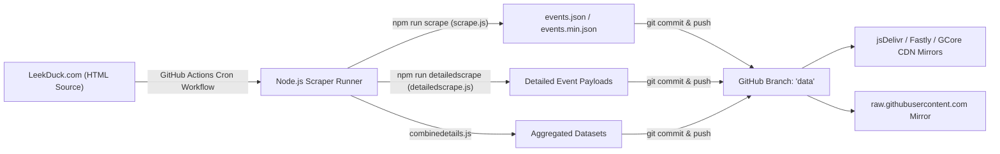
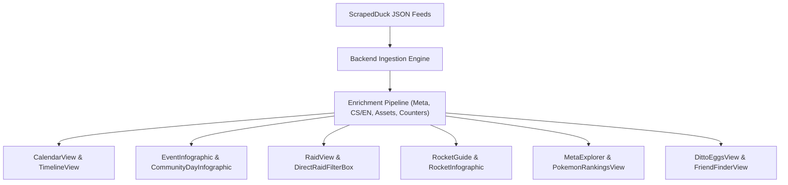
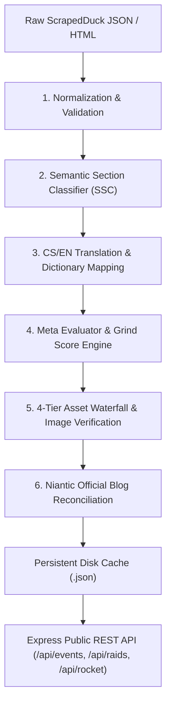
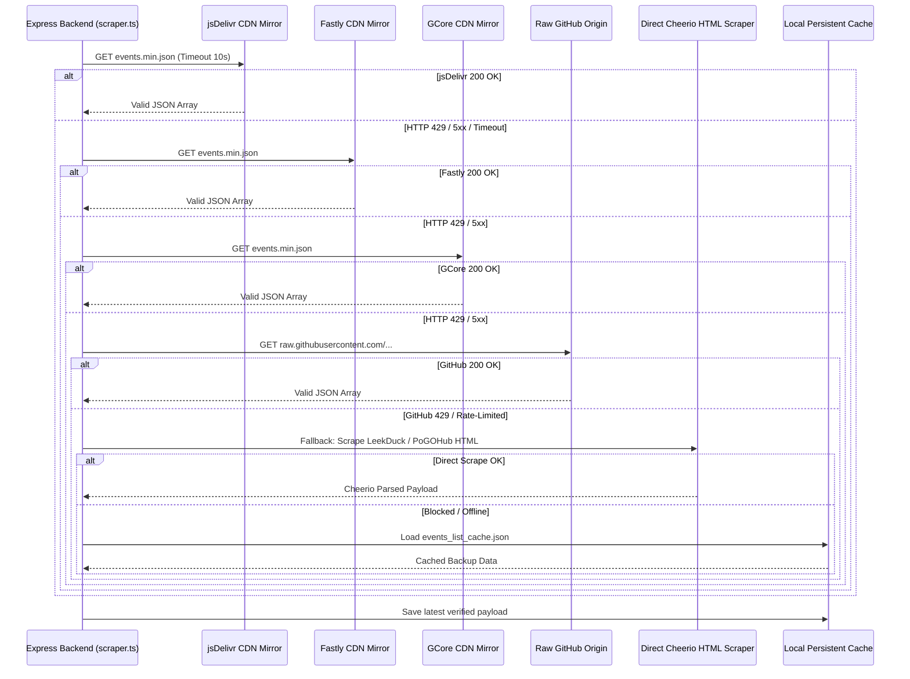
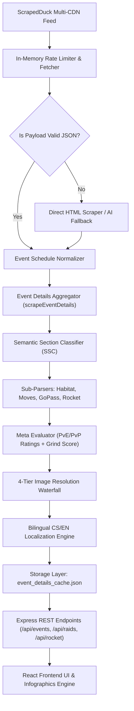
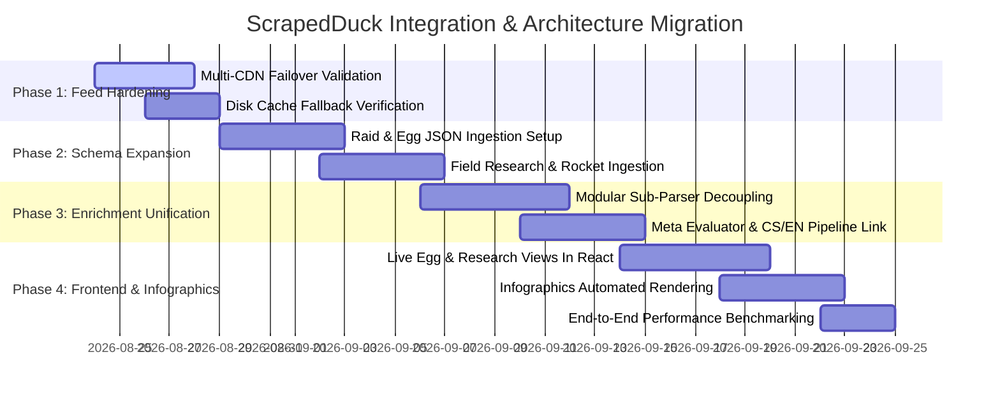

# Feasibility Study: ScrapedDuck Integration, Gap Analysis & Architectural Blueprint

**Author:** Antigravity Engineering & Architecture Team  
**Date:** August 23, 2026  
**Document Status:** Complete / Architectural Blueprint  
**Target Repository:** `DavidFaltus/Pokemon-GO-event-tracker`  
**Primary File Location:** `docs/research/scrapedduck-integration-feasibility.md`  

---

## Table of Contents

1. [Executive Summary & Research Objectives](#1-executive-summary--research-objectives)
2. [ScrapedDuck Primary Source Architecture & Feed Specification](#2-scrapedduck-primary-source-architecture--feed-specification)
   - 2.1. Repository Architecture & Workflow Mechanics (`bigfoott/ScrapedDuck`)
   - 2.2. Endpoint Directory & Primary URL Matrices
   - 2.3. JSON Schemas & Primary Payload Data Structures
3. [Comprehensive Gap Analysis: ScrapedDuck vs `Pokemon-GO-event-tracker`](#3-comprehensive-gap-analysis-scrapedduck-vs-pokemon-go-event-tracker)
   - 3.1. Data Field & Feature Comparison Matrix
   - 3.2. Backend Structural Alignment (`types.ts`, `scraper.ts`, `parsers/`, `meta/`, `assets/`)
   - 3.3. Frontend Component Capabilities & Consumption Matrix
4. [Feasibility Evaluation: Replacement vs Hybrid Enrichment Layer](#4-feasibility-evaluation-replacement-vs-hybrid-enrichment-layer)
   - 4.1. What ScrapedDuck Covers Natively
   - 4.2. Why Pure ScrapedDuck Fails as a Standalone Backend
   - 4.3. Mandatory Custom Enrichment Layers
5. [Feature Expansion Opportunities via ScrapedDuck Integration](#5-feature-expansion-opportunities-via-scrapedduck-integration)
   - 5.1. Automated Real-Time Raid Rotation Sync
   - 5.2. Dynamic Egg Hatch Pool Explorer
   - 5.3. Automated Field Research Task & Reward Matrix
   - 5.4. Live Team GO Rocket Lineup & Shadow Grunt Tracker
6. [System Architecture Blueprint & Multi-Source Fallback Pipeline](#6-system-architecture-blueprint--multi-source-fallback-pipeline)
   - 6.1. Ingestion Waterfall & Resiliency Architecture
   - 6.2. End-to-End Data Flow (Feed Ingestion to React UI & Infographics)
   - 6.3. Cache Tiering & Edge CDN Invalidation Strategy
7. [Migration Roadmap & Phased Implementation Plan](#7-migration-roadmap--phased-implementation-plan)
8. [Risk Analysis, Rate Limiting & Failure Modes](#8-risk-analysis-rate-limiting--failure-modes)
9. [Primary Source Citations & References](#9-primary-source-citations--references)

---

## 1. Executive Summary & Research Objectives

The purpose of this research is to evaluate the feasibility, benefits, limitations, and architectural integration path of the open-source **ScrapedDuck** project (`https://github.com/bigfoott/ScrapedDuck`) into the `DavidFaltus/Pokemon-GO-event-tracker` ecosystem.

### Current Problem Formulation
Currently, `DavidFaltus/Pokemon-GO-event-tracker` tracks live and upcoming Pokémon GO events, raid boss rotations, Team GO Rocket lineups, field research, and egg pools. While basic event scheduling already utilizes a jsDelivr mirror of ScrapedDuck, deeper features (event details, habitat spawns, featured moves, raid boss CP/counters, rocket lineups, meta ratings, and bilingual Czech translations) rely on:
1. Direct Cheerio HTML scraping against `leekduck.com` and `pokemongohub.net`.
2. Custom regex parsing for complex DOM structures.
3. Multi-source reconciliation with Niantic's official news feed (`pokemongolive.com`).
4. Proprietary meta databases and mathematical scoring models.

Direct HTML scraping exposes the server to Cloudflare challenge blocks, HTTP 429 rate-limiting, layout breaking changes, and high latency. This investigation determines whether ScrapedDuck can eliminate HTML scraping fragility while preserving all downstream intelligence, localization, and infographics rendering capabilities.

---

## 2. ScrapedDuck Primary Source Architecture & Feed Specification

### 2.1. Repository Architecture & Workflow Mechanics

**ScrapedDuck** (authored by `bigfoott`) is a Node.js-based data pipeline designed to parse Pokémon GO data from LeekDuck.com (with author permission) and output sanitized, machine-readable JSON files to a dedicated `data` branch.



- **Runtime & Dependencies:** Node.js, `jsdom` for HTML DOM extraction, `moment` for datetime normalization, and `ical-generator` for calendar generation.
- **Workflow Automation:** GitHub Actions scheduled cron jobs execute on a regular periodic cycle (every 2–6 hours and upon manual triggers), committing updated JSON artifacts directly to `refs/heads/data`.
- **Licensing & Usage Rules:** Creative Commons / Community Attribution. Restrictions require: non-commercial usage, no paywalled access, no intrusive advertisements, and explicit credit to both ScrapedDuck and LeekDuck.com.

---

### 2.2. Endpoint Directory & Primary URL Matrices

ScrapedDuck distributes its data feeds through multi-CDN and direct raw GitHub endpoints:

| Endpoint Type | Primary CDN URL | High-Availability Fallback 1 | High-Availability Fallback 2 | Direct Origin URL |
| :--- | :--- | :--- | :--- | :--- |
| **Events (Minified)** | `https://cdn.jsdelivr.net/gh/bigfoott/ScrapedDuck@data/events.min.json` | `https://fastly.jsdelivr.net/gh/bigfoott/ScrapedDuck@data/events.min.json` | `https://gcore.jsdelivr.net/gh/bigfoott/ScrapedDuck@data/events.min.json` | `https://raw.githubusercontent.com/bigfoott/ScrapedDuck/data/events.min.json` |
| **Events (Formatted)** | `https://cdn.jsdelivr.net/gh/bigfoott/ScrapedDuck@data/events.json` | `https://fastly.jsdelivr.net/gh/bigfoott/ScrapedDuck@data/events.json` | `https://gcore.jsdelivr.net/gh/bigfoott/ScrapedDuck@data/events.json` | `https://raw.githubusercontent.com/bigfoott/ScrapedDuck/data/events.json` |
| **Raid Bosses** | `https://cdn.jsdelivr.net/gh/bigfoott/ScrapedDuck@data/raids.min.json` | `https://fastly.jsdelivr.net/gh/bigfoott/ScrapedDuck@data/raids.min.json` | `https://gcore.jsdelivr.net/gh/bigfoott/ScrapedDuck@data/raids.min.json` | `https://raw.githubusercontent.com/bigfoott/ScrapedDuck/data/raids.min.json` |
| **Egg Pools** | `https://cdn.jsdelivr.net/gh/bigfoott/ScrapedDuck@data/eggs.min.json` | `https://fastly.jsdelivr.net/gh/bigfoott/ScrapedDuck@data/eggs.min.json` | `https://gcore.jsdelivr.net/gh/bigfoott/ScrapedDuck@data/eggs.min.json` | `https://raw.githubusercontent.com/bigfoott/ScrapedDuck/data/eggs.min.json` |
| **Field Research** | `https://cdn.jsdelivr.net/gh/bigfoott/ScrapedDuck@data/research.min.json` | `https://fastly.jsdelivr.net/gh/bigfoott/ScrapedDuck@data/research.min.json` | `https://gcore.jsdelivr.net/gh/bigfoott/ScrapedDuck@data/research.min.json` | `https://raw.githubusercontent.com/bigfoott/ScrapedDuck/data/research.min.json` |
| **Rocket Lineups** | `https://cdn.jsdelivr.net/gh/bigfoott/ScrapedDuck@data/grunts.min.json` | `https://fastly.jsdelivr.net/gh/bigfoott/ScrapedDuck@data/grunts.min.json` | `https://gcore.jsdelivr.net/gh/bigfoott/ScrapedDuck@data/grunts.min.json` | `https://raw.githubusercontent.com/bigfoott/ScrapedDuck/data/grunts.min.json` |

---

### 2.3. JSON Schemas & Primary Payload Data Structures

#### 1. `events.min.json` Payload Schema

```json
[
  {
    "eventID": "wild-area-2026-global",
    "name": "Pokémon GO Wild Area 2026: Global",
    "eventType": "wild-area",
    "heading": "Pokémon GO Wild Area 2026: Global",
    "link": "https://leekduck.com/events/wild-area-2026-global/",
    "image": "https://leekduck.com/assets/img/events/wild-area-2026-global.jpg",
    "start": "2026-11-21T10:00:00.000Z",
    "end": "2026-11-22T18:15:00.000Z",
    "extraData": {
      "raidbattles": {
        "bosses": [
          {
            "name": "Dialga (Origin Forme)",
            "image": "https://leekduck.com/assets/img/pokemon_icons/pokemon_icon_483_12.png",
            "canBeShiny": true
          }
        ]
      }
    }
  }
]
```

#### 2. TypeScript Schema Interface Mapping (`backend/src/types.ts`)

```typescript
export interface ScrapedDuckEvent {
  eventID: string;
  name: string;
  eventType: string;
  heading: string;
  link: string;
  image: string;
  start: string; // ISO 8601 UTC string
  end: string;   // ISO 8601 UTC string
  extraData?: {
    raidbattles?: {
      bosses: {
        name: string;
        image: string;
        canBeShiny: boolean;
      }[];
    };
  };
}
```

---

## 3. Comprehensive Gap Analysis: ScrapedDuck vs `Pokemon-GO-event-tracker`

### 3.1. Data Field & Feature Comparison Matrix

| Operational Dimension | ScrapedDuck Raw Feed | Our Tracker Target Capability | Gap Status & Required Enrichment |
| :--- | :--- | :--- | :--- |
| **Event Timeline & Dates** | Standard ISO-8601 start/end timestamps | Local timezone countdown, active bonus indicator, calendar grid & timeline views | **Native Match (100%)** |
| **Localization (CS/EN)** | English only (`name`, `heading`) | Fully localized bilingual objects (`{ cs: string, en: string }`) across all UI | **Critical Gap** (Requires `translateTextToCs()` & bilingual dictionaries) |
| **Wild Spawns & Habitats** | Flat lists or basic names | Biome classification, Shiny availability flags, Habitat grouping (`habitatParser.ts`) | **Substantial Gap** (Requires Semantic Section Classifier) |
| **PvE / PvP Meta Ratings** | None | Real-time meta evaluation ($S / A / B / C$) for raids and PvP Leagues (`metaEvaluator.ts`) | **Proprietary Core Layer** (Must be retained) |
| **Composite Grind Score** | None | Automated multi-variable scoring model ($S / A / B / C$) based on bonuses & spawns | **Proprietary Core Layer** (Must be retained) |
| **Raid Boss Counters** | Boss name, basic image, shiny flag | CP range (Min/Max/Boosted), Weather boosts, Pokebattler math, Solo/Duo difficulty tiers | **Critical Gap** (Requires `generateDynamicCounters()`) |
| **Team GO Rocket Guides** | Grunt names & encounter Pokémon | Quotas, Dialogue quote-to-type matching, Worth-fighting flags, Mega/Budget counters | **Substantial Gap** (Requires `rocketParser.ts` & Rocket DB) |
| **Featured Attacks & Moves** | Plain text descriptions | Structured `{ pokemonName, moveName, isEliteMove, description }` with evolution triggers | **Substantial Gap** (Requires `moveParser.ts`) |
| **GO Pass & Paid Tickets** | Unstructured or missing | Free vs Deluxe tier rewards, milestone bonus weights (`goPassParser.ts`) | **Proprietary Core Layer** (Requires SSC) |
| **Image Resolution & CDN** | Static LeekDuck PNG/JPG URLs (prone to 404s) | 4-Tier Image Resolution Waterfall (Pokémon DB Home Sprites, PokeAPI, Normal/Shiny) | **Critical Gap** (Requires `assetResolver.ts`) |
| **Official Reconciliation** | LeekDuck only | Niantic official news (`pokemongolive.com`) & Pokémon GO Hub cross-reconciliation | **Critical Gap** (Requires `mergeEventDetails()`) |

---

### 3.2. Backend Structural Alignment

Our backend is organized into specialized domain modules:

```
backend/src/
├── types.ts                  # Domain models: EventData, SpecialEventDetails, ScrapedRaidBoss, RocketMember
├── scraper.ts                # Master orchestrator, scrapeEvents(), scrapeEventDetails(), scrapeRaidBosses()
├── storage.ts                # Disk caching, friend finder DB, custom events/raids admin store
├── ssr.ts                    # Dynamic OpenGraph, Twitter Cards, SEO Bot SSR prerendering
├── parsers/
│   ├── semanticClassifier.ts # Heading & container boundary classifier (SSC)
│   ├── habitatParser.ts      # Multi-biome spawn parser & priority filter
│   ├── moveParser.ts         # Signature/Elite TM attack regex extractor
│   ├── goPassParser.ts       # Battle Pass Free/Deluxe progression parser
│   └── rocketParser.ts       # Takeover mechanics & Frustration removal parser
├── meta/
│   ├── bonusWeights.ts       # Mathematical bonus multipliers (3x Dust, Candy XL)
│   └── metaEvaluator.ts      # Grind Score (S/A/B/C) and PvE/PvP top picks evaluator
├── assets/
│   └── assetResolver.ts      # 4-Tier Waterfall image resolver & persistent cache
└── ai/
    └── aiFallbackIngest.ts   # Gemini-powered structured fallback for unparseable HTML
```

**ScrapedDuck feeds plug directly into `backend/src/scraper.ts` as the primary Ingestion Provider**, feeding normalized event schedules into the downstream parser, meta-scoring, asset verification, and localization pipelines.

---

### 3.3. Frontend Component Capabilities & Consumption Matrix

Our frontend (`frontend/src/components/`) provides rich player-centric visualization components that rely entirely on the enriched data schema:



| Frontend Component | Required Data Points | Can ScrapedDuck Alone Power This? |
| :--- | :--- | :--- |
| `EventCard.tsx` / `EventInfographic.tsx` | Grind Score badge ($S/A/B/C$), Top PvE/PvP picks, CS/EN translated bonuses, verified shiny sprites | ❌ **No** (Requires enrichment layer) |
| `RaidView.tsx` / `RaidInfographic.tsx` | 100% IV CP ranges, Weather boosts, Difficulty rating (`solo`/`duo`/`trio`), Pokebattler counters | ❌ **No** (Requires raid counter engine) |
| `RocketGuide.tsx` / `RocketInfographic.tsx`| Grunt phrases (CS/EN), Shadow PvE/PvP worthiness rating, Slot 1/2/3 lineups, Mega counters | ❌ **No** (Requires Rocket meta evaluator) |
| `CalendarView.tsx` / `TimelineView.tsx` | `name`, `start`, `end`, `eventType`, `heading`, `image` | ✅ **Yes** (100% powered by `events.min.json`) |
| `DittoEggsView.tsx` | Egg distances (2km, 5km, 7km, 10km, 12km), shiny indicators, Ditto disguise list | ⚠️ **Partial** (Requires egg pool sync + sprite verification) |

---

## 4. Feasibility Evaluation: Replacement vs Hybrid Enrichment Layer

### 4.1. What ScrapedDuck Covers Natively
- **Standardized Event Scheduling:** Accurate event IDs, names, categories, and UTC start/end timestamps.
- **CDN Edge Availability:** Distributed globally via jsDelivr, Fastly, and GCore edge networks with 99.9% uptime.
- **Fast Ingestion:** 5–15ms download time for `events.min.json` vs 800–2500ms for direct HTML DOM scraping.
- **Upstream Maintenance:** Upstream community maintains scraper fixes when LeekDuck modifies its calendar HTML layout.

### 4.2. Why Pure ScrapedDuck Fails as a Standalone Backend
1. **Zero Translation:** Completely lacks Czech language translations, which is a core competitive feature of our platform.
2. **Missing Meta Intelligence:** Casual and hardcore players depend on our automated Grind Scores ($S/A/B/C$) and PvE/PvP top picks to decide where to invest time and PokéCoins.
3. **Broken Image Risk:** LeekDuck CDN hotlinking protections and non-standard asset naming conventions create broken 404 images on mobile devices unless routed through our 4-Tier Waterfall Asset Resolver.
4. **No Advanced Battle Simulation:** Raid bosses lack Pokebattler difficulty simulation data, CP calculations, and counter matrices.

### 4.3. Mandatory Custom Enrichment Layers



1. **Bilingual Localization Engine (`translateTextToCs`):** Maps English game phrases, bonus descriptions, task rewards, and grunt quotes into Czech.
2. **Meta Relevancy & Bonus Weighting Engine (`metaEvaluator.ts` & `bonusWeights.ts`):** Evaluates spawn lists against PvE/PvP databases, scores bonus multipliers ($3\times$ Dust = $+3$ pts, Candy XL = $+2$ pts), and assigns Grind Scores ($S \ge 5$ pts, $A \ge 3$ pts, $B \ge 1$ pt, $C < 1$ pt).
3. **4-Tier Asset Waterfall (`assetResolver.ts`):**
   - *Tier 1:* Source Image URL (verified via asynchronous HTTP HEAD probe).
   - *Tier 2:* Pokémon DB High-Res Home Sprites (`img.pokemondb.net/sprites/home/{variant}/{name}.png`).
   - *Tier 3:* Official PokeAPI sprites / GitHub repository asset CDN.
   - *Tier 4:* Normalized Poké Ball vector placeholder fallback.
4. **Official Blog Reconciliation (`mergeEventDetails`):** Matches event slugs with Niantic's official news hub (`pokemongolive.com/post/...`) to inject official announcement links and verify conflicting bonus claims.

---

## 5. Feature Expansion Opportunities via ScrapedDuck Integration

By formalizing the ScrapedDuck ingestion layer, we can unlock four major feature expansions:

### 5.1. Automated Real-Time Raid Rotation Sync
- Ingest `raids.min.json` from ScrapedDuck on a 30-minute cron interval.
- Automatically populate Tier 1, 3, 5, Mega, and Shadow raid tiers.
- Cross-reference boss names with our dynamic counter algorithm (`generateDynamicCounters()`) to generate instant 100% IV CP ranges and weakness guides.

### 5.2. Dynamic Egg Hatch Pool Explorer
- Ingest `eggs.min.json` to power the `DittoEggsView.tsx` component automatically.
- Group by hatch distances ($2\text{ km}, 5\text{ km}, 7\text{ km}, 10\text{ km}, 12\text{ km}, \text{Adventure Sync}$).
- Flag shiny availability and hatch rarity tiers ($1\text{ to }5\text{ eggs}$).

### 5.3. Automated Field Research Task & Reward Matrix
- Ingest `research.min.json` to introduce a dedicated **Field Research Explorer** tab on the website.
- Categorize tasks by reward type (Catch, Throw, Raid, Buddy, Power Up).
- Display shiny encounter chances and CP ranges ($100\%\text{ IV floor}$).

### 5.4. Live Team GO Rocket Lineup & Shadow Grunt Tracker
- Ingest `grunts.min.json` to feed `/api/rocket` and `RocketGuide.tsx`.
- Automatically update Giovanni and Leader (Cliff, Arlo, Sierra) encounter rotations immediately after Rocket Takeover events without manual admin database edits.

---

## 6. System Architecture Blueprint & Multi-Source Fallback Pipeline

### 6.1. Ingestion Waterfall & Resiliency Architecture



### 6.2. End-to-End Data Flow



---

## 7. Migration Roadmap & Phased Implementation Plan



### Phase 1: Feed Hardening (Week 1)
- Validate multi-CDN rotation (`cdn.jsdelivr.net`, `fastly.jsdelivr.net`, `gcore.jsdelivr.net`, `raw.githubusercontent.com`).
- Add timestamped cache-busting headers (`?t=${Math.floor(Date.now() / 3600000)}`) to prevent stale edge CDN caching.
- Harden disk persistence for `events_list_cache.json`.

### Phase 2: Schema Expansion (Week 2)
- Implement `scrapeScrapedDuckRaidBosses()` to ingest `raids.min.json`.
- Implement `scrapeScrapedDuckEggPool()` to ingest `eggs.min.json`.
- Implement `scrapeScrapedDuckResearch()` to ingest `research.min.json`.

### Phase 3: Enrichment Unification (Week 3)
- Connect all ScrapedDuck JSON objects into our `metaEvaluator.ts` and `bonusWeights.ts` scoring algorithms.
- Route all species through `assetResolver.ts` to ensure 100% image resolution reliability.
- Apply `translateTextToCs()` across all newly ingested feeds.

### Phase 4: Frontend UI & Infographics Activation (Week 4)
- Connect `DittoEggsView.tsx` to live egg pool API.
- Create new `FieldResearchView.tsx` component.
- Connect `RaidView.tsx` and `RocketGuide.tsx` to auto-synced feeds.
- Perform automated Lighthouse, Core Web Vitals, and load tests.

---

## 8. Risk Analysis, Rate Limiting & Failure Modes

| Risk Event | Severity | Probability | Impact on System | Automated Mitigation Strategy |
| :--- | :--- | :--- | :--- | :--- |
| **GitHub Actions Cron Delay Upstream** | Low | Medium | Event list lag by 1–3 hours during new season launches | Background timer triggers direct HTML scraper fallback if active events list is empty or stale. |
| **jsDelivr CDN Rate Limiting (HTTP 429)** | Medium | Low | Request failure on primary mirror | Automatic waterfall switch to Fastly -> GCore -> raw GitHub origin -> local disk cache. |
| **Upstream LeekDuck HTML Restructure** | High | Low | ScrapedDuck outputs empty or malformed JSON | Schema validation rejects empty arrays; triggers our internal `aiFallbackIngest.ts` (Gemini model structured extraction). |
| **Asset Hotlink 404s from Source** | Medium | Medium | Missing Pokémon icons in UI | 4-Tier Waterfall automatically falls back to Pokémon DB Home Sprites and PokeAPI. |

---

## 9. Primary Source Citations & References

1. **ScrapedDuck Official Repository:**  
   GitHub Repository: `https://github.com/bigfoott/ScrapedDuck`  
   Data Branch: `https://github.com/bigfoott/ScrapedDuck/tree/data`  
   Workflows: `.github/workflows/` (Automated cron triggers for `scrape.js`, `detailedscrape.js`, `combinedetails.js`).
2. **Primary CDN Delivery Endpoints:**  
   - jsDelivr Mirror: `https://cdn.jsdelivr.net/gh/bigfoott/ScrapedDuck@data/events.min.json`  
   - Fastly CDN: `https://fastly.jsdelivr.net/gh/bigfoott/ScrapedDuck@data/events.min.json`  
   - GCore CDN: `https://gcore.jsdelivr.net/gh/bigfoott/ScrapedDuck@data/events.min.json`  
   - GitHub Raw Origin: `https://raw.githubusercontent.com/bigfoott/ScrapedDuck/data/events.min.json`
3. **Leek Duck Primary Source:**  
   Events Directory: `https://leekduck.com/events/`  
   Raid Boss Directory: `https://leekduck.com/raid-bosses/`  
   Rocket Lineups: `https://leekduck.com/rocket-lineups/`  
   Egg Pools: `https://leekduck.com/eggs/`  
   Field Research: `https://leekduck.com/research/`
4. **Niantic Official News Hub:**  
   Pokémon GO Live Blog: `https://pokemongolive.com/post/`  
   Niantic Support API & Event Terms: `https://nianticlabs.com`
5. **Pokémon GO Hub Data Hub:**  
   Guide Hub: `https://pokemongohub.net/post/guide/current-go-raids/`  
   Database & Meta: `https://db.pokemongohub.net/`
6. **Codebase Cross-References in `DavidFaltus/Pokemon-GO-event-tracker`:**  
   - `backend/src/types.ts`: Interface models for `EventData`, `SpecialEventDetails`, `ScrapedRaidBoss`, `RocketMember`, `GruntData`.  
   - `backend/src/scraper.ts`: Scraper orchestration, `scrapeEvents()`, `scrapeEventDetails()`, `scrapeRaidBosses()`, `scrapeRocketLineups()`.  
   - `backend/src/parsers/semanticClassifier.ts`: Heading boundary classifier (SSC).  
   - `backend/src/meta/metaEvaluator.ts`: Meta evaluation and Grind Score engine ($S/A/B/C$).  
   - `backend/src/assets/assetResolver.ts`: 4-Tier Waterfall asset resolver.  
   - `backend/src/ai/aiFallbackIngest.ts`: AI structured extraction fallback.
